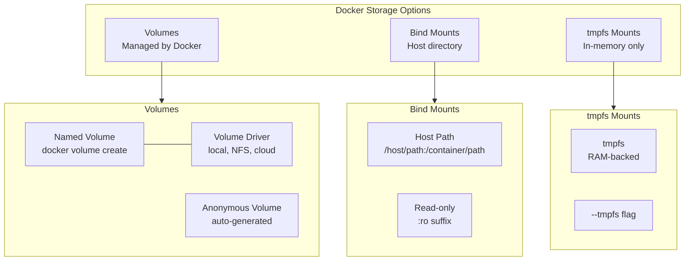

# Docker Storage

## Definition
Docker storage manages persistent data for containers through volumes, bind mounts, and tmpfs mounts. Proper storage management is essential for stateful applications running in ephemeral containers.

## Real-World Example
**GitLab**: Uses Docker named volumes for PostgreSQL database storage and repository data. When upgrading GitLab, containers are replaced but volumes persist with all data. Volume backups are taken via `docker run --rm --volumes-from` with a backup container.

## Storage Types



## Named Volumes

### Create and Use Volumes
```bash
# Create a named volume
docker volume create pgdata

# List volumes
docker volume ls

# Inspect volume
docker volume inspect pgdata
[
    {
        "CreatedAt": "2024-01-15T10:00:00Z",
        "Driver": "local",
        "Mountpoint": "/var/lib/docker/volumes/pgdata/_data",
        "Name": "pgdata",
        "Options": {},
        "Scope": "local"
    }
]

# Mount volume in container
docker run -d \
  --name postgres \
  -v pgdata:/var/lib/postgresql/data \
  -e POSTGRES_PASSWORD=secret \
  postgres:16

# Mount with specific options
docker run -d \
  --mount type=volume,source=pgdata,target=/data,readonly \
  nginx
```

### Volume Lifecycle
```bash
# Volume is created on first use
# Volume persists after container removal
# Manual cleanup required

# Remove specific volume
docker volume rm pgdata

# Prune unused volumes
docker volume prune

# Prune with filter
docker volume prune --filter label=env=dev
```

## Bind Mounts

Mount a host directory or file into the container.

```bash
# Basic bind mount
docker run -d \
  -v /host/data:/container/data \
  nginx

# Using --mount syntax (preferred)
docker run -d \
  --mount type=bind,source=/host/data,target=/container/data \
  nginx

# Read-only bind mount
docker run -d \
  --mount type=bind,source=/host/config,target=/app/config,readonly \
  myapp

# Mount single file
docker run -d \
  --mount type=bind,source=/host/config.yaml,target=/app/config.yaml \
  myapp
```

### Host to Container Mapping
```
Host: /home/user/project/
Host: /var/log/nginx/
Host: /etc/nginx/nginx.conf
         │
         │ bind mount
         ▼
Container: /app/
Container: /var/log/
Container: /etc/nginx/nginx.conf
```

### Bind Mount Use Cases
- Development: mount source code for hot-reload
- Configuration: mount config files from host
- Logging: persist logs on host filesystem
- Unix sockets: mount Docker socket for DinD

## tmpfs Mounts

Volatile, RAM-backed storage. Data is lost when container stops.

```bash
# Mount tmpfs (256MB limit)
docker run -d \
  --tmpfs /app/cache:noexec,nosuid,size=256M \
  myapp

# Using --mount syntax
docker run -d \
  --mount type=tmpfs,target=/app/cache,tmpfs-size=268435456 \
  myapp
```

### tmpfs Characteristics
- **In-memory**: Fastest storage option
- **Ephemeral**: Data lost on container stop
- **No persistence**: Not shared with other containers
- **Use cases**: Cache files, session data, scratch space
- **Size limit**: Default is 50% of host RAM

## Volume Drivers

### Local Driver (default)
```bash
# Default driver — stores on host filesystem
docker volume create --driver local mydata

# With device options
docker volume create --driver local \
  --opt type=nfs \
  --opt o=addr=192.168.1.100,rw \
  --opt device=:/export/data \
  nfs_volume
```

### NFS Driver
```yaml
# In Docker Compose
volumes:
  nfs_data:
    driver: local
    driver_opts:
      type: nfs
      o: "addr=192.168.1.100,nolock,soft,rw"
      device: ":/export/data"
```

### Cloud Volume Drivers
```bash
# AWS EBS (using REX-Ray or similar)
docker volume create --driver rexray/ebs \
  --opt size=100 \
  --opt volumeType=gp3 \
  my_ebs_volume

# GCE Persistent Disk
docker volume create --driver gce-docker \
  --opt disk-type=pd-ssd \
  --opt size=100GB \
  my_pd_volume

# Azure Disk
docker volume create --driver azurefile \
  --opt share=myshare \
  --opt storageaccountname=mystore \
  --opt storageaccountkey=mykey \
  azure_volume
```

## Volume Backup and Restore

### Backup
```bash
# Backup volume data to host
docker run --rm \
  -v pgdata:/source:ro \
  -v /backup:/destination \
  alpine tar czf /destination/pgdata-2024-01-15.tar.gz -C /source .

# Backup with compression
docker run --rm \
  -v pgdata:/data:ro \
  alpine sh -c "cd /data && tar czf - ." > pgdata-backup.tar.gz

# Incremental backup (rsync)
docker run --rm \
  -v pgdata:/source:ro \
  -v /backup-pgdata:/destination \
  alpine sh -c "rsync -av /source/ /destination/"
```

### Restore
```bash
# Restore from backup tar
docker run --rm \
  -v pgdata:/target \
  -v /backup:/source:ro \
  alpine sh -c "cd /target && tar xzf /source/pgdata-2024-01-15.tar.gz"

# Restore from compressed file
docker run --rm \
  -v pgdata:/data \
  alpine sh -c "cd /data && tar xzf -" < pgdata-backup.tar.gz

# Migrate volume between hosts
# 1. Backup on host A
docker run --rm -v myvolume:/source:ro -v /tmp:/dest alpine tar czf /dest/volume.tar.gz -C /source .
# 2. Copy volume.tar.gz to host B
# 3. Restore on host B
docker volume create myvolume
docker run --rm -v myvolume:/target -v /tmp:/source:ro alpine tar xzf /source/volume.tar.gz -C /target
```

## Docker Volume Commands

| Command | Description | Example |
|---------|-------------|---------|
| `docker volume create` | Create a volume | `docker volume create myvol` |
| `docker volume ls` | List volumes | `docker volume ls` |
| `docker volume inspect` | Show volume details | `docker volume inspect myvol` |
| `docker volume rm` | Remove volume | `docker volume rm myvol` |
| `docker volume prune` | Remove unused volumes | `docker volume prune -a` |
| `docker run -v` | Mount volume at runtime | `docker run -v myvol:/data nginx` |
| `docker run --mount` | Mount with options | `docker run --mount type=volume,src=myvol,target=/data nginx` |

## Storage Decision Guide

```
Need data to persist after container restart?
  ├── Yes ──► Need to share between containers?
  │            ├── Yes ──► Named Volume
  │            └── No ────► Need highest performance?
  │                         ├── Yes ──► tmpfs (if ephemeral)
  │                         └── No ────► Named Volume or Bind Mount
  └── No ────► Need to share host files?
               ├── Yes ──► Bind Mount
               └── No ────► No storage needed (ephemeral)
```

## Best Practices

| Practice | Detail |
|----------|--------|
| **Use named volumes** | Preferred over bind mounts for production |
| **No data in containers** | Treat containers as ephemeral |
| **Volume labels** | Label volumes for automated cleanup |
| **Backup regularly** | Use docker-volume-backup or custom scripts |
| **Use --mount syntax** | More explicit than -v in scripts |
| **Read-only mounts** | Mount config files as read-only |
| **Single writer** | Avoid multiple containers writing to same volume |
| **Monitor disk usage** | docker system df shows volume sizes |
| **Cloud driver encryption** | Enable encryption for cloud volume drivers |
| **Plan capacity** | Volume size affects performance and cost |

## Interview Questions

1. What are the three storage types in Docker and when would you use each?
2. How is a named volume different from a bind mount?
3. How do you back up and restore a Docker volume?
4. What happens to data in a tmpfs mount when the container stops?
5. How do volume drivers extend Docker's storage capabilities?
6. Why are named volumes preferred over bind mounts in production?
7. How would you share data between multiple containers?
8. What is the difference between `-v` and `--mount` syntax?
9. How do you migrate a Docker volume from one host to another?
10. How does Docker's storage driver (overlay2) manage data layers?
