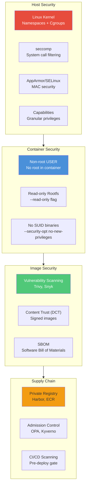

# Docker Security

## Definition
Docker security encompasses the practices, configurations, and tools used to secure containerized applications — from image integrity and runtime isolation to host-level hardening and secrets management.

## Real-World Example
**Bloomberg**: Runs thousands of containers in production with strict security controls. They use non-root users, read-only root filesystems, dropped kernel capabilities, and mandatory image scanning with Trivy to ensure all containers meet security baselines before deployment.

## Security Architecture



## Non-Root User

Always run containers as a non-root user to limit damage from container escapes.

```dockerfile
# Bad: runs as root
FROM node:20
WORKDIR /app
COPY . .
RUN npm install
CMD ["node", "server.js"]
# Container runs as root (UID 0)

# Good: runs as non-root
FROM node:20
RUN groupadd -r appgroup && useradd -r -g appgroup appuser
WORKDIR /app
COPY . .
RUN npm install && chown -R appuser:appgroup /app
USER appuser
CMD ["node", "server.js"]
# Container runs as appuser (UID 1000)
```

```bash
# Runtime user override
docker run --user 1000:1000 myapp

# Use predefined user from image
docker run --user www-data nginx
```

## Read-Only Root Filesystem

Prevents writing to the container's filesystem — all writes must go to mounted volumes.

```bash
# Run with read-only rootfs
docker run --read-only \
  --mount type=volume,target=/var/run \
  --mount type=tmpfs,target=/tmp \
  nginx

# Container cannot modify /etc, /usr, /bin
# Must explicitly allow writeable paths
```

```yaml
# Docker Compose
services:
  web:
    image: nginx:alpine
    read_only: true
    tmpfs:
      - /var/cache/nginx
    volumes:
      - nginx_run:/var/run
```

## Capability Dropping

Linux capabilities provide fine-grained access control. Drop all capabilities and add only what's needed.

```bash
# Drop all capabilities, add specific ones
docker run --cap-drop ALL --cap-add NET_BIND_SERVICE nginx

# Common capabilities
#   CHOWN       - change file ownership
#   NET_BIND    - bind to privileged ports (< 1024)
#   NET_RAW     - use raw sockets
#   SYS_TIME    - change system time
#   DAC_OVERRIDE - bypass file permission checks

# Run with no capabilities
docker run --cap-drop ALL --security-opt no-new-privileges:true alpine

# Grant specific capability
docker run --cap-drop ALL --cap-add SYS_PTRACE strace-container
```

## seccomp Profiles

seccomp (secure computing mode) restricts the system calls a container can make.

```bash
# Default Docker seccomp profile (blocks ~44 of ~300 syscalls)
docker run --security-opt seccomp=default nginx

# Custom seccomp profile
docker run --security-opt seccomp=custom-profile.json nginx
```

```json
// custom-profile.json — example
{
  "defaultAction": "SCMP_ACT_ERRNO",
  "architectures": ["SCMP_ARCH_X86_64"],
  "syscalls": [
    {
      "names": ["accept", "bind", "connect", "listen", "read", "write", "open", "close", "stat", "fstat", "mmap", "mprotect", "munmap", "brk", "sched_yield", "exit", "exit_group"],
      "action": "SCMP_ACT_ALLOW"
    },
    {
      "names": ["clone", "fork", "vfork"],
      "action": "SCMP_ACT_ALLOW",
      "args": [],
      "comment": "Process creation"
    }
  ]
}
```

## AppArmor and SELinux

Mandatory Access Control (MAC) profiles for additional container isolation.

```bash
# AppArmor — load profile for container
docker run --security-opt apparmor=my-custom-profile alpine

# SELinux — apply context
docker run --security-opt label=level:TopSecret alpine
docker run --security-opt label=type:container_t alpine

# Disable SELinux label confinement
docker run --security-opt label=disable alpine
```

## Image Vulnerability Scanning

### Trivy (Open Source)
```bash
# Scan a single image
trivy image nginx:1.25

# Scan all images in Docker
trivy image --severity CRITICAL,HIGH nginx:1.25

# Scan with detailed output
trivy image --format json --output results.json myapp:latest

# Scan Dockerfile
trivy config --severity CRITICAL,HIGH ./Dockerfile

# CI/CD integration
trivy image --exit-code 1 --severity CRITICAL myapp:latest
```

### Snyk
```bash
# Scan with Snyk
snyk container test nginx:1.25
snyk container monitor nginx:1.25

# Test Dockerfile
snyk iac test Dockerfile
```

## Docker Bench Security

Automated security audit based on CIS Docker Benchmark.

```bash
# Run Docker Bench Security
docker run --rm \
  --net host \
  --pid host \
  --userns host \
  --cap-add audit_control \
  -e DOCKER_CONTENT_TRUST=$DOCKER_CONTENT_TRUST \
  -v /var/lib:/var/lib:ro \
  -v /var/run/docker.sock:/var/run/docker.sock:ro \
  -v /usr/lib/systemd:/usr/lib/systemd:ro \
  -v /etc:/etc:ro \
  docker/docker-bench-security
```

```
Sample Output:
[INFO] 1.1.1  - Ensure a separate partition for containers
[PASS] 1.1.2  - Ensure the container host has been Hardened
[WARN] 1.1.3  - Ensure Docker is up to date
[PASS] 1.2.1  - Ensure container host architecture
[FAIL] 2.1    - Ensure network traffic is restricted between containers
```

## Docker Content Trust (DCT)

Signs and verifies images to ensure integrity and provenance.

```bash
# Enable content trust
export DOCKER_CONTENT_TRUST=1

# Push signed image
docker push myapp:latest
# Signs image with delegation keys

# Pull requires signature verification
docker pull myapp:latest
# Fails if image is unsigned or modified

# Generate keys
docker trust key generate signer-name
docker trust signer add --key cert.pem repo/signer-name

# Inspect trust data
docker trust inspect --pretty myapp:latest
```

### Key Hierarchy
```
Root Key
  └── Repository Key (per repository)
        └── Delegation Key (per signer)
              └── Tag Key (per image tag)
```

## Secrets Management

```bash
# Production: use Docker Swarm secrets
printf "my_secret_password" | docker secret create db_password -

docker service create \
  --secret db_password \
  --secret source=api_key,target=/app/config/api_key \
  --name myapp \
  myapp:latest

# Or use external secret stores
#   - HashiCorp Vault
#   - AWS Secrets Manager
#   - Azure Key Vault
#   - GCP Secret Manager
```

```yaml
# Docker Compose secrets (Swarm deploy only)
services:
  app:
    image: myapp:latest
    secrets:
      - db_password
      - source: api_key
        target: /app/config/api_key
        uid: '1000'
        gid: '1000'
        mode: 0400

secrets:
  db_password:
    external: true
  api_key:
    file: ./secrets/api_key.txt
```

## Security Checklist

```yaml
Complete Docker Security Checklist:

[ ] Run containers as non-root user
[ ] Use read-only root filesystem
[ ] Drop all capabilities, add only needed
[ ] Enable no-new-privileges
[ ] Use seccomp default profile
[ ] Enable AppArmor/SELinux
[ ] Scan images for vulnerabilities
[ ] Sign images with DCT
[ ] Use private registry with scanning
[ ] Limit resource usage (CPU, memory)
[ ] Use separate networks for isolation
[ ] Enable Docker Bench Security
[ ] Rotate secrets regularly
[ ] Use encrypted overlay networks
[ ] Audit container activities
[ ] Keep Docker up to date
```

## Best Practices

| Practice | Detail |
|----------|--------|
| **Least privilege** | Run as non-root, drop all capabilities, add only what's needed |
| **Read-only rootfs** | Prevents container compromise from modifying binaries |
| **Image scanning** | Scan every image in CI/CD, block critical vulnerabilities |
| **Signed images** | Enable DCT to prevent tampered images |
| **Private registry** | Use Harbor/ECR with vulnerability scanning |
| **Network segmentation** | Isolate containers by function on separate networks |
| **Resource limits** | Prevent DoS via CPU/memory limits |
| **No secrets in images** | Use secrets management, not ENV or COPY |
| **Security updates** | Regularly rebuild images with security patches |
| **Audit logging** | Enable Docker daemon audit logging |

## Interview Questions

1. How do you run a container without root privileges?
2. What is the purpose of Linux capabilities in Docker security?
3. How does seccomp protect containers from malicious system calls?
4. What is Docker Content Trust and how does it work?
5. How do you scan Docker images for vulnerabilities?
6. What is Docker Bench Security and what does it check?
7. How do you prevent a container from writing to the filesystem?
8. Compare AppArmor and SELinux for container security
9. How would you manage secrets for Docker containers in production?
10. What is the no-new-privileges flag and why is it important?
