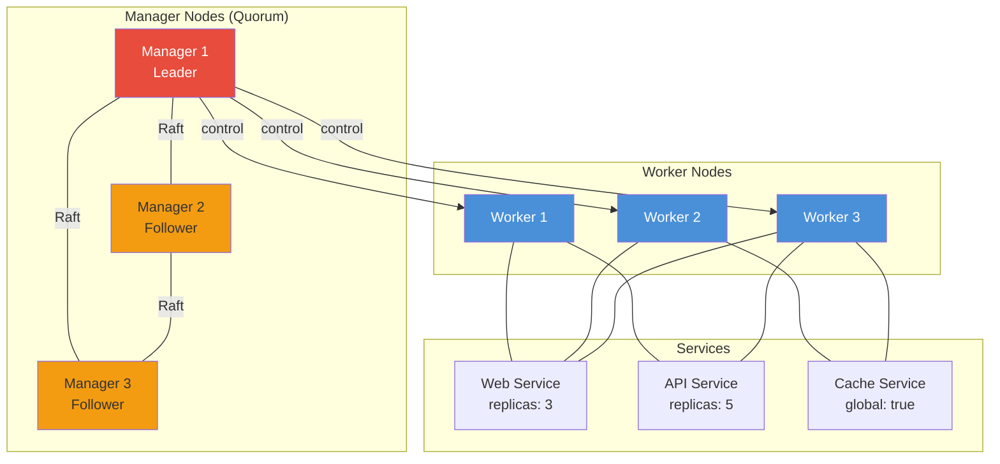
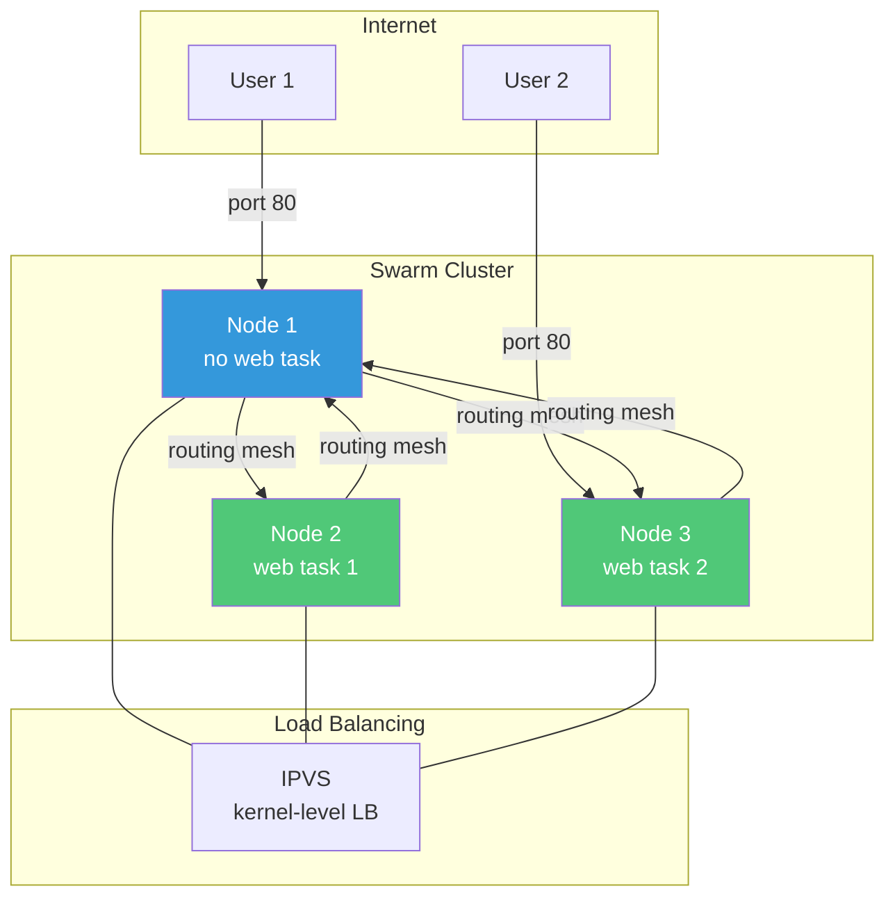

# Docker Swarm

## Definition
Docker Swarm is Docker's native clustering and orchestration solution. It converts a group of Docker hosts into a single virtual Docker host, enabling declarative service deployment, scaling, and management across multiple nodes.

## Real-World Example
**Play Framework** (Lightbend): Uses Docker Swarm to deploy reactive microservices across a cluster. Swarm's built-in routing mesh handles load balancing, rolling updates enable zero-downtime deployments, and the declarative model simplifies managing hundreds of services.

## Swarm Architecture



## Manager vs Worker Nodes

| Aspect | Manager | Worker |
|--------|---------|--------|
| **Role** | Cluster management, scheduling | Run containers (tasks) |
| **Raft quorum** | Participates | Does not participate |
| **API access** | Full | Restricted |
| **Scheduling** | Can schedule tasks | Executes assigned tasks |
| **Auto-accept** | Yes (by default) | Yes |
| **Promotion** | N/A | Can be promoted to manager |
| **Drain** | Can be drained | Can be drained |
| **Recommended count** | 3 or 5 | 3+ |

## Service vs Task

```
Service (declarative specification)
  ├── name: web
  ├── image: nginx:alpine
  ├── replicas: 3
  ├── ports: [80:80]
  └── restart_policy: on-failure
        │
        ▼
Tasks (running instances)
  ├── Task 1 → running on Worker 1
  ├── Task 2 → running on Worker 3
  └── Task 3 → running on Worker 1

Each task = one container + one slot.
If container fails → Swarm creates new task.
```

## Cluster Lifecycle

### Initialize Swarm
```bash
# Initialize manager
docker swarm init --advertise-addr 192.168.1.10

# Output:
# Swarm initialized: current node (abc123) is now a manager.
# To add a worker to this swarm, run the following command:
#   docker swarm join --token WORKER_TOKEN 192.168.1.10:2377
# To add a manager, run:
#   docker swarm join --token MANAGER_TOKEN 192.168.1.10:2377

# Generate join tokens
docker swarm join-token worker
docker swarm join-token manager

# Join as worker (on worker node)
docker swarm join --token SWMTKN-1-abc 192.168.1.10:2377

# List nodes
docker node ls
```

### Node Management
```bash
# Promote worker to manager
docker node promote worker1

# Demote manager to worker
docker node demote manager3

# Drain node (move tasks away)
docker node update --availability drain node4

# Activate node (accept tasks)
docker node update --availability active node4

# Remove node
docker node rm --force node4

# Label nodes
docker node update --label-add zone=us-east node1
docker node update --label-add role=db node2
```

## Service Deployment

```bash
# Create a replicated service
docker service create \
  --name web \
  --replicas 5 \
  --publish 80:80 \
  --update-delay 10s \
  --update-parallelism 2 \
  --restart-condition on-failure \
  --limit-cpu 0.5 \
  --limit-memory 256M \
  --mount type=volume,source=web_data,target=/var/www \
  --network frontend \
  nginx:alpine

# Create a global service (one per node)
docker service create \
  --name log-collector \
  --mode global \
  --mount type=bind,source=/var/log,target=/var/log \
  fluent/fluentd

# List services
docker service ls

# List tasks for service
docker service ps web

# Inspect service
docker service inspect --pretty web

# View service logs
docker service logs web

# Scale service
docker service scale web=10

# Update service
docker service update \
  --image nginx:1.25 \
  --replicas 3 \
  web

# Remove service
docker service rm web
```

## Stack Deploy

Deploy a complete application stack using Docker Compose format.

```yaml
# stack.yml
version: "3.9"

services:
  web:
    image: nginx:alpine
    ports:
      - "80:80"
    deploy:
      mode: replicated
      replicas: 3
      restart_policy:
        condition: on-failure
      update_config:
        parallelism: 1
        delay: 10s
        failure_action: rollback
      resources:
        limits:
          cpus: "0.5"
          memory: 256M
        reservations:
          cpus: "0.25"
          memory: 128M
      placement:
        constraints:
          - node.role == worker
          - node.labels.zone == us-east
    networks:
      - frontend

  api:
    image: myapp:latest
    environment:
      DB_HOST: postgres
    secrets:
      - db_password
    deploy:
      replicas: 5
      update_config:
        parallelism: 2
        delay: 5s
    networks:
      - backend
    depends_on:
      - postgres

  postgres:
    image: postgres:16
    volumes:
      - pgdata:/var/lib/postgresql/data
    environment:
      POSTGRES_DB: myapp
    secrets:
      - db_password
    deploy:
      mode: replicated
      replicas: 1
      placement:
        constraints:
          - node.labels.role == db
    networks:
      - backend

networks:
  frontend:
    driver: overlay
  backend:
    driver: overlay
    internal: true

volumes:
  pgdata:
    driver: local

secrets:
  db_password:
    external: true
```

```bash
# Deploy stack
docker stack deploy -c stack.yml myapp

# List stacks
docker stack ls

# List services in stack
docker stack services myapp

# List tasks in stack
docker stack ps myapp

# Remove stack
docker stack rm myapp
```

## Routing Mesh

Swarm's routing mesh (Ingress mode) load-balances incoming traffic across all nodes running the service.



### Port Publishing Modes
```bash
# Ingress mode (default) — routing mesh
docker service create --publish published=80,target=80 nginx

# Host mode — direct port binding on task node only
docker service create --publish mode=host,target=80,published=8080 nginx
```

## Rolling Updates

```bash
# Deploy with update configuration
docker service create \
  --name web \
  --replicas 5 \
  --update-delay 15s \
  --update-parallelism 2 \
  --update-failure-action rollback \
  --rollback-monitor 30s \
  nginx:1.24

# Update image
docker service update \
  --image nginx:1.25 \
  --update-delay 10s \
  web

# Manual rollback
docker service rollback web

# Custom rollback
docker service update \
  --rollback-parallelism 1 \
  --rollback-monitor 30s \
  web
```

```
Update flow for 5 replicas (parallelism=2, delay=10s):
  Time 0:  Stop 2 old → Start 2 new → Wait 10s
  Time 10: Stop 2 old → Start 2 new → Wait 10s
  Time 20: Stop 1 old → Start 1 new → Done
```

## Secrets and Configs

```bash
# Create secrets
echo "my_db_password" | docker secret create db_password -
docker secret create api_key ./secrets/api_key.txt

# Create configs
docker config create nginx.conf ./nginx.conf
docker config create app_config ./config.json

# Use in service
docker service create \
  --name web \
  --secret db_password \
  --secret source=api_key,target=/app/config/api_key,mode=0400 \
  --config source=nginx.conf,target=/etc/nginx/nginx.conf \
  nginx

# List
docker secret ls
docker config ls
```

### Secret Security
```
Secrets are:
  - Stored encrypted in Raft log
  - Only sent to nodes running the service
  - Mounted as in-memory tmpfs (never written to disk)
  - Available at /run/secrets/<name> inside container
  - Automatically removed when service removed
```

## Quorum

Swarm uses Raft consensus for cluster state management.

```
Manager Nodes:     3 nodes
Quorum required:   2 (majority)
Tolerated failure: 1 node

Manager Nodes:     5 nodes
Quorum required:   3 (majority)
Tolerated failure: 2 nodes

Formula:
  Quorum = floor(n/2) + 1
  Failures tolerated = n - quorum = floor((n-1)/2)
```

## Best Practices

| Practice | Detail |
|----------|--------|
| **Odd managers** | 3 or 5 managers for quorum (never even) |
| **Worker count** | At least 3 workers for fault tolerance |
| **Drain managers** | Mark managers with --availability drain |
| **Use stacks** | Always use docker stack deploy for production |
| **Resource limits** | Set CPU/memory limits on every service |
| **Healthchecks** | Add healthchecks for automatic recovery |
| **Encrypted overlay** | Use --opt encrypted for sensitive traffic |
| **Labels** | Label nodes for placement constraints |
| **Rolling updates** | Use parallelism and delay for zero-downtime |
| **Monitor quorum** | Lost quorum = cluster unresponsive |

## Interview Questions

1. How does Docker Swarm achieve high availability at the manager level?
2. What is the difference between a replicated service and a global service?
3. How does Swarm's routing mesh work?
4. Explain the difference between docker service update and docker service rollback
5. What is quorum in Swarm and why does it require an odd number of managers?
6. How do Secrets and Configs differ in Docker Swarm?
7. How does placement constraints control where tasks run?
8. What happens to tasks when a node is drained?
9. Compare docker stack deploy vs docker compose up
10. How would you perform a zero-downtime update in Swarm?
