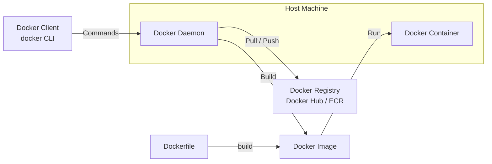

# Docker

## Definition
Docker is a containerization platform that packages applications and dependencies into lightweight, portable containers.

## Docker vs VM

```
┌──────────────────┐     ┌──────────────────┐
│    VM            │     │    Container     │
│                  │     │                  │
│ ┌──────────────┐ │     │ ┌──────────────┐ │
│ │ App A        │ │     │ │ App A        │ │
│ ├──────────────┤ │     │ ├──────────────┤ │
│ │ Libs         │ │     │ │ Libs         │ │
│ ├──────────────┤ │     │ └──────────────┘ │
│ │ Guest OS     │ │     │ ┌──────────────┐ │
│ └──────────────┘ │     │ │ Container    │ │
│ ┌──────────────┐ │     │ │ Runtime      │ │
│ │ Hypervisor   │ │     │ ├──────────────┤ │
│ └──────────────┘ │     │ │ Host OS      │ │
│ ┌──────────────┐ │     │ └──────────────┘ │
│ │ Host OS      │ │     └──────────────────┘
│ └──────────────┘ │     ~MB, seconds to start
└──────────────────┘
~GB, minutes to start
```



## Dockerfile Best Practices

```dockerfile
# Multi-stage build
FROM golang:1.21 AS builder
WORKDIR /app
COPY go.mod go.sum ./
RUN go mod download
COPY . .
RUN CGO_ENABLED=0 go build -o app

FROM alpine:3.18
RUN apk --no-cache add ca-certificates
WORKDIR /root/
COPY --from=builder /app/app .
CMD ["./app"]
```

## Interview Questions
1. How does Docker achieve container isolation?
2. What's the difference between COPY and ADD in a Dockerfile?
3. How do you optimize Docker image size?
4. Compare Docker containers and virtual machines
5. What is a multi-stage build and why is it useful?
