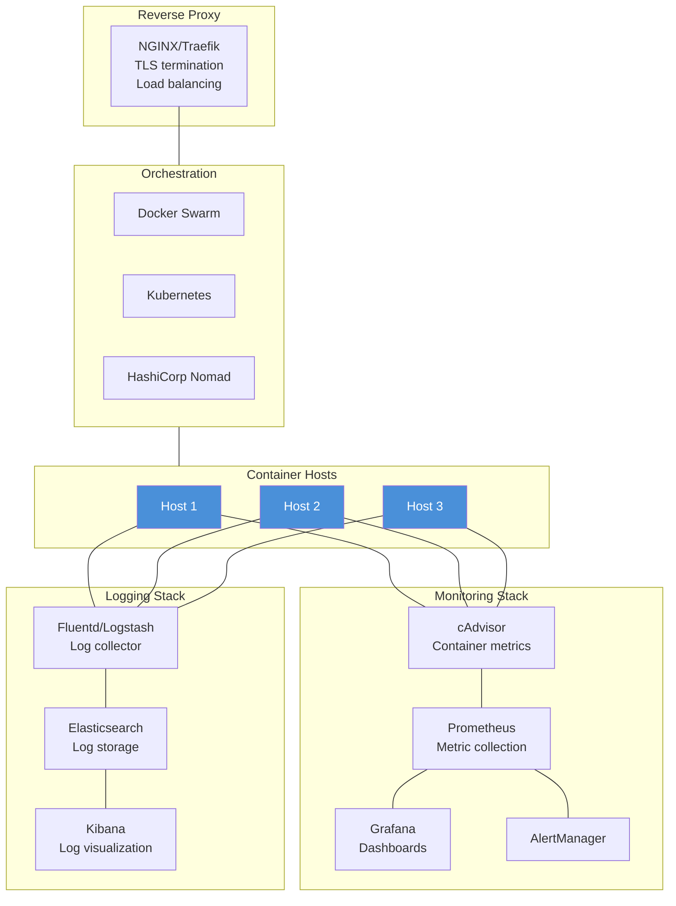

# Docker Production

## Definition
Running Docker in production requires robust configurations covering resource management, monitoring, logging, security, and orchestration — transforming Docker from a development tool into a production-grade platform.

## Real-World Example
**Spotify**: Runs thousands of containers in production using Docker with custom orchestration. They use resource limits to prevent noisy neighbors, structured logging with JSON format routed to central logging, and multi-stage builds producing minimal images for fast deployments across their global infrastructure.

## Production Architecture



## Resource Constraints

CPU and memory limits are critical for preventing noisy neighbors in shared environments.

```bash
# CPU constraints
docker run --cpus=1.5 myapp                # 1.5 CPU cores
docker run --cpuset-cpus=0-3 myapp         # Pin to CPUs 0-3
docker run --cpu-shares=512 myapp          # Relative weight (default 1024)

# Memory constraints
docker run --memory=512m myapp             # Hard limit
docker run --memory=512m --memory-reservation=256m myapp   # Soft limit
docker run --memory=512m --memory-swap=1g myapp           # Include swap

# Combined
docker run \
  --cpus=1.0 \
  --memory=512m \
  --memory-reservation=256m \
  --oom-kill-disable=false \
  myapp
```

```yaml
# Docker Compose production service
services:
  web:
    image: nginx:alpine
    deploy:
      resources:
        limits:
          cpus: "0.5"
          memory: 256M
        reservations:
          cpus: "0.25"
          memory: 128M
```

## OOM (Out of Memory) Handling

When a container exceeds its memory limit, Docker's OOM killer terminates it.

```
Memory Usage:
  │
  │    ┌────────┐
  │    │        │  OOM Kill threshold
  │    │ XXXXXX │  Container killed
  │    └────────┘
  │    ┌────────┐
  │    │////////│  Memory reservation (soft)
  │    │////////│  Container may be killed if host OOM
  │    └────────┘
  │    ┌────────┐
  │    │        │  Normal operation
  │    └────────┘
  └───────────────────────

Strategies:
  - Set memory limits (prevent OOM in first place)
  - Use memory reservations (soft limits)
  - Monitor memory usage trends
  - Set --oom-score-adj (OOM priority)
```

```bash
# Control OOM behavior
docker run --memory=512m \
  --memory-swap=512m \              # No swap
  --oom-kill-disable=false \        # Allow OOM kill
  --oom-score-adj=-500 \            # Lower OOM priority (less likely killed)
  myapp
```

## Restart Policies

| Policy | Behavior | Use Case |
|--------|----------|----------|
| **no** | Never restart | Batch jobs |
| **always** | Always restart unless manually stopped | Long-running daemons |
| **unless-stopped** | Same as always, but not after daemon restart | Most services |
| **on-failure** | Restart only on non-zero exit | Short-lived jobs |

```bash
docker run --restart always nginx
docker run --restart on-failure:5 myapp    # Max 5 retries
docker run --restart unless-stopped db
```

## Logging Drivers

Docker supports multiple logging drivers for shipping container logs.

```bash
# Production: JSON file driver (default)
docker run --log-driver json-file \
  --log-opt max-size=10m \
  --log-opt max-file=3 \
  nginx

# Forward to syslog
docker run --log-driver syslog \
  --log-opt syslog-address=tcp://192.168.1.100:514 \
  --log-opt tag="myapp" \
  nginx

# Forward to Fluentd
docker run --log-driver fluentd \
  --log-opt fluentd-address=localhost:24224 \
  --log-opt tag="docker.{{.Name}}" \
  nginx

# AWS CloudWatch
docker run --log-driver awslogs \
  --log-opt awslogs-region=us-east-1 \
  --log-opt awslogs-group=myapp-logs \
  --log-opt awslogs-stream=web \
  nginx

# GCP Stackdriver
docker run --log-driver gcplogs \
  --log-opt log-cmd=true \
  nginx
```

### Structured Logging (from inside container)
```python
# Python - log structured JSON
import json, logging

logging.basicConfig(
    format='{"time": "%(asctime)s", "level": "%(levelname)s", "msg": "%(message)s"}',
    stream=sys.stdout
)
logging.info("User logged in", extra={"user_id": 12345})

# Output:
# {"time": "2024-01-15 10:30:00", "level": "INFO", "msg": "User logged in", "user_id": 12345}
```

## Docker Monitoring

### docker stats
```bash
# Real-time container metrics
docker stats --no-stream
docker stats --format "table {{.Name}}\t{{.CPUPerc}}\t{{.MemUsage}}"

CONTAINER ID   NAME      CPU %     MEM USAGE / LIMIT     MEM %     NET I/O
abc123         web       2.35%     45.2MiB / 256MiB      17.66%    1.2kB / 640B
def456         api       12.50%    128.1MiB / 512MiB     25.02%    3.5kB / 1.2kB
```

### cAdvisor (Container Advisor)
```bash
# Deploy cAdvisor
docker run --rm \
  --volume=/var/run/docker.sock:/var/run/docker.sock:ro \
  --volume=/sys:/sys:ro \
  --volume=/var/lib/docker/:/var/lib/docker:ro \
  --publish=8080:8080 \
  --name=cadvisor \
  gcr.io/cadvisor/cadvisor:latest

# Access UI at http://localhost:8080
# Exposes Prometheus metrics at /metrics
```

### Prometheus + Grafana
```yaml
# docker-compose.monitoring.yml
services:
  prometheus:
    image: prom/prometheus
    volumes:
      - ./prometheus.yml:/etc/prometheus/prometheus.yml
    ports:
      - "9090:9090"

  grafana:
    image: grafana/grafana
    environment:
      - GF_AUTH_ANONYMOUS_ENABLED=true
    ports:
      - "3000:3000"
```

## Reverse Proxy (NGINX / Traefik)

### NGINX
```yaml
services:
  nginx:
    image: nginx:alpine
    ports:
      - "80:80"
      - "443:443"
    volumes:
      - ./nginx.conf:/etc/nginx/nginx.conf:ro
      - /etc/letsencrypt:/etc/letsencrypt:ro
    depends_on:
      - web
      - api

  web:
    image: myapp-web:latest
    expose:
      - "3000"

  api:
    image: myapp-api:latest
    expose:
      - "8080"
```

### Traefik (Cloud Native)
```yaml
services:
  traefik:
    image: traefik:v3.0
    command:
      - "--api.insecure=true"
      - "--providers.docker=true"
      - "--providers.docker.exposedbydefault=false"
      - "--entrypoints.web.address=:80"
      - "--entrypoints.websecure.address=:443"
      - "--certificatesresolvers.letsencrypt.acme.tlschallenge=true"
      - "--certificatesresolvers.letsencrypt.acme.email=admin@example.com"
      - "--certificatesresolvers.letsencrypt.acme.storage=/letsencrypt/acme.json"
    ports:
      - "80:80"
      - "443:443"
    volumes:
      - "/var/run/docker.sock:/var/run/docker.sock:ro"
      - "letsencrypt:/letsencrypt"

  web:
    image: myapp:latest
    labels:
      - "traefik.enable=true"
      - "traefik.http.routers.web.rule=Host(`example.com`)"
      - "traefik.http.routers.web.entrypoints=websecure"
      - "traefik.http.routers.web.tls.certresolver=letsencrypt"
      - "traefik.http.services.web.loadbalancer.server.port=3000"
```

## Container Orchestration Comparison

| Feature | Docker Swarm | Kubernetes (K8s) | HashiCorp Nomad |
|---------|-------------|------------------|-----------------|
| **Setup complexity** | Low | High | Medium |
| **Learning curve** | Low | High | Medium |
| **Built-in** | Docker native | Separate install | Separate install |
| **Service discovery** | DNS + VIP | DNS (CoreDNS) | DNS (Consul) |
| **Load balancing** | Ingress routing mesh | Service + Ingress | Fabio/Envoy |
| **Scaling** | Manual, CPU | HPA (CPU, custom) | Nomad autoscaler |
| **Rolling updates** | Built-in | Deployments | Job update |
| **Stateful workloads** | Volumes + constraints | StatefulSets, PVC | Volumes + CSI |
| **Networking** | Overlay (VXLAN) | CNI (Calico, Cilium) | CNI + Consul Connect |
| **Security** | RBAC, secrets | RBAC, PSP, OPA | ACL, Vault integration |
| **Monitoring** | Third-party (cAdvisor) | Built-in (metrics-server) | Consul + third-party |
| **Ecosystem** | Small | Large (Helm, Operators) | Medium |
| **Multi-cloud** | Limited | Strong | Strong |
| **Schedule batch jobs** | docker service create | Job/CronJob | Job + Periodic |
| **Best for** | Small-medium deployments | Enterprise, complex | Ops teams, simplicity |

## Production Best Practices Summary

| Area | Best Practice |
|------|---------------|
| **Images** | Multi-stage builds, specific tags, scan for vulnerabilities |
| **Resources** | Set CPU/memory limits on every container |
| **Logging** | Use structured JSON logging, ship to central storage |
| **Monitoring** | Deploy cAdvisor + Prometheus + Grafana |
| **Restart** | Use unless-stopped or on-failure policies |
| **Security** | Non-root user, read-only rootfs, drop capabilities |
| **Secrets** | Use Swarm secrets or Vault (not env vars) |
| **Healthchecks** | Add HEALTHCHECK to Dockerfile |
| **Labels** | Label containers for automation and cleanup |
| **Networks** | User-defined bridge/overlay with isolation |
| **Backups** | Regular volume backups to object storage |
| **Updates** | Rolling updates with health check gating |
| **Cleanup** | Regular docker system prune |
| **CI/CD** | Build and scan in CI, deploy with gitops |
| **Documentation** | Maintain runbooks for incident response |

## Interview Questions

1. How do you prevent a single container from consuming all host resources?
2. What restart policy would you use for a database container vs a web server?
3. How would you set up centralized logging for a Docker production environment?
4. Compare Docker Swarm, Kubernetes, and Nomad for production orchestration
5. What is cAdvisor and how does it help with container monitoring?
6. How do you handle secrets in a Docker production environment?
7. How does the OOM killer work in Docker and how do you control it?
8. What logging driver would you use for shipping logs to Elasticsearch?
9. How would you do a zero-downtime deployment with Docker?
10. What metrics should you monitor for Docker containers in production?
