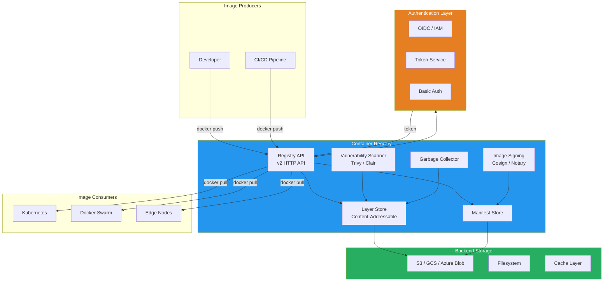

# Docker Container Registries

## What Is It?
A container registry is a storage and distribution system for container images. It provides versioned storage, access control, and distribution mechanisms that allow Docker clients to push and pull images across environments, from development to production.

## Why It Was Created
As container adoption grew, organizations needed a centralized, secure, and reliable way to store and share container images. Docker Hub provided the first public registry, but enterprises required private registries with access control, audit logging, vulnerability scanning, geo-replication, and integration with cloud provider IAM systems. Registries evolved to become the trusted distribution layer in the container supply chain.

## When to Use It
- **Every CI/CD pipeline** — store built images before deployment
- **Production deployments** — pull known-immutable image digests
- **Air-gapped environments** — mirror images to a private registry
- **Multi-team organizations** — enforce access controls and audit trails
- **Compliance-heavy industries** — image signing and SBOM generation
- **Edge/multi-cloud deployments** — geo-replicated registries for low-latency pulls

## Registry Architecture



## Major Registry Providers

### Docker Hub
Docker's official public registry, the default registry for Docker Engine.

| Feature | Free | Pro | Team | Business |
|---------|------|-----|------|----------|
| **Private repos** | 1 | 500 | Unlimited | Unlimited |
| **Pull rate limit** | 100 pulls/6h (anon)<br/>200 pulls/6h (auth) | Unlimited | Unlimited | Unlimited |
| **Image scanning** | Basic | Advanced | Advanced | Advanced |
| **Collaborators** | 1 | 5 | Unlimited | Unlimited |
| **Automated builds** | — | ✓ | ✓ | ✓ |
| **Price** | Free | $9/month | $15/user/month | $21/user/month |

### Amazon Elastic Container Registry (ECR)
AWS-managed private registry integrated with IAM, VPC endpoints, and ECS/EKS.

| Feature | Detail |
|---------|--------|
| **Storage** | Pay-per-GB stored, pay-per-GB transferred |
| **Pricing** | $0.10/GB/month for storage + data transfer costs |
| **Scanning** | Enhanced scanning with Amazon Inspector ($0.01/image scan) |
| **Replication** | Cross-region and cross-account replication |
| **Lifecycle** | Automated image expiration policies |
| **Throughput** | Up to 10 Gbps per repository |

### Google Artifact Registry (formerly GCR)
GCP's unified artifact management service.

| Feature | Detail |
|---------|--------|
| **Pricing** | $0.10/GB/month (first 0.5GB free) |
| **Scanning** | OS and package-level vulnerability scanning (free) |
| **Vulnerability analysis** | Automatic on push or on-demand |
| **Formats** | Docker, Maven, npm, Apt, Yum |
| **Regions** | Multi-region support |
| **Cleanup** | Automatic cleanup policies |

### Azure Container Registry (ACR)
Azure-managed registry with integrated AAD authentication.

| Tier | Storage | Throughput | Price |
|------|---------|------------|-------|
| **Basic** | 10GB | 1 read/sec, 1 write/sec | ~$0.67/day |
| **Standard** | 100GB | 10 read/sec, 5 write/sec | ~$2.40/day |
| **Premium** | 500GB | 50 read/sec, 20 write/sec | ~$6.34/day |

### Harbor
An open-source, CNCF-graduated cloud-native registry with built-in security.

| Feature | Detail |
|---------|--------|
| **License** | Open source (Apache 2.0) |
| **Vulnerability scanning** | Integrated with Trivy, Clair, Aqua |
| **Replication** | Push/pull replication between registries |
| **RBAC** | Project-level role-based access control |
| **Garbage collection** | Online and offline GC |
| **Image retention** | Tag-based retention policies |
| **Audit logging** | Full audit trail |
| **Notary integration** | Image signing with Docker Content Trust |

## Hands-On Examples

### Pushing and Pulling Images

```bash
# Login to registry
docker login docker.io
docker login myregistry.azurecr.io
aws ecr get-login-password --region us-east-1 | docker login --username AWS --password-stdin 123456789.dkr.ecr.us-east-1.amazonaws.com
gcloud auth configure-docker us-central1-docker.pkg.dev

# Tag and push
docker tag myapp:latest docker.io/myorg/myapp:v1.0.0
docker push docker.io/myorg/myapp:v1.0.0

# Pull by digest for immutability
docker pull myregistry.azurecr.io/myapp@sha256:a4b8c9d0e1f2...

# Pull from private registry
docker pull 123456789.dkr.ecr.us-east-1.amazonaws.com/myapp:v1.0.0
```

### Harbor Deployment with Docker Compose
```yaml
version: "3.9"
services:
  harbor:
    image: goharbor/harbor-core:v2.10.0
    ports:
      - 80:8080
      - 443:8443
    volumes:
      - harbor_data:/data
      - ./harbor.yml:/etc/harbor/harbor.yml
    environment:
      - HARBOR_ADMIN_PASSWORD=${HARBOR_PASSWORD}
    networks:
      - harbor_net

  harbor-db:
    image: goharbor/harbor-db:v2.10.0
    volumes:
      - harbor_db:/var/lib/postgresql/data
    networks:
      - harbor_net

  harbor-redis:
    image: goharbor/harbor-redis:v2.10.0
    networks:
      - harbor_net

  trivy:
    image: goharbor/trivy-adapter:v2.10.0
    environment:
      - TRIVY_DEBUG=false
      - SCANNER_STORE_REDIS_URL=redis://harbor-redis:6379/0
    networks:
      - harbor_net

networks:
  harbor_net:
    driver: bridge

volumes:
  harbor_data:
  harbor_db:
```

### Image Scanning with Trivy
```bash
# Scan a local image
trivy image myapp:latest

# Scan with severity filter
trivy image --severity CRITICAL,HIGH myapp:latest

# Scan and output JSON
trivy image --format json --output scan.json myapp:latest

# Scan in CI/CD pipeline
trivy image --exit-code 1 --severity CRITICAL myapp:latest

# Scan a remote image without pulling
trivy image --scanners vuln,secret,misconfig docker.io/myorg/myapp:v1.0.0
```

### Image Signing with Cosign
```bash
# Generate a key pair
cosign generate-key-pair

# Sign an image
cosign sign --key cosign.key myregistry.io/myapp:v1.0.0

# Verify an image
cosign verify --key cosign.pub myregistry.io/myapp:v1.0.0

# Sign with keyless signing (OIDC)
cosign sign myregistry.io/myapp:v1.0.0

# Verify keyless
cosign verify myregistry.io/myapp:v1.0.0

# Add an SBOM
cosign attach sbom --sbom sbom.spdx myregistry.io/myapp:v1.0.0

# Verify SBOM attestation
cosign verify-attestation --type spdx myregistry.io/myapp:v1.0.0
```

### Registry Garbage Collection
```bash
# Docker distribution GC (requires maintenance mode)
docker-registry garbage-collect /etc/docker/registry/config.yml

# Harbor online GC
curl -X POST -u admin:password "https://harbor.example.com/api/v2.0/system/gc/schedule" \
  -H "Content-Type: application/json" \
  -d '{"schedule": {"type": "Daily", "offtime": "03:00"}}'

# ACR purge untagged images
az acr run --registry myregistry \
  --cmd "acr purge --filter 'myapp:.*' --untagged --ago 30d" /dev/null

# ECR lifecycle policy
aws ecr put-lifecycle-policy \
  --repository-name myapp \
  --lifecycle-policy-text '{
    "rules": [{
      "rulePriority": 1,
      "description": "Expire untagged images older than 14 days",
      "selection": {
        "tagStatus": "untagged",
        "countType": "sinceImagePushed",
        "countUnit": "days",
        "countNumber": 14
      },
      "action": {"type": "expire"}
    }]
  }'
```

## Pricing Model or Cost Considerations

### Cost Components
| Component | Typical Cost | Optimization |
|-----------|-------------|--------------|
| **Storage** | $0.05–$0.15/GB/month | Remove unused images, use compression |
| **Data transfer out** | $0.05–$0.12/GB | Use same-region pulls, cache at edge |
| **Scanning** | $0.00–$0.01/image | Only scan on promotion to production |
| **API requests** | Often included | Minimize unnecessary pulls with image caching |
| **Geo-replication** | $10–$100/month per region | Replicate only critical images |

### Cost-Saving Strategies
- **Pull-through caches** — Deploy a local Harbor or Nexus registry as a proxy cache
- **Image optimization** — Multi-stage builds reduce image size by 50-80%
- **Lifecycle policies** — Automatically expire untagged and old images
- **Same-region pulls** — Always pull images from the same cloud region as compute
- **Layer sharing** — Base images shared across team reduce storage costs significantly

## Best Practices

| Practice | Detail |
|----------|--------|
| **Use immutable tags** | Reference images by digest, never re-tag `latest` |
| **Sign all images** | Use Cosign or Notary for supply chain integrity |
| **Scan before deploy** | Reject images with CRITICAL vulnerabilities at CI gate |
| **Enforce least privilege** | Service accounts get pull-only access; CI gets push-only |
| **Enable audit logging** | Track who pushed/pulled what and when |
| **Set lifecycle policies** | Auto-clean untagged and old images |
| **Use dedicated registry per env** | Separate dev/staging/prod namespaces or registries |
| **Rate limit pulls** | Protect against runaway pull costs and throttling |
| **Geo-replicate for global teams** | Place registries close to compute for fast pulls |
| **Vet base images** | Use only approved, scanned base images from curated registry |

## Interview Questions

1. How does the Docker registry HTTP API V2 handle image distribution? Explain the manifest and layer pull flow.
2. What is the difference between a public and private container registry, and when would you use each?
3. How does image signing with Cosign protect against supply chain attacks? Explain the keyless signing workflow.
4. What strategies can you use to optimize container pull times in a production environment?
5. Explain how garbage collection works in Docker registries and why it's necessary.
6. Compare Docker Hub, Harbor, ECR, and ACR for enterprise use — what factors drive the choice?
7. How do you implement vulnerability scanning in a CI/CD pipeline? What tools integrate with registries?
8. What is the difference between a manifest list (multi-arch) and a single-architecture manifest?
9. How would you design a registry strategy for a multi-cloud, global organization?
10. Explain the concept of pull-through cache registries and when you'd deploy one.

## Real Company Usage

**Shopify**: Operates thousands of containers across multiple regions using ECR with cross-region replication. They enforce immutable image tags with digest-based deployments, use automated lifecycle policies to expire old images, and scan every image with Trivy before allowing it into production. Their CI pipeline builds multi-arch images (amd64 + arm64) and pushes them to ECR with Cosign signatures attached.

**Pinterest**: Migrated from Docker Hub to Harbor for better audit trails and RBAC. They run Harbor in HA mode behind a load balancer, replicating images to a disaster recovery region. Each team at Pinterest has isolated Harbor projects with per-team quotas, and images are automatically garbage-collected after 90 days of inactivity. All images are scanned with Clair before deployment, and critical vulnerabilities block the build.

**Goldman Sachs**: In their regulated financial environment, they deployed Harbor with Notary integration for image signing and verification. Every image must be signed by both the developer and the CI system before it can be deployed to production. They use Cosign for keyless signing tied to their corporate OIDC provider, and all image pulls are logged to their SIEM for compliance auditing.
