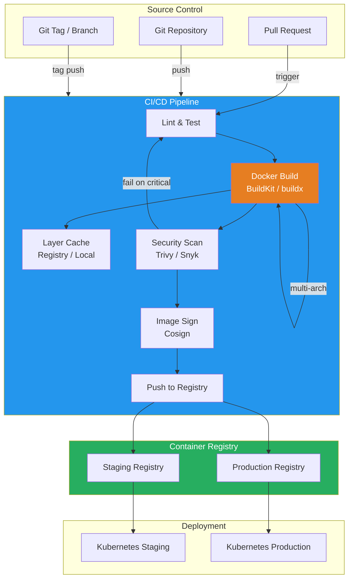

# Docker in CI/CD

## What Is It?
Docker in CI/CD refers to the integration of container build, test, and deployment pipelines into continuous integration and continuous delivery workflows. It leverages Docker's image-based packaging to create reproducible, cacheable builds that produce immutable deployment artifacts.

## Why It Was Created
Traditional CI/CD suffered from "works on my machine" problems, inconsistent build environments, slow pipelines due to dependency installation, and no reliable caching mechanism. Docker solves this by wrapping the build in a container with deterministic tooling, caching layers, and producing self-contained images that can be deployed identically anywhere.

## When to Use It
- **Every build pipeline** — produce container images as deployable artifacts
- **Multi-architecture deployments** — build for amd64 + arm64 simultaneously
- **Fast iteration cycles** — leverage layer caching for sub-minute rebuilds
- **In-cluster building** — build images inside Kubernetes without Docker daemon
- **Air-gapped environments** — pre-cache all layers in a private registry
- **Complex build matrices** — test across multiple base images or configurations

## CI/CD Architecture with Docker



## Layer Caching Strategies

### How Docker Layer Caching Works
Every Dockerfile instruction creates a layer. If the instruction and its context haven't changed, Docker reuses the cached layer instead of re-executing the instruction.

### Structure-Sensitive Caching
```dockerfile
FROM node:20-alpine AS base
WORKDIR /app

# Cache these layers first — they change infrequently
COPY package.json package-lock.json ./
RUN npm ci --only=production

# Cache TypeScript config separately
COPY tsconfig.json ./
RUN npm run build

# Application source changes most frequently — last layer
COPY src/ ./src/
```

### Cache Mounts for Package Managers
```dockerfile
FROM node:20-alpine
WORKDIR /app

# Cache npm global cache across builds
RUN --mount=type=cache,target=/root/.npm \
    npm ci

# Cache pip packages
FROM python:3.12-slim
RUN --mount=type=cache,target=/root/.cache/pip \
    pip install -r requirements.txt

# Cache apt packages
FROM ubuntu:22.04
RUN --mount=type=cache,target=/var/cache/apt \
    apt-get update && apt-get install -y build-essential
```

### Dockerfile Cache Busting
```dockerfile
# Bust cache when base image updates
ARG CACHE_BUST=1
FROM node:20-alpine

# Bust cache when build args change
ARG BUILD_DATE
RUN echo "Build date: $BUILD_DATE"

# Use --cache-from with remote registry
# docker build --cache-from myregistry.io/myapp:cache --tag myapp:latest .
```

## Multi-Arch Builds with buildx

### Setting Up buildx
```bash
# Create a multi-arch builder instance
docker buildx create --name multiarch --driver docker-container --use

# List available platforms
docker buildx ls

# Bootstrap the builder
docker buildx inspect --bootstrap
```

### Building Multi-Arch Images
```bash
# Build for multiple platforms simultaneously
docker buildx build \
  --platform linux/amd64,linux/arm64,linux/arm/v7 \
  --tag myregistry.io/myapp:v1.0.0 \
  --push .

# Build with cache from registry
docker buildx build \
  --platform linux/amd64,linux/arm64 \
  --cache-from type=registry,ref=myregistry.io/myapp:cache \
  --cache-to type=registry,ref=myregistry.io/myapp:cache,mode=max \
  --tag myregistry.io/myapp:v1.0.0 \
  --push .

# Build and load into local Docker (single platform)
docker buildx build --platform linux/amd64 --load -t myapp:latest .
```

### Dockerfile Considerations for Multi-Arch
```dockerfile
FROM --platform=$BUILDPLATFORM node:20-alpine AS base
ARG TARGETPLATFORM
ARG BUILDPLATFORM
ARG TARGETARCH

RUN echo "Building for $TARGETPLATFORM on $BUILDPLATFORM"

# Architecture-specific installations
RUN if [ "$TARGETARCH" = "arm64" ]; then \
      apk add --no-cache chromium; \
    else \
      apk add --no-cache chromium; \
    fi

FROM base AS final
COPY --from=base /app /app
```

## Docker BuildKit

BuildKit is Docker's next-generation build subsystem, enabled by default since Docker 23.0.

### Key Features
```bash
# Enable BuildKit
export DOCKER_BUILDKIT=1

# Build with BuildKit
docker build --progress=plain -t myapp:latest .

# View BuildKit cache
docker buildx du

# Clear BuildKit cache
docker buildx prune
```

### BuildKit-Specific Features
```dockerfile
# syntax = docker/dockerfile:1.7
FROM node:20-alpine

# Secret mounting (no secret in image layers)
RUN --mount=type=secret,id=npmrc,target=/root/.npmrc \
    npm ci --only=production

# SSH agent forwarding for private repos
RUN --mount=type=ssh \
    git clone git@github.com:myorg/private-lib.git

# Bind mount for faster builds
RUN --mount=type=bind,from=base,source=/build,target=/build \
    cp -r /build /app/build

# Output to filesystem (not image layers)
FROM scratch AS outputs
COPY --from=build /app/dist /dist
```

## CI/CD Integrations

### GitHub Actions
```yaml
name: Docker Build and Push

on:
  push:
    branches: [main]
    tags: ["v*"]

jobs:
  build:
    runs-on: ubuntu-latest
    steps:
      - uses: actions/checkout@v4

      - name: Set up Docker Buildx
        uses: docker/setup-buildx-action@v3

      - name: Login to Docker Hub
        uses: docker/login-action@v3
        with:
          username: ${{ secrets.DOCKER_USERNAME }}
          password: ${{ secrets.DOCKER_PASSWORD }}

      - name: Extract metadata
        id: meta
        uses: docker/metadata-action@v5
        with:
          images: myorg/myapp
          tags: |
            type=ref,event=branch
            type=ref,event=tag
            type=sha,format=long
            type=raw,value=latest,enable={{is_default_branch}}

      - name: Build and push
        uses: docker/build-push-action@v5
        with:
          context: .
          platforms: linux/amd64,linux/arm64
          push: true
          tags: ${{ steps.meta.outputs.tags }}
          labels: ${{ steps.meta.outputs.labels }}
          cache-from: type=gha
          cache-to: type=gha,mode=max

      - name: Scan image
        uses: aquasecurity/trivy-action@master
        with:
          image-ref: myorg/myapp:${{ github.sha }}
          format: sarif
          output: trivy-results.sarif
          severity: CRITICAL,HIGH
          exit-code: 1
```

### GitLab CI
```yaml
variables:
  DOCKER_BUILDKIT: "1"
  BUILDKIT_PROGRESS: "plain"

stages:
  - build
  - scan
  - push

build:
  stage: build
  image: docker:25
  services:
    - docker:25-dind
  script:
    - docker login -u $CI_REGISTRY_USER -p $CI_REGISTRY_PASSWORD $CI_REGISTRY
    - docker buildx create --use --driver docker-container
    - docker buildx build
        --cache-from type=registry,ref=$CI_REGISTRY_IMAGE:cache
        --cache-to type=registry,ref=$CI_REGISTRY_IMAGE:cache,mode=max
        --tag $CI_REGISTRY_IMAGE:$CI_COMMIT_SHA
        --tag $CI_REGISTRY_IMAGE:$CI_COMMIT_REF_SLUG
        --push
        .

scan:
  stage: scan
  image: aquasec/trivy:latest
  script:
    - trivy image --exit-code 1 --severity CRITICAL $CI_REGISTRY_IMAGE:$CI_COMMIT_SHA

deploy:
  stage: deploy
  image: bitnami/kubectl:latest
  script:
    - kubectl set image deployment/myapp myapp=$CI_REGISTRY_IMAGE:$CI_COMMIT_SHA
  environment:
    name: production
```

## Kaniko for In-Cluster Building

Kaniko builds container images inside Kubernetes without Docker daemon access — ideal for secure, in-cluster CI/CD.

### Running Kaniko
```yaml
apiVersion: v1
kind: Pod
metadata:
  name: kaniko-build
spec:
  containers:
    - name: kaniko
      image: gcr.io/kaniko-project/executor:latest
      args:
        - --dockerfile=Dockerfile
        - --context=git://github.com/myorg/myapp.git
        - --destination=myregistry.io/myapp:$BUILD_NUMBER
        - --cache=true
        - --cache-repo=myregistry.io/myapp/cache
      volumeMounts:
        - name: docker-config
          mountPath: /kaniko/.docker/
      env:
        - name: GOOGLE_APPLICATION_CREDENTIALS
          value: /kaniko/.docker/gcp-key.json
  volumes:
    - name: docker-config
      secret:
        secretName: docker-credentials
  restartPolicy: Never
```

### Kaniko with GitLab CI (Kubernetes Executor)
```yaml
kaniko-build:
  stage: build
  image:
    name: gcr.io/kaniko-project/executor:debug
    entrypoint: [""]
  script:
    - /kaniko/executor
        --context=$CI_PROJECT_DIR
        --dockerfile=$CI_PROJECT_DIR/Dockerfile
        --destination=$CI_REGISTRY_IMAGE:$CI_COMMIT_SHA
        --cache=true
        --cache-repo=$CI_REGISTRY_IMAGE/cache
  tags:
    - kubernetes
```

## Docker Bake

Docker Bake is a declarative build automation tool using HCL or YAML files, integrated into BuildKit.

### docker-bake.hcl
```hcl
variable "IMAGE_TAG" {
  default = "latest"
}

variable "REGISTRY" {
  default = "myregistry.io"
}

group "default" {
  targets = ["app", "worker", "migrate"]
}

target "app" {
  context = "."
  dockerfile = "Dockerfile"
  tags = [
    "${REGISTRY}/myapp:${IMAGE_TAG}",
    "${REGISTRY}/myapp:${IMAGE_TAG}-amd64"
  ]
  platforms = ["linux/amd64", "linux/arm64"]
  cache-from = ["type=registry,ref=${REGISTRY}/myapp:cache"]
  cache-to = ["type=registry,ref=${REGISTRY}/myapp:cache,mode=max"]
  labels = {
    "org.label-schema.build-date" = timestamp()
    "org.label-schema.vcs-ref" = "${IMAGE_TAG}"
  }
}

target "worker" {
  context = "./worker"
  dockerfile = "Dockerfile.worker"
  tags = ["${REGISTRY}/myapp-worker:${IMAGE_TAG}"]
  platforms = ["linux/amd64"]
}

target "migrate" {
  context = "./migrate"
  dockerfile = "Dockerfile.migrate"
  tags = ["${REGISTRY}/myapp-migrate:${IMAGE_TAG}"]
  platforms = ["linux/amd64"]
}
```

### Running Bake
```bash
# Build all targets
docker bake

# Build specific target
docker bake app

# Override variables
docker bake --set app.tags=myapp:dev app

# Bake with file
docker bake -f docker-bake.hcl

# Push all targets
docker bake --push
```

## Pricing Model or Cost Considerations

| Component | Cost Factor | Optimization |
|-----------|-------------|--------------|
| **Build minutes** | CI provider charges per minute | Layer caching reduces rebuild time by 60–80% |
| **Storage for cache** | Registry storage costs | Use ephemeral cache, prune regularly |
| **Multi-arch builds** | Emulation (QEMU) is 3-5x slower | Use native arm64 runners |
| **Network transfer** | Pulling base images repeatedly | Use mirror registry, pin base images |
| **Kaniko resources** | CPU/memory for in-cluster builds | Set resource limits, use spot nodes |

## Best Practices

| Practice | Detail |
|----------|--------|
| **Leverage layer caching** | Order Dockerfile instructions from least to most volatile |
| **Use cache mounts** | Speed up package manager operations by 10-50x |
| **Build multi-arch simultaneously** | One `buildx` command for amd64 + arm64 |
| **Pin base image digests** | Use `@sha256:` for reproducible builds |
| **Scan before pushing** | Gate builds on vulnerability scan results |
| **Sign images** | Use Cosign to create a verifiable supply chain |
| **Separate cache per branch** | Different caches for main, feature, and PR branches |
| **Use BuildKit secrets** | Never bake credentials into image layers |
| **Set build timeouts** | Prevent runaway builds from burning CI minutes |
| **Tag with metadata** | Include commit SHA, branch, timestamp for traceability |

## Interview Questions

1. How does Docker layer caching work and how would you optimize a Dockerfile for CI/CD performance?
2. What is the difference between BuildKit and the traditional Docker builder, and what advantages does BuildKit offer?
3. Explain how multi-arch builds work in Docker — what is a manifest list and how does the client select the right image?
4. Compare Kaniko, Docker BuildKit, and `docker build` for building images inside a Kubernetes cluster.
5. How do you implement efficient Docker layer caching in GitHub Actions? What cache backends are available?
6. What is Docker Bake and when would you use it over docker-compose for builds?
7. How does `--cache-from` and `--cache-to` work with buildx? What's the difference between `mode=min` and `mode=max`?
8. Explain the security implications of Docker-in-Docker (DinD) vs using BuildKit or Kaniko in CI pipelines.
9. How would you design a CI/CD pipeline that builds images for both x86 and ARM architectures and deploys to a mixed cluster?
10. What strategies reduce image build time in CI from 10 minutes to under 1 minute?

## Real Company Usage

**Uber**: Migrated their build infrastructure to BuildKit with buildx for multi-architecture support as they adopted ARM-based servers. They use a custom cache backend distributed across S3 buckets with per-team namespaces, reducing average build times from 12 minutes to 90 seconds. Their CI pipeline builds 3000+ images daily across amd64 and arm64, with Cosign signatures attached to every production image.

**ByteDance (TikTok)**: Deployed Kaniko for in-cluster building across thousands of Kubernetes nodes, processing over 10,000 builds per day. They chose Kaniko over Docker-in-Docker to avoid privileged containers and reduce security risk. Layer caching is implemented using a dedicated GCR cache repository with a 7-day TTL, while critical vulnerabilities blocking promotion are enforced via Trivy integration at the CI gate.

**Adobe**: Uses Docker Bake to manage their monorepo's complex build matrix, which produces 150+ container images from a single codebase. Each team owns a bake target definition, and the CI orchestrator runs all targets in parallel with shared dependency graphs. Bake's HCL configuration allows them to templatize image tags, labels, and platform support across all teams consistently.
