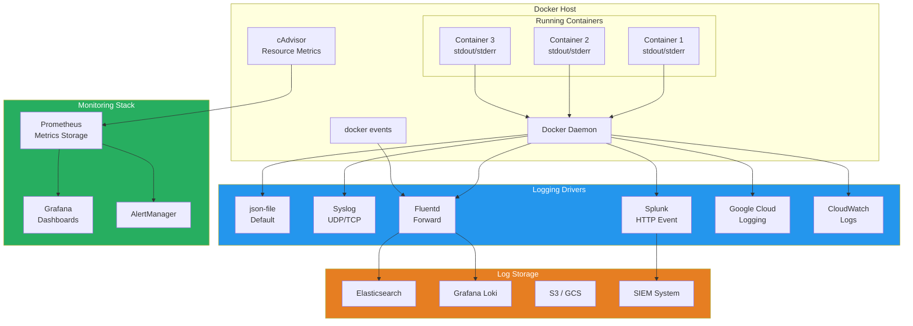

# Docker Logging & Monitoring

## What Is It?
Docker logging and monitoring encompasses the tools, drivers, and practices for collecting, routing, and analyzing container output and performance metrics. It provides visibility into container behavior, resource utilization, and application health across single hosts and distributed clusters.

## Why It Was Created
Containers are ephemeral and stateless by design — when a container stops, its logs and data disappear. Organizations needed a way to capture stdout/stderr streams persistently, route them to centralized logging backends, and collect performance metrics (CPU, memory, network, disk I/O) at the container level. Docker's logging driver plugin system and the cAdvisor/ Prometheus ecosystem emerged to solve these observability challenges.

## When to Use It
- **Production deployments** — centralized log aggregation for debugging
- **Performance troubleshooting** — identify CPU/memory/IO bottlenecks
- **Alerting and incident response** — trigger alerts on container health or resource thresholds
- **Compliance and auditing** — retain container logs for regulatory requirements
- **Capacity planning** — track resource usage trends across hosts
- **Cost optimization** — identify over-provisioned or runaway containers

## Logging & Monitoring Architecture



## Logging Drivers Deep Dive

### json-file (Default)
Writes container logs to JSON files on disk. Simple, no external dependencies, but requires log rotation management.

```bash
# Configure log driver globally in daemon.json
{
  "log-driver": "json-file",
  "log-opts": {
    "max-size": "10m",
    "max-file": "3",
    "compress": "true"
  }
}

# Configure per container
docker run \
  --log-driver json-file \
  --log-opt max-size=5m \
  --log-opt max-file=5 \
  nginx

# Read logs
docker logs mycontainer
docker logs --tail 100 --follow mycontainer
docker logs --since 2024-01-01T00:00:00 --until 2024-01-02T00:00:00 mycontainer
```

### syslog
Routes container logs to the host's syslog daemon or a remote syslog server.

```bash
# Forward to local syslog
docker run \
  --log-driver syslog \
  --log-opt syslog-address=udp://localhost:514 \
  --log-opt tag="{{.Name}}/{{.ID}}" \
  nginx

# Forward to remote syslog server
docker run \
  --log-driver syslog \
  --log-opt syslog-address=tcp://syslog.example.com:514 \
  --log-opt syslog-facility=daemon \
  --log-opt tag="nginx" \
  nginx
```

### fluentd
Sends logs to Fluentd for routing, filtering, and forwarding.

```bash
# Run Fluentd as a container
docker run -d \
  --name fluentd \
  -p 24224:24224 \
  -v ./fluent.conf:/fluentd/etc/fluent.conf \
  fluent/fluentd:v1.16

# Run container with Fluentd log driver
docker run \
  --log-driver fluentd \
  --log-opt fluentd-address=localhost:24224 \
  --log-opt tag="myapp.{{.Name}}" \
  nginx
```

```ruby
# fluent.conf configuration
<source>
  @type forward
  port 24224
  bind 0.0.0.0
</source>

<filter **>
  @type record_transformer
  <record>
    hostname "#{Socket.gethostname}"
  </record>
</filter>

<match **>
  @type elasticsearch
  host elasticsearch.example.com
  port 9200
  logstash_format true
  buffer_chunk_limit 2M
  flush_interval 5s
</match>
```

### splunk
Sends logs directly to Splunk HTTP Event Collector (HEC).

```bash
docker run \
  --log-driver splunk \
  --log-opt splunk-token=your-hec-token \
  --log-opt splunk-url=https://splunk.example.com:8088 \
  --log-opt splunk-source=nginx \
  --log-opt splunk-sourcetype=docker \
  --log-opt splunk-index=main \
  --log-opt splunk-insecureskipverify=true \
  nginx
```

## Resource Monitoring

### Docker Stats
```bash
# Live stream of container resource usage
docker stats

# Stats for specific containers
docker stats web db redis

# Format output
docker stats --format "table {{.Name}}\t{{.CPUPerc}}\t{{.MemUsage}}\t{{.NetIO}}"

# One-shot stats
docker stats --no-stream

# JSON output for programmatic use
docker stats --no-stream --format "{{json .}}"
```

### Resource Constraints
```bash
# CPU constraints
docker run --cpus=2 nginx                     # Max 2 full CPUs
docker run --cpuset-cpus=0,2 nginx             # Pin to CPU cores 0 and 2
docker run --cpu-shares=512 nginx              # Relative weight (default 1024)

# Memory constraints
docker run --memory=512m nginx                 # Hard limit
docker run --memory-reservation=256m nginx     # Soft limit (best effort)
docker run --memory-swap=1g nginx              # Total memory + swap limit
docker run --memory-swappiness=0 nginx         # Disable swap (0-100)

# IO constraints
docker run --device-read-bps=/dev/sda:10mb nginx   # Read limit
docker run --device-write-bps=/dev/sda:10mb nginx  # Write limit
docker run --device-read-iops=/dev/sda:100 nginx   # IOPS read limit
docker run --device-write-iops=/dev/sda:100 nginx  # IOPS write limit

# PIDs limit
docker run --pids-limit=100 nginx              # Max number of processes

# Restart policies
docker run --restart=no nginx                  # Never restart (default)
docker run --restart=on-failure:5 nginx        # Restart on failure, max 5 times
docker run --restart=always nginx              # Always restart
docker run --restart=unless-stopped nginx      # Always except explicit stop
```

### Docker Compose Resource Limits
```yaml
version: "3.9"
services:
  web:
    image: nginx:alpine
    deploy:
      resources:
        limits:
          cpus: "0.50"
          memory: 256M
        reservations:
          cpus: "0.25"
          memory: 128M
    restart: unless-stopped

  db:
    image: postgres:16
    deploy:
      resources:
        limits:
          cpus: "2"
          memory: 2G
    volumes:
      - pgdata:/var/lib/postgresql/data
    healthcheck:
      test: ["CMD-SHELL", "pg_isready -U postgres"]
      interval: 5s
      timeout: 5s
      retries: 5

volumes:
  pgdata:
```

## Healthchecks

### Dockerfile HEALTHCHECK
```dockerfile
FROM node:20-alpine
WORKDIR /app
COPY package.json .
RUN npm ci
COPY . .
EXPOSE 3000

HEALTHCHECK --interval=30s --timeout=5s --start-period=10s --retries=3 \
  CMD wget --no-verbose --tries=1 --spider http://localhost:3000/health || exit 1
```

### Healthcheck Types by Application
```dockerfile
# HTTP healthcheck
HEALTHCHECK CMD curl -f http://localhost/health || exit 1

# TCP healthcheck
HEALTHCHECK CMD nc -z localhost 5432 || exit 1

# Custom script healthcheck
HEALTHCHECK CMD /app/healthcheck.sh || exit 1

# PostgreSQL healthcheck
HEALTHCHECK --interval=10s --timeout=5s --retries=5 \
  CMD pg_isready -U postgres || exit 1

# Redis healthcheck
HEALTHCHECK --interval=10s --timeout=3s --retries=3 \
  CMD redis-cli ping || exit 1
```

### Healthcheck in Docker Compose
```yaml
services:
  api:
    build: .
    healthcheck:
      test: ["CMD", "curl", "-f", "http://localhost:8080/ready"]
      interval: 10s
      timeout: 5s
      retries: 3
      start_period: 30s
    depends_on:
      db:
        condition: service_healthy
      redis:
        condition: service_healthy
```

## Docker Events

### Event Stream Monitoring
```bash
# Stream all Docker events
docker events

# Filter events
docker events --filter type=container
docker events --filter event=destroy
docker events --filter "container=myapp"
docker events --filter "event=health_status"

# Format events
docker events --format "{{json .}}"

# Since a specific time
docker events --since 2024-01-01T00:00:00
```

### Event-Driven Actions
```bash
# Restart failed containers
docker events --filter event=die --filter type=container | \
  while read event; do
    container=$(echo "$event" | grep -oP 'container \K[^ ]+')
    echo "Restarting failed container: $container"
    docker restart "$container"
  done

# Alert on OOM events
docker events --filter event=oom | \
  while read event; do
    echo "OOM KILL detected: $event" | mail -s "Docker OOM Alert" ops@example.com
  done
```

## cAdvisor

cAdvisor (Container Advisor) provides resource usage and performance characteristics for running containers.

### Running cAdvisor
```bash
# Run cAdvisor as a container
docker run \
  --volume=/:/rootfs:ro \
  --volume=/var/run:/var/run:ro \
  --volume=/sys:/sys:ro \
  --volume=/var/lib/docker/:/var/lib/docker:ro \
  --volume=/dev/disk/:/dev/disk:ro \
  --publish=8080:8080 \
  --detach=true \
  --name=cadvisor \
  --privileged \
  --device=/dev/kmsg \
  gcr.io/cadvisor/cadvisor:latest

# Access the UI
# http://localhost:8080/containers/

# Access metrics endpoint
# http://localhost:8080/metrics
```

### cAdvisor + Prometheus + Grafana
```yaml
version: "3.9"
services:
  cadvisor:
    image: gcr.io/cadvisor/cadvisor:latest
    volumes:
      - /:/rootfs:ro
      - /var/run:/var/run:ro
      - /sys:/sys:ro
      - /var/lib/docker/:/var/lib/docker:ro
      - /dev/disk/:/dev/disk:ro
    ports:
      - "8080:8080"
    privileged: true
    devices:
      - /dev/kmsg
    restart: unless-stopped

  prometheus:
    image: prom/prometheus:latest
    volumes:
      - ./prometheus.yml:/etc/prometheus/prometheus.yml
      - prometheus_data:/prometheus
    ports:
      - "9090:9090"
    restart: unless-stopped

  grafana:
    image: grafana/grafana:latest
    volumes:
      - grafana_data:/var/lib/grafana
    ports:
      - "3000:3000"
    environment:
      - GF_SECURITY_ADMIN_PASSWORD=${GRAFANA_PASSWORD}
    restart: unless-stopped

volumes:
  prometheus_data:
  grafana_data:
```

```yaml
# prometheus.yml
scrape_configs:
  - job_name: "cadvisor"
    scrape_interval: 15s
    static_configs:
      - targets: ["cadvisor:8080"]

  - job_name: "docker-engine"
    scrape_interval: 15s
    static_configs:
      - targets: ["host.docker.internal:9323"]
```

## Centralized Logging with Docker + Loki

```yaml
version: "3.9"
services:
  loki:
    image: grafana/loki:2.9
    ports:
      - "3100:3100"
    volumes:
      - loki_data:/loki
    command: -config.file=/etc/loki/local-config.yaml
    restart: unless-stopped

  promtail:
    image: grafana/promtail:2.9
    volumes:
      - /var/log:/var/log:ro
      - /var/lib/docker/containers:/var/lib/docker/containers:ro
      - ./promtail.yml:/etc/promtail/config.yml
    command: -config.file=/etc/promtail/config.yml
    restart: unless-stopped
    depends_on:
      - loki

  grafana:
    image: grafana/grafana:latest
    ports:
      - "3000:3000"
    environment:
      - GF_INSTALL_PLUGINS=grafana-lokiexplore-app
    volumes:
      - grafana_data:/var/lib/grafana
    restart: unless-stopped

volumes:
  loki_data:
  grafana_data:
```

## Pricing Model or Cost Considerations

| Component | Cost | Notes |
|-----------|------|-------|
| **Docker stdout/stderr** | Free | Built-in, zero additional cost |
| **json-file driver** | Free | Disk space only |
| **Splunk** | $150/user/month + ingest | Volume-based pricing tiers |
| **Elastic Cloud** | $16/GB/month (ingest) | Storage + compute per GB |
| **Grafana Cloud** | Free (10K series, 50GB logs) | Paid tiers for higher volume |
| **cAdvisor** | Free | Minimal resource overhead |
| **Prometheus** | Free | Storage costs for long retention |
| **CloudWatch Logs** | $0.50/GB ingested + $0.03/GB stored | Data transfer costs apply |

## Best Practices

| Practice | Detail |
|----------|--------|
| **Use structured logging** | Output JSON format logs for easy parsing |
| **Set log rotation** | Always configure max-size and max-file to prevent disk exhaustion |
| **Use a centralized log aggregator** | Route logs to Elasticsearch, Loki, or Splunk |
| **Tag logs with metadata** | Include service name, version, environment in each log line |
| **Configure resource limits** | Always set --memory and --cpus to prevent noisy neighbors |
| **Add healthchecks to all services** | Docker restarts unhealthy containers automatically |
| **Monitor Docker daemon metrics** | Enable the experimental metrics endpoint |
| **Alert on OOM kills** | An OOM event indicates severe resource misconfiguration |
| **Use cAdvisor + Prometheus** | Collect historical metrics for capacity planning |
| **Retain logs appropriately** | Define retention policies per environment (dev vs prod) |

## Interview Questions

1. How do Docker logging drivers work and what is the default driver? How would you change it per container?
2. What is the difference between `docker logs`, `docker events`, and `docker stats` and when would you use each?
3. Explain how Docker resource constraints work — how do cgroups enforce CPU, memory, and I/O limits?
4. How does the HEALTHCHECK instruction work in a Dockerfile? What happens when a healthcheck fails?
5. Compare json-file, fluentd, syslog, and splunk logging drivers — what factors guide the choice?
6. How would you design a centralized logging solution for 100 Docker hosts running 2000 containers?
7. What metrics does cAdvisor expose and how would you set up Prometheus to scrape them?
8. Explain the difference between `--memory`, `--memory-reservation`, and `--memory-swap` flags.
9. How do you debug a container that keeps restarting with an unhealthy healthcheck status?
10. What is Docker's event system and how can you use it for automated incident response?

## Real Company Usage

**Spotify**: Runs a global logging pipeline where every container's stdout is captured by the json-file driver with rotation, then Fluentd agents on each host forward logs to a Kafka cluster, which feeds Elasticsearch. They tag every log line with the service name, container ID, and deployment version. Grafana dashboards aggregate logs across 5000+ containers, and developers can tail logs for their specific deployment from a self-service UI.

**Yelp**: Uses a combination of cAdvisor and Prometheus to collect container metrics across their Docker Swarm fleet. They set conservative resource limits on all containers (CPU shares, memory limits), and Grafana alerts trigger when any container exceeds 80% of its memory limit for more than 5 minutes. OOM-killed containers automatically trigger a PagerDuty incident with the container name, host, and memory limit attached.

**Twilio**: Deployed the Splunk logging driver across their entire Docker estate to integrate with their existing Splunk infrastructure. Each container ships logs directly to the Splunk HEC endpoint with structured JSON metadata. They use Splunk's machine learning toolkit to detect anomalous log patterns, such as sudden error rate increases after a deployment, which triggers automated rollbacks.
