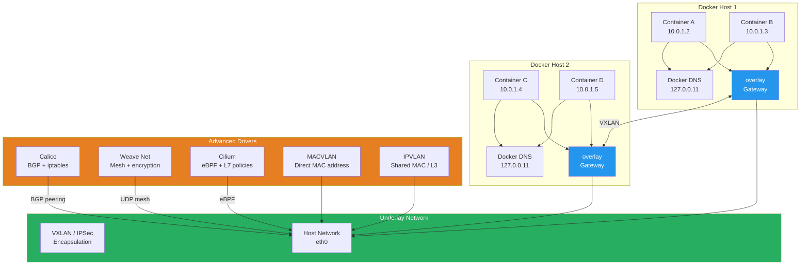

# Advanced Docker Networking

## What Is It?
Advanced Docker networking extends beyond basic bridge and host networking to provide overlay networks that span multiple hosts, encrypted data plane traffic, IPv6 support, pluggable CNI network providers (Calico, Weave, Cilium), and direct host-level network integration via MACVLAN and IPVLAN drivers.

## Why It Was Created
Single-host bridge networking was insufficient for distributed applications. Multi-host communication required a network abstraction that could span physical hosts while providing service discovery, encryption, and isolation. As container deployments scaled, organizations needed software-defined networking (SDN) solutions with advanced policies, network segmentation, and direct hardware integration for high-throughput applications.

## When to Use It
- **Multi-host Docker Swarm** — overlay networks for cross-host communication
- **Multi-tenant clusters** — network policies for tenant isolation
- **Compliance environments** — encrypted data plane for sensitive workloads
- **IPv6-only networks** — dual-stack or IPv6-only container networking
- **High-performance networking** — MACVLAN for near-native throughput
- **Service mesh integration** — Cilium eBPF for L7-aware networking
- **Hybrid cloud** — consistent networking across on-prem and cloud hosts

## Advanced Networking Architecture



## Overlay Networks

### Creating and Using Overlay Networks
```bash
# Create an overlay network (requires Swarm mode or external key-value store)
docker network create \
  --driver overlay \
  --subnet 10.0.0.0/16 \
  --gateway 10.0.0.1 \
  --ip-range 10.0.1.0/24 \
  --opt encrypted \
  my-overlay

# Create overlay with custom options
docker network create \
  --driver overlay \
  --opt com.docker.network.driver.overlay.vxlan_port=4789 \
  --opt com.docker.network.driver.mtu=1450 \
  --opt encrypted \
  secure-overlay

# Attach container to overlay network
docker service create \
  --name web \
  --network my-overlay \
  --replicas 3 \
  nginx

# Attach container to multiple networks
docker service create \
  --name api \
  --network my-overlay \
  --network monitoring \
  --replicas 2 \
  myapp:latest

# Inspect overlay network
docker network inspect my-overlay
```

### Overlay Network Encryption
```bash
# Create encrypted overlay network (IPSec)
docker network create \
  --driver overlay \
  --opt encrypted \
  --opt encryption.key=auto \
  encrypted-overlay

# Verify encryption is enabled
docker network inspect encrypted-overlay --format '{{json .Options}}'

# The encrypted flag enables IPSec encryption between all nodes
# in the overlay network using GCM-AES
```

## Service Discovery with Docker DNS

Docker has a built-in DNS server at 127.0.0.11 that provides service discovery for containers on the same network.

```bash
# Create a network
docker network create mynet

# Run containers — they can resolve each other by container name
docker run -d --name web --network mynet nginx
docker run -d --name api --network mynet myapp

# From within a container, resolve services
docker exec api ping web
docker exec web nslookup api

# DNS round-robin for Swarm services
docker service create \
  --name backend \
  --network my-overlay \
  --replicas 3 \
  myapp:latest

# All 3 replicas resolved via DNS:
docker exec web nslookup backend
```

### Custom DNS Configuration
```bash
# Custom DNS servers
docker run --dns 8.8.8.8 --dns 1.1.1.1 nginx

# Custom DNS search domains
docker run --dns-search example.com --dns-search prod.example.com nginx

# Disable Docker DNS (use host DNS only)
docker run --dns 0.0.0.0 nginx

# Per-network DNS settings
docker network create \
  --driver overlay \
  --dns 10.0.0.2 \
  --dns-option ndots:2 \
  custom-dns-net
```

### DNS Round-Robin with Swarm
```yaml
version: "3.9"
services:
  web:
    image: nginx:alpine
    networks:
      - public
    ports:
      - "80:80"

  api:
    image: myapp:latest
    networks:
      - public
      - private
    deploy:
      replicas: 5
    environment:
      - DB_HOST=db.private

  db:
    image: postgres:16
    networks:
      - private
    deploy:
      replicas: 2
    healthcheck:
      test: ["CMD", "pg_isready", "-U", "postgres"]

networks:
  public:
    driver: overlay
  private:
    driver: overlay
    internal: true
```

## IPv6 Networking

### Enabling IPv6 on Docker Daemon
```json
{
  "experimental": true,
  "ipv6": true,
  "fixed-cidr-v6": "2001:db8:1::/64",
  "ip6tables": true
}
```

### IPv6 Container Networking
```bash
# Create an IPv6-enabled network
docker network create \
  --driver bridge \
  --subnet 172.20.0.0/16 \
  --subnet 2001:db8:2::/64 \
  --gateway 2001:db8:2::1 \
  ipv6-network

# Run container with IPv6
docker run \
  --network ipv6-network \
  --sysctl net.ipv6.conf.all.disable_ipv6=0 \
  alpine ping6 2001:db8:2::1

# IPv6 overlay network
docker network create \
  --driver overlay \
  --subnet 10.0.0.0/16 \
  --subnet 2001:db8:3::/64 \
  --ipv6 \
  ipv6-overlay

# IPv6 port mapping
docker run -d \
  --name web \
  -p 2001:db8:1::1:80:80 \
  nginx
```

### Dual-Stack Services
```yaml
version: "3.9"
services:
  web:
    image: nginx:alpine
    networks:
      dual-stack:
        ipv4_address: 10.0.1.10
        ipv6_address: 2001:db8:1::10
    ports:
      - "80:80/tcp"
      - "80:80/tcp6"

networks:
  dual-stack:
    driver: bridge
    enable_ipv6: true
    ipam:
      config:
        - subnet: 10.0.0.0/16
        - subnet: 2001:db8:1::/64
```

## Network Plugins

### Calico
Calico provides BGP-based networking with iptables policy enforcement for high-performance, scalable container networking.

```bash
# Deploy Calico with Docker (without Kubernetes)
docker run --net=host --privileged \
  -v /var/log/calico:/var/log/calico \
  -v /run/docker/plugins:/run/docker/plugins \
  -v /lib/modules:/lib/modules \
  -v /var/run/calico:/var/run/calico \
  calico/node:v3.27

# Create a Calico network
docker network create \
  --driver calico \
  --ipam-driver calico-ipam \
  --subnet 192.168.0.0/16 \
  calico-net

# Create network policy (calicoctl)
cat <<EOF | calicoctl apply -f -
apiVersion: projectcalico.org/v3
kind: NetworkPolicy
metadata:
  name: allow-frontend
spec:
  selector: role == 'backend'
  ingress:
    - action: Allow
      protocol: TCP
      source:
        selector: role == 'frontend'
      destination:
        ports:
          - 8080
EOF
```

### Weave Net
Weave creates a mesh network between Docker hosts with built-in encryption and DNS-based service discovery.

```bash
# Deploy Weave
docker run --privileged --pid host \
  -v /var/run/docker.sock:/var/run/docker.sock \
  -v /var/lib/weave:/var/lib/weave \
  -v /proc:/proc \
  -v /sys:/sys \
  --entrypoint=/usr/bin/weave \
  weaveworks/weave:2.8.1 launch --password mysecret

# Create a Weave network
docker network create \
  --driver weave \
  --subnet 10.32.0.0/12 \
  weave-net

# Cross-host container communication
docker run -d --name app1 --network weave-net alpine sleep 3600
docker run -d --name app2 --network weave-net alpine sleep 3600

# Encrypted communication
docker exec app1 ping app2

# Weave status
docker exec weave weave status
```

### Cilium (eBPF-based)
Cilium uses eBPF programs for high-performance networking and L7-aware security policies.

```bash
# Deploy Cilium
docker run -d --name cilium \
  --network host \
  --privileged \
  -v /sys/fs/bpf:/sys/fs/bpf \
  -v /var/run/cilium:/var/run/cilium \
  -v /var/run/docker.sock:/var/run/docker.sock \
  cilium/cilium:v1.15

# Create Cilium network
docker network create \
  --driver cilium \
  --ipam-driver cilium \
  --subnet 10.0.0.0/16 \
  cilium-net

# Apply L7 HTTP-aware policy
cat <<EOF | cilium policy import -
{
  "name": "http-allow",
  "rules": [{
    "endpointSelector": {
      "matchLabels": {"app": "api"}
    },
    "ingress": [{
      "fromEndpoints": [{
        "matchLabels": {"app": "web"}
      }],
      "toPorts": [{
        "ports": [{"port": "8080", "protocol": "TCP"}],
        "rules": {
          "http": [{
            "method": "GET",
            "path": "/api/v1/.*"
          }]
        }
      }]
    }]
  }]
}
EOF
```

## MACVLAN and IPVLAN

### MACVLAN
MACVLAN assigns a unique MAC address to each container, making them appear as physical devices on the network.

```bash
# Create a MACVLAN network
docker network create \
  --driver macvlan \
  --subnet 192.168.1.0/24 \
  --gateway 192.168.1.1 \
  --ip-range 192.168.1.64/28 \
  --opt parent=eth0 \
  macvlan-net

# Create a MACVLAN in bridge mode (default)
docker network create \
  --driver macvlan \
  --opt parent=eth0.100 \
  --opt macvlan_mode=bridge \
  macvlan-vlan100

# Run container with MACVLAN network
docker run \
  --network macvlan-net \
  --ip 192.168.1.68 \
  -d nginx

# MACVLAN with 802.1q VLAN tagging
docker network create \
  --driver macvlan \
  --subnet 10.0.100.0/24 \
  --gateway 10.0.100.1 \
  --opt parent=eth0.100 \
  macvlan-vlan100

# Verify the container gets its own MAC address
docker exec --privileged container-name ip link show eth0
```

### IPVLAN
IPVLAN shares the host MAC address but assigns unique IP addresses to each container (L2 or L3 mode).

```bash
# Create an IPVLAN network (L2 mode)
docker network create \
  --driver ipvlan \
  --subnet 192.168.1.0/24 \
  --gateway 192.168.1.1 \
  --opt parent=eth0 \
  --opt ipvlan_mode=l2 \
  ipvlan-l2

# Create an IPVLAN network (L3 mode)
docker network create \
  --driver ipvlan \
  --subnet 10.10.0.0/16 \
  --subnet 10.20.0.0/16 \
  --opt parent=eth0 \
  --opt ipvlan_mode=l3 \
  ipvlan-l3

# Run container with IPVLAN
docker run \
  --network ipvlan-l2 \
  --ip 192.168.1.100 \
  -d nginx

# IPVLAN with multiple subnets
docker network create \
  --driver ipvlan \
  --subnet 172.16.1.0/24 \
  --subnet 172.16.2.0/24 \
  --opt parent=eth0 \
  --opt ipvlan_mode=l3 \
  multi-subnet-ipvlan
```

### MACVLAN vs IPVLAN

| Feature | MACVLAN | IPVLAN |
|---------|---------|--------|
| **MAC address** | Unique per container | Shared with host |
| **Mode** | Bridge, 802.1q, Private | L2, L3 |
| **Performance** | Near-native | Near-native |
| **MAC table limits** | Switch may limit MAC learning | No MAC table issues |
| **Use case** | Legacy apps requiring direct MAC | High-density deployments |
| **Scalability** | Limited by switch MAC table | Higher density |
| **VLAN support** | 802.1q trunking | Internal routing |

## Multi-Host Networking with Consul (External KV Store)

```bash
# Run Consul for service discovery and network coordination
docker run -d \
  --name consul \
  -p 8500:8500 \
  -p 8300:8300 \
  consul:1.17

# Configure Docker daemon on each host
# /etc/docker/daemon.json
{
  "cluster-store": "consul://10.0.0.10:8500",
  "cluster-advertise": "eth0:2377",
  "cluster-store-opts": {
    "kv.cacertfile": "/etc/docker/ca.pem",
    "kv.certfile": "/etc/docker/cert.pem",
    "kv.keyfile": "/etc/docker/key.pem"
  }
}

# Create a multi-host overlay network
docker network create \
  --driver overlay \
  --subnet 10.1.0.0/16 \
  --opt com.docker.network.driver.mtu=1400 \
  multi-host-overlay
```

## Pricing Model or Cost Considerations

| Component | Cost | Notes |
|-----------|------|-------|
| **Docker overlay network** | Free | Built-in, no additional cost |
| **Calico** | Free (open source) | Calico Cloud starts at $0.025/node/hour |
| **Weave Net** | Free (open source) | Weave Cloud starts at $0.07/node/hour |
| **Cilium** | Free (open source) | Isovalent Enterprise starts at $5/node/month |
| **MACVLAN/IPVLAN** | Free | Built-in Docker drivers |
| **Consul KV store** | Free (up to 5 nodes) | Consul Enterprise $15/node/month |
| **IPSec encryption** | Free | CPU overhead ~5-10% for encryption |

## Best Practices

| Practice | Detail |
|----------|--------|
| **Use overlay for multi-host** | Never use bridge for cross-host communication |
| **Encrypt sensitive traffic** | Use `--opt encrypted` for overlay networks |
| **Pin overlay MTU** | Set MTU to 1450 to account for VXLAN overhead (50 bytes) |
| **Use internal networks** | Mark overlay networks as `internal: true` for backend services |
| **Avoid MACVLAN at scale** | Switches have MAC table limits (~8K entries) |
| **Prefer IPVLAN for density** | No MAC table issues, better scaling |
| **Calico for policy-heavy** | Calico's iptables/eBPF policies are more granular |
| **Cilium for service mesh** | eBPF provides L7-aware policies without sidecars |
| **Enable IPv6 early** | Adding IPv6 later requires network recreation |
| **Monitor VXLAN tunnels** | Packet loss in VXLAN causes hard-to-diagnose issues |

## Interview Questions

1. How does Docker overlay networking work under the hood? Explain VXLAN encapsulation and the data plane flow.
2. What is the difference between MACVLAN and IPVLAN? When would you use each?
3. How does Docker's built-in DNS resolution work for service discovery? Explain the resolution order.
4. Compare Calico, Weave, and Cilium as Docker network plugins — what are the trade-offs?
5. How does overlay network encryption work? What protocol does Docker use and what's the performance impact?
6. Explain the MTU considerations when using overlay networks — why is MTU 1450 recommended?
7. How would you set up IPv6 for Docker containers? What daemon configuration is required?
8. What happens when a container is attached to multiple overlay networks? How does routing work?
9. How does Docker Swarm integrate with overlay networks for service discovery and load balancing?
10. Explain the difference between L2 and L3 IPVLAN modes and when each is appropriate.

## Real Company Usage

**Bloomberg**: Runs a high-frequency trading platform using MACVLAN networking to give each container its own MAC address and IP on the physical network. This allows their trading applications to bind to specific IP addresses and integrate with legacy network monitoring that expects unique MACs per application instance. They use 802.1q VLAN tagging with MACVLAN to isolate development, staging, and production traffic on separate VLANs across the same physical infrastructure.

**DigitalOcean**: Deployed Cilium with eBPF for their container platform (DOKS), processing over 1 million network policy evaluations per second per node. They chose Cilium over Calico for its superior performance at scale and its ability to enforce L7 HTTP-aware policies without sidecar proxies. Cilium's eBPF-based networking gave them a 40% reduction in CPU overhead compared to their previous iptables-based Calico deployment.

**ING Bank**: Uses Calico network policies across their Docker Swarm clusters to enforce strict multi-tenant isolation. Each business unit gets its own Calico namespace with policies that prevent any cross-tenant traffic. All sensitive financial data traffic between containers is encrypted using Calico's WireGuard integration. They run 3000+ containers across 200 Docker hosts with full network policy enforcement.
