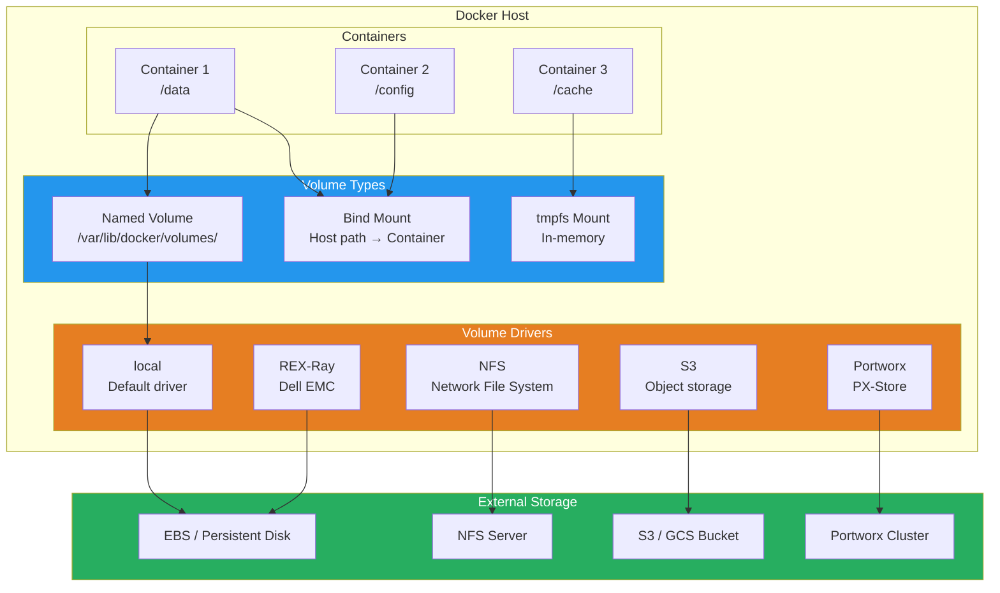

# Docker Volume Management

## What Is It?
Docker volume management covers the creation, backup, restore, migration, and lifecycle management of persistent data in Docker environments. It includes named volumes, bind mounts, tmpfs mounts, volume drivers, and strategies for moving data between hosts and clusters.

## Why It Was Created
Containers are ephemeral by design — their writable layer disappears when the container stops. Stateful applications (databases, message queues, file stores) require persistent storage that outlives containers. Docker volumes decouple data lifecycle from container lifecycle, allowing data to be shared, backed up, migrated, and managed independently of containers.

## When to Use It
- **Databases in containers** — PostgreSQL, MySQL, MongoDB need persistent storage
- **Stateful microservices** — Kafka, Redis, RabbitMQ require durable queues
- **Content management** — WordPress, Drupal store uploads in volumes
- **Shared configuration** — config files shared across multiple containers
- **Development hot-reload** — bind mount source code for live editing
- **High-performance scratch** — tmpfs for ephemeral, fast temporary data
- **Multi-host stateful workloads** — Portworx/REX-Ray for persistent storage across cluster
- **Disaster recovery** — volume backup and restore strategies

## Volume Management Architecture



## Volume Types in Detail

### Named Volumes
Managed by Docker, stored in `/var/lib/docker/volumes/`. The recommended way to persist data.

```bash
# Create a named volume
docker volume create --name app-data

# Create with driver options
docker volume create \
  --driver local \
  --opt type=btrfs \
  --opt device=/dev/sda \
  --opt o=noatime \
  my-volume

# Mount volume in container
docker run -v app-data:/var/lib/postgresql/data postgres:16

# Modern syntax with --mount
docker run \
  --mount source=app-data,target=/var/lib/postgresql/data \
  postgres:16

# Inspect volume
docker volume inspect app-data

# List volumes
docker volume ls

# Prune unused volumes
docker volume prune
docker volume prune --filter "label!=keep"
```

### Bind Mounts
Map a host directory directly into the container. Used for development and config sharing.

```bash
# Basic bind mount
docker run -v /host/path:/container/path nginx

# Read-only bind mount
docker run -v /host/config:/etc/nginx/conf.d:ro nginx

# Modern syntax with --mount
docker run \
  --mount type=bind,source=/host/data,target=/data,readonly \
  nginx

# Bind mount with SELinux context
docker run \
  --mount type=bind,source=/host/data,target=/data,z \
  nginx

# Bind mount single file
docker run \
  --mount type=bind,source=/host/config.yml,target=/app/config.yml \
  myapp
```

### tmpfs Mounts
In-memory storage for temporary data. Fast, ephemeral, never persisted to disk.

```bash
# tmpfs mount for container
docker run \
  --tmpfs /tmp:rw,noexec,nosuid,size=256m \
  nginx

# Modern syntax
docker run \
  --mount type=tmpfs,destination=/cache,tmpfs-size=256M,tmpfs-mode=1777 \
  nginx

# Multiple tmpfs mounts
docker run \
  --mount type=tmpfs,destination=/tmp,tmpfs-size=128M \
  --mount type=tmpfs,destination=/run,tmpfs-size=64M \
  nginx

# Verify tmpfs usage
docker exec container df -h /tmp
```

## Docker Compose Volume Configurations

```yaml
version: "3.9"
services:
  db:
    image: postgres:16
    volumes:
      - pgdata:/var/lib/postgresql/data
      - ./init.sql:/docker-entrypoint-initdb.d/init.sql:ro
      - type: tmpfs
        target: /tmp
        tmpfs:
          size: 256M
    environment:
      POSTGRES_DB: myapp
      POSTGRES_PASSWORD: ${DB_PASSWORD}

  redis:
    image: redis:7-alpine
    volumes:
      - redis_data:/data
      - type: bind
        source: ./redis.conf
        target: /usr/local/etc/redis/redis.conf
        read_only: true
    command: redis-server /usr/local/etc/redis/redis.conf

  app:
    image: myapp:latest
    volumes:
      - uploads:/app/uploads
      - type: volume
        source: app_config
        target: /app/config
        volume:
          nocopy: true
    depends_on:
      - db
      - redis

volumes:
  pgdata:
    driver: local
  redis_data:
    driver: local
    driver_opts:
      type: none
      device: /mnt/ssd/redis
      o: bind
  uploads:
    driver: local
  app_config:
    external: true
    name: shared-config-prod
```

## Backup and Restore Strategies

### Manual Backup Using Temporary Container
```bash
# Backup a named volume
docker run --rm \
  -v app-data:/source:ro \
  -v $(pwd):/backup \
  alpine tar czf /backup/app-data-$(date +%Y%m%d).tar.gz -C /source .

# Restore a named volume
docker run --rm \
  -v app-data:/target \
  -v $(pwd):/backup \
  alpine tar xzf /backup/app-data-20240101.tar.gz -C /target

# Backup with compression and encryption
docker run --rm \
  -v app-data:/source:ro \
  -v $(pwd):/backup \
  alpine sh -c "tar czf - -C /source . | openssl enc -aes-256-cbc -salt -out /backup/app-data.tar.gz.enc -pass pass:${BACKUP_KEY}"
```

### Automated Backup Script
```bash
#!/bin/bash
# backup-volumes.sh — Automated volume backup
set -euo pipefail

BACKUP_DIR="/backups/docker-volumes"
DATE=$(date +%Y%m%d_%H%M%S)
RETENTION_DAYS=30

# Get all named volumes
volumes=$(docker volume ls --format '{{.Name}}')

for volume in $volumes; do
  echo "Backing up volume: $volume"

  # Stop containers using this volume
  containers=$(docker ps --filter "volume=$volume" --format '{{.ID}}')
  if [ -n "$containers" ]; then
    docker stop $containers
  fi

  # Create backup
  docker run --rm \
    -v $volume:/source:ro \
    -v $BACKUP_DIR:/backup \
    alpine tar czf /backup/${volume}_${DATE}.tar.gz -C /source .

  # Start containers again
  if [ -n "$containers" ]; then
    docker start $containers
  fi
done

# Cleanup old backups
find $BACKUP_DIR -name "*.tar.gz" -mtime +$RETENTION_DAYS -delete
echo "Backup complete. Files in $BACKUP_DIR"
```

### Database-Specific Backup
```bash
# PostgreSQL backup using pg_dump
docker exec db pg_dump -U postgres myapp > /backups/myapp_$(date +%Y%m%d).sql

# PostgreSQL backup with compression
docker exec db pg_dump -U postgres myapp | gzip > /backups/myapp_$(date +%Y%m%d).sql.gz

# MySQL backup
docker exec mysql mysqldump --all-databases -u root -p${MYSQL_ROOT_PASSWORD} | gzip > /backups/mysql_$(date +%Y%m%d).sql.gz

# MongoDB backup
docker exec mongo mongodump --archive=/tmp/mongo_$(date +%Y%m%d).archive
docker cp mongo:/tmp/mongo_$(date +%Y%m%d).archive /backups/
```

## Volume Migration Between Hosts

### SSH-Based Volume Migration
```bash
# On source host: create backup
docker run --rm \
  -v app-data:/source:ro \
  alpine tar czf - -C /source . | \
  ssh user@destination-host "cat > /tmp/app-data.tar.gz"

# On destination host: restore
docker run --rm \
  -v app-data:/target \
  -v /tmp:/backup:ro \
  alpine tar xzf /backup/app-data.tar.gz -C /target
```

### Using Docker Machine for Migration
```bash
# Create volume on new host
docker -H tcp://new-host:2375 volume create --name app-data

# Transfer data using docker cp and temporary containers
docker run -d --name temp-source -v app-data-source:/data alpine sleep 3600
docker run -d --name temp-dest -v app-data-dest:/data alpine sleep 3600

# On source
docker exec temp-source tar czf /tmp/data.tar.gz -C /data .

# Copy archive between hosts
docker cp temp-source:/tmp/data.tar.gz /tmp/
scp /tmp/data.tar.gz user@new-host:/tmp/
docker -H tcp://new-host:2375 cp /tmp/data.tar.gz temp-dest:/tmp/

# On destination
docker exec temp-dest tar xzf /tmp/data.tar.gz -C /data

# Cleanup
docker rm -f temp-source temp-dest
```

## Volume Drivers

### REX-Ray
REX-Ray provides persistent storage for Docker across multiple cloud and storage platforms.

```bash
# Install REX-Ray
curl -sSL https://rexray.io/install | sh

# Configure REX-Ray (/etc/rexray/config.yml)
rexray:
  logLevel: info
libstorage:
  service: ebs
  integration:
    volume:
      operations:
        mount:
          preempt: true
ebs:
  accessKey: ${AWS_ACCESS_KEY}
  secretKey: ${AWS_SECRET_KEY}

# Create a volume with REX-Ray
docker volume create \
  --driver rexray \
  --opt size=100 \
  --opt volumetype=gp3 \
  --opt iops=3000 \
  my-ebs-volume

# Use the volume
docker run \
  --volume-driver rexray \
  -v my-ebs-volume:/data \
  postgres:16

# List REX-Ray volumes
rexray volume ls
```

### Portworx
Portworx provides software-defined storage for containers with high availability, snapshots, and encryption.

```bash
# Install Portworx (using pxctl)
docker run --rm -v /var/run/docker.sock:/var/run/docker.sock \
  portworx/px-dev:latest pxctl cluster provision

# Create storage pool
docker exec pxctl pxctl service pool create --repl 3 --size 100

# Create a Portworx volume
docker volume create \
  --driver pxd \
  --opt size=50 \
  --opt repl=3 \
  --opt io_priority=high \
  --opt shared=true \
  --opt fs=ext4 \
  --opt encryption=true \
  --opt passphrase=${PX_PASSPHRASE} \
  px-mysql-data

# Use the volume
docker run \
  --volume-driver pxd \
  -v px-mysql-data:/var/lib/mysql \
  mysql:8

# Create snapshot
docker exec pxctl pxctl volume snapshot create px-mysql-data --name pre-upgrade

# Clone from snapshot
docker volume create \
  --driver pxd \
  --opt source=pre-upgrade \
  px-mysql-clone
```

### NFS Volume Driver
```bash
# Create an NFS volume
docker volume create \
  --driver local \
  --opt type=nfs \
  --opt o=addr=nfs-server.example.com,rw,nfsvers=4.1,hard,intr \
  --opt device=:/exports/data \
  nfs-data

# Use NFS volume
docker run \
  -v nfs-data:/data \
  nginx

# Docker Compose with NFS
---
version: "3.9"
services:
  web:
    image: nginx:alpine
    volumes:
      - nfs-uploads:/app/uploads

volumes:
  nfs-uploads:
    driver: local
    driver_opts:
      type: nfs
      o: addr=192.168.1.100,rw,nfsvers=4
      device: ":/exports/uploads"
```

### S3 Volume Driver
```bash
# Create S3-backed volume
docker volume create \
  --driver local \
  --opt type=s3fs \
  --opt o=allow_other,use_path_request_style \
  --opt device=my-bucket:/path \
  s3-data

# Third-party S3 volume driver (rexray/s3fs)
docker volume create \
  --driver rexray/s3fs \
  --opt accessKey=${AWS_ACCESS_KEY} \
  --opt secretKey=${AWS_SECRET_KEY} \
  --opt bucket=my-app-bucket \
  --opt region=us-east-1 \
  s3-app-data
```

## Volume Management in Docker Compose for Production

```yaml
version: "3.9"
services:
  postgres:
    image: postgres:16
    volumes:
      - db-data:/var/lib/postgresql/data
      - ./backup.sh:/backup.sh:ro
    environment:
      POSTGRES_DB: myapp
      POSTGRES_PASSWORD_FILE: /run/secrets/db_password
    secrets:
      - db_password
    deploy:
      replicas: 1
      resources:
        limits:
          memory: 4G
        reservations:
          memory: 2G
    healthcheck:
      test: ["CMD-SHELL", "pg_isready -U postgres"]
      interval: 10s
      timeout: 5s
      retries: 5

  nfs-backup:
    image: alpine:latest
    volumes:
      - db-data:/source:ro
      - nfs-backup:/backup
    command: >
      sh -c "while true; do
        tar czf /backup/db-$(date +%Y%m%d-%H%M%S).tar.gz -C /source .;
        sleep 3600;
      done"
    deploy:
      replicas: 1
      placement:
        constraints:
          - node.role == manager

volumes:
  db-data:
    driver: pxd
    driver_opts:
      repl: "3"
      size: "100"
      io_priority: "high"
      sticky: "true"

  nfs-backup:
    driver: local
    driver_opts:
      type: nfs
      o: addr=backup-server.example.com,rw,nfsvers=4.1
      device: ":/volume-backups"

secrets:
  db_password:
    external: true
```

## Volume Capacity Management

```bash
# Check volume disk usage
docker system df -v

# Check specific volume size
docker run --rm \
  -v app-data:/data \
  alpine du -sh /data

# Limit volume size with device mapper (direct-lvm)
docker volume create \
  --driver local \
  --opt type=ext4 \
  --opt device=/dev/docker/thinpool \
  --opt o=noatime,size=10G \
  size-limited-volume

# XFS project quota for volume limits
docker volume create \
  --driver local \
  --opt type=xfs \
  --opt device=/dev/sdb1 \
  --opt o=pquota \
  quota-volume

# Monitor volume I/O with docker stats
docker stats --format "table {{.Name}}\t{{.BlockIO}}"
```

## Pricing Model or Cost Considerations

| Component | Cost | Notes |
|-----------|------|-------|
| **local driver** | Free | Uses host disk space only |
| **tmpfs** | Free | Uses RAM — no persistent cost |
| **EBS volume** | $0.08/GB/month (gp3) | Provisioned IOPS cost extra |
| **Portworx** | $0.001/GB/hour (~$0.72/GB/month) | Includes replication and snapshots |
| **REX-Ray** | Free (open source) | Storage infrastructure costs apply |
| **NFS server** | Free (self-hosted) | Network infrastructure costs |
| **S3 as volume** | $0.023/GB/month (standard) | Request costs per operation |

## Best Practices

| Practice | Detail |
|----------|--------|
| **Prefer named volumes** | Always use named volumes over bind mounts for production data |
| **Use tmpfs for caches** | In-memory storage for redis, session data, build artifacts |
| **Backup before upgrades** | Take volume snapshots before migrating or updating stateful services |
| **Label volumes** | Add labels for automated backup and lifecycle management |
| **Set volume size limits** | Prevent runaway containers from filling the disk |
| **Use read-only bind mounts** | Mount config files read-only to prevent accidental modification |
| **Place databases on SSDs** | Use `driver_opts` to bind mount SSD-backed paths for DB volumes |
| **Implement retention policies** | Automate backup cleanup based on age (30/60/90 days) |
| **Use volume drivers for HA** | Portworx or REX-Ray for cross-host volume availability |
| **Test restore procedures** | Regularly validate backups by restoring to a staging environment |

## Interview Questions

1. What's the difference between a named volume, a bind mount, and a tmpfs mount? When would you use each?
2. How do you back up a Docker named volume? Walk through the steps using a temporary container.
3. Explain how to migrate a volume between two Docker hosts. What tools or methods would you use?
4. How do volume drivers like REX-Ray and Portworx work? How do they provide cross-host persistent storage?
5. What happens to volume data when you run `docker compose down -v`? How would you prevent accidental data loss?
6. How does NFS volume sharing work in Docker? What are the performance implications?
7. Explain the lifecycle of a tmpfs mount — when is data created, available, and destroyed?
8. How would you set up an automated backup strategy for 50 PostgreSQL containers running on Docker Swarm?
9. What are the challenges of running stateful containers in a Docker Swarm or Kubernetes cluster?
10. How do you monitor and manage volume disk usage across a Docker cluster? What metrics would you track?

## Real Company Usage

**GitLab**: Runs their entire SaaS platform (gitlab.com) on Docker containers with REX-Ray provisioning EBS volumes for each stateful service. Each PostgreSQL, Redis, and Gitaly container gets a dedicated EBS volume that persists across container restarts and host migrations. Automated snapshots run every 6 hours with 30-day retention, and volume restores are tested weekly by the SRE team to ensure recovery procedures work.

**Slack**: Uses Portworx for their Docker-based message storage infrastructure. Each message shard runs in a container with a Portworx volume that provides 3-way replication across availability zones. If a host fails, the Portworx volume automatically detaches and re-attaches to a healthy host within seconds, allowing the container to restart with its data intact. They manage over 500TB of container-attached storage using Portworx, with snapshot-based backups running every hour.

**NetApp (internal)**: Demonstrates Docker volume migrations by running a Jenkins CI/CD pipeline that builds Docker images, creates Portworx volumes on a source cluster, takes a snapshot, and restores the snapshot on a destination cluster 2000 miles away. The entire volume migration of a 50GB PostgreSQL database completes in under 2 minutes, demonstrating disaster recovery capabilities with zero data loss.
