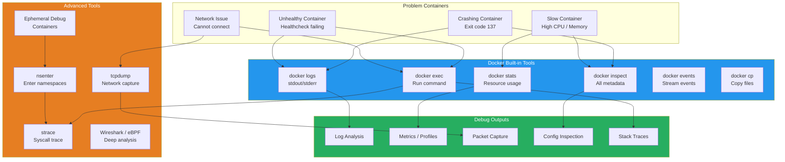

# Docker Debugging & Troubleshooting

## What Is It?
Docker debugging and troubleshooting encompasses the tools, techniques, and workflows for diagnosing container failures, performance issues, network problems, and resource exhaustion in Docker environments. It includes both built-in Docker commands (logs, inspect, exec) and external tools (nsenter, ephemeral debug containers, strace, tcpdump).

## Why It Was Created
Containers add a layer of abstraction that makes traditional debugging harder — you can't SSH into a container like a VM, the filesystem is layered and ephemeral, and network isolation hides connectivity issues. Docker debugging tools were created to provide visibility into container internals without compromising the container's ephemeral nature, enabling developers to diagnose issues in the same way they would on a traditional system.

## When to Use It
- **Container crashes** — investigate why a container exited with non-zero code
- **Startup failures** — debug containers that fail immediately after starting
- **Network issues** — diagnose connectivity between containers or to external services
- **Resource exhaustion** — identify containers consuming excessive CPU, memory, or disk
- **Image problems** — inspect image layers, dependencies, and configuration
- **Permission errors** — debug file permissions, user IDs, and capability issues
- **Slow performance** — profile container CPU, memory, and I/O bottlenecks
- **Orchestration issues** — troubleshoot Swarm service scheduling and networking

## Debugging Architecture



## docker inspect Deep Dive

### Basic Inspection
```bash
# Inspect everything
docker inspect mycontainer

# Format with Go templates
docker inspect --format '{{.State.Status}}' mycontainer
docker inspect --format '{{.NetworkSettings.IPAddress}}' mycontainer
docker inspect --format '{{range .NetworkSettings.Networks}}{{.IPAddress}}{{end}}' mycontainer

# Get mounted volumes
docker inspect --format '{{range .Mounts}}{{.Source}} -> {{.Destination}}{{"\n"}}{{end}}' mycontainer

# Get environment variables
docker inspect --format '{{range .Config.Env}}{{.}}{{"\n"}}{{end}}' mycontainer

# Get resource limits
docker inspect --format '{{.HostConfig.Memory}} {{.HostConfig.NanoCpus}}' mycontainer

# Get entrypoint and command
docker inspect --format '{{json .Config.Entrypoint}} {{json .Config.Cmd}}' mycontainer
```

### Inspecting Exit Codes and Restart History
```bash
# Get exit code
docker inspect --format '{{.State.ExitCode}}' mycontainer

# Get exit reason
docker inspect --format '{{.State.Error}}' mycontainer

# Get restart count
docker inspect --format '{{.State.Restarting}} {{.State.StartedAt}} {{.State.FinishedAt}}' mycontainer

# Get OOM status
docker inspect --format '{{.State.OOMKilled}}' mycontainer

# Get healthcheck status
docker inspect --format '{{json .State.Health}}' mycontainer
```

### Inspecting Images
```bash
# Inspect image metadata
docker inspect myapp:latest

# View image layers
docker history myapp:latest

# View image layers as JSON
docker inspect --format '{{json .RootFS.Layers}}' myapp:latest

# Compare images
docker diff mycontainer

# Check image creation details
docker inspect --format '{{.Created}} {{.Architecture}} {{.Os}}' myapp:latest
```

## docker logs Analysis

### Log Retrieval Techniques
```bash
# Basic log retrieval
docker logs mycontainer
docker logs --tail 100 mycontainer
docker logs --since 2024-01-01T00:00:00 mycontainer
docker logs --until 2024-01-02T00:00:00 mycontainer

# Follow logs
docker logs --follow mycontainer

# Timestamps
docker logs --timestamps mycontainer

# Combine with grep
docker logs mycontainer 2>&1 | grep ERROR
docker logs mycontainer 2>&1 | grep -E "CRITICAL|FATAL"

# Extract JSON fields from structured logs
docker logs mycontainer | grep -o '"level":"error"[^}]*' | head -20

# Filter by time range with awk
docker logs --timestamps mycontainer | awk '/2024-01-15T10:00:00/,/2024-01-15T11:00:00/'
```

### Common Log Patterns
```bash
# Check for OOM-related messages
docker logs mycontainer 2>&1 | grep -i "out of memory\|killed\|exit code 137\|OOM"

# Check for health check failures
docker inspect --format '{{json .State.Health.Log}}' mycontainer | jq '.[-1]'

# Analyze restart loops
docker inspect --format '{{.State.StartedAt}} -> {{.State.FinishedAt}}' mycontainer

# Check for permission denied
docker logs mycontainer 2>&1 | grep -i "permission denied\|EACCES\|EPERM"
```

## docker exec Debugging

### Interactive Debugging
```bash
# Start a shell in running container
docker exec -it mycontainer bash
docker exec -it mycontainer sh
docker exec -it mycontainer powershell

# Run a single command
docker exec mycontainer cat /etc/nginx/nginx.conf
docker exec mycontainer env
docker exec mycontainer ps aux
docker exec mycontainer netstat -tulpn

# Debug network connectivity
docker exec mycontainer ping google.com
docker exec mycontainer curl -v http://api-service:8080/health
docker exec mycontainer nslookup db-service
docker exec mycontainer traceroute db-service

# Debug resource usage
docker exec mycontainer top -bn1
docker exec mycontainer df -h
docker exec mycontainer free -m
docker exec mycontainer iostat -x 1 3
```

### Inspecting Processes Inside Container
```bash
# List processes
docker exec mycontainer ps aux
docker exec mycontainer ps -ef

# Process tree
docker exec mycontainer pstree

# File descriptors
docker exec mycontainer ls -la /proc/1/fd
docker exec mycontainer cat /proc/1/status

# Network connections
docker exec mycontainer ss -tulpn
docker exec mycontainer lsof -iTCP -sTCP:LISTEN -P -n
```

### Copying Files In/Out
```bash
# Copy from container to host
docker cp mycontainer:/app/logs/app.log ./app.log
docker cp mycontainer:/etc/nginx/nginx.conf ./nginx-backup.conf

# Copy from host to container
docker cp ./fixed-config.yml mycontainer:/app/config.yml
docker cp ./hotfix.jar mycontainer:/app/application.jar

# Copy entire directory
docker cp mycontainer:/var/log/ ./container-logs/
docker cp ./plugins/ mycontainer:/app/plugins/
```

## nsenter — Advanced Namespace Debugging

nsenter allows you to enter a container's namespaces from the host, without needing a running shell inside the container.

```bash
# Find the container's PID
CONTAINER_ID=$(docker inspect --format '{{.State.Pid}}' mycontainer)

# Enter the container's network namespace
nsenter -t $CONTAINER_ID -n ip addr
nsenter -t $CONTAINER_ID -n ss -tulpn

# Enter the container's mount namespace
nsenter -t $CONTAINER_ID -m mount
nsenter -t $CONTAINER_ID -m df -h

# Enter the container's PID namespace
nsenter -t $CONTAINER_ID -p ps aux

# Enter all namespaces (full shell inside container)
nsenter -t $CONTAINER_ID -a /bin/bash

# Debug a crashed container (still has its PID on host)
CRASHED_PID=$(docker inspect --format '{{.State.Pid}}' crashed-container)
nsenter -t $CRASHED_PID -a bash
```

### Practical nsenter Scenarios
```bash
# Scenario: Container can't resolve DNS — check from network namespace
CONTAINER_PID=$(docker inspect --format '{{.State.Pid}}' broken-container)
nsenter -t $CONTAINER_PID -n cat /etc/resolv.conf

# Scenario: Permission denied on file — check from mount namespace
nsenter -t $CONTAINER_PID -m ls -la /app/data
nsenter -t $CONTAINER_PID -m id

# Scenario: Debug why process is stuck
nsenter -t $CONTAINER_PID -p strace -p 1

# Scenario: Check container's cgroup limits
CONTAINER_ID=$(docker ps --no-trunc -q | head -1)
cat /sys/fs/cgroup/memory/docker/$CONTAINER_ID/memory.limit_in_bytes
cat /sys/fs/cgroup/cpu/docker/$CONTAINER_ID/cpu.cfs_quota_us
```

## Ephemeral Debug Containers

Docker's ephemeral debug containers allow you to attach temporary debugging tools to running containers without modifying the original container.

### Using Debug Containers with docker run
```bash
# Run a debug container sharing the network namespace
docker run -it --rm \
  --network container:mycontainer \
  nicolaka/netshoot \
  tcpdump -i eth0 -w /tmp/capture.pcap

# Debug container with shared PID namespace
docker run -it --rm \
  --pid container:mycontainer \
  alpine sh -c "apk add --no-cache strace && strace -p 1"

# Debug container with shared all namespaces
docker run -it --rm \
  --pid container:mycontainer \
  --network container:mycontainer \
  --ipc container:mycontainer \
  --volumes-from mycontainer \
  nicolaka/netshoot bash

# Debug with specific tool images
docker run -it --rm \
  --network container:mycontainer \
  corfr/tcpdump

docker run -it --rm \
  --network container:mycontainer \
  networkstatic/iperf3 -c server
```

### Using the distroless Debug Image
```bash
# For distroless containers (no shell, no tools)
docker run -it --rm \
  --pid container:distroless-app \
  gcr.io/distroless/cc:debug \
  /busybox/sh

# Google's debug container
docker run -it --rm \
  --pid container:distroless-app \
  gcr.io/distroless/base:debug \
  /busybox/ps aux
```

### netshoot Power User Commands
```bash
# Run netshoot with all debugging tools
docker run -it --rm \
  --network container:mycontainer \
  nicolaka/netshoot

# Inside netshoot:
#   curl, httpie, wget, drill, dig, nslookup
#   nmap, netcat, iperf3, tcpdump, tshark
#   strace, lsof, ss, ip, iftop, htop, iotop
#   dmesg, ethtool, calicoctl, crictl

# HTTP debugging
curl -v http://service:8080/api/v1/status
http --verbose GET http://service:8080/api/v1/health

# DNS debugging
dig +short service-name +search
nslookup service-name
drill service-name

# Network performance
iperf3 -c throughput-server -t 10

# Route tracing
mtr --report service-name
```

## Common Issues and Solutions

### 1. Container Exits Immediately (Crash Loop)
```bash
# Check exit code
docker inspect --format 'ExitCode: {{.State.ExitCode}} Error: {{.State.Error}}' mycontainer

# Common exit codes:
#   0   — Normal exit
#   1   — Application error (check logs)
#   137 — SIGKILL (OOM or manual kill)
#   139 — SIGSEGV (segfault)
#   143 — SIGTERM (graceful shutdown)

# Solution: Read logs
docker logs mycontainer

# Solution: Override entrypoint to debug
docker run -it --entrypoint sh myapp:latest

# Solution: Check if OOM killed
docker inspect --format '{{.State.OOMKilled}}' mycontainer

# Solution: Test with interactive session before detaching
docker run -it --rm --entrypoint bash myapp:latest -c "ls -la && echo 'Ready'"
```

### 2. OOMKilled (Out of Memory)
```bash
# Check OOM status
docker inspect --format 'OOM: {{.State.OOMKilled}} Exit: {{.State.ExitCode}}' mycontainer

# Solution: Increase memory limits
docker run -d --memory=2g --memory-swap=3g myapp:latest

# Solution: Add memory reservation (soft limit)
docker run -d --memory=2g --memory-reservation=1g myapp:latest

# Solution: Check memory usage patterns
docker stats mycontainer --no-stream

# Solution: Profile memory inside container
docker exec mycontainer ps aux --sort -%mem
docker exec mycontainer cat /proc/1/status | grep Vm
docker exec mycontainer top -bn1

# Solution: Enable swap accounting
# Add to /etc/docker/daemon.json: {"swappiness": 0}
```

### 3. Health Check Failures
```bash
# Check health status
docker inspect --format '{{json .State.Health}}' mycontainer | jq .

# Get health check log
docker inspect --format '{{range .State.Health.Log}}{{.Output}}{{"\n"}}{{end}}' mycontainer

# Solution: Test healthcheck manually
docker exec mycontainer curl -f http://localhost:8080/health

# Solution: Debug healthcheck from network namespace
CONTAINER_PID=$(docker inspect --format '{{.State.Pid}}' mycontainer)
nsenter -t $CONTAINER_PID -n curl -f http://localhost:8080/health

# Solution: Check healthcheck script permissions
docker exec mycontainer ls -la /healthcheck.sh
```

### 4. Network Connectivity Problems
```bash
# Step 1: Check if container is on the right network
docker inspect --format '{{range $k,$v := .NetworkSettings.Networks}}{{$k}}: {{$v.IPAddress}}{{"\n"}}{{end}}' mycontainer

# Step 2: Test DNS resolution
docker exec mycontainer nslookup db-service
docker exec mycontainer cat /etc/resolv.conf

# Step 3: Test connectivity
docker exec mycontainer ping -c 3 db-service
docker exec mycontainer curl -v http://db-service:5432

# Step 4: Trace route
docker exec mycontainer traceroute -n db-service

# Step 5: Capture traffic
# From host:
CONTAINER_PID=$(docker inspect --format '{{.State.Pid}}' mycontainer)
nsenter -t $CONTAINER_PID -n tcpdump -i any port 5432

# From debug container:
docker run -it --rm --network container:mycontainer nicolaka/netshoot tcpdump -i eth0

# Step 6: Check iptables rules
docker run --rm --privileged --net=host alpine ash -c "iptables -L -n -v | grep DOCKER"
```

### 5. Disk Space / Image Layer Issues
```bash
# Check disk usage
docker system df

# Check image layer sizes
docker history myapp:latest

# Find large files inside container
docker exec mycontainer du -sh /* 2>/dev/null | sort -rh | head -10

# Check for dangling images and volumes
docker image prune -a -f
docker volume prune -f

# Check container log files on host
# Windows: C:\ProgramData\docker\containers\<container-id>\<container-id>-json.log
ls -lh /var/lib/docker/containers/$(docker ps -q --no-trunc)/*-json.log

# Limit log file size
# Add to daemon.json:
# {
#   "log-driver": "json-file",
#   "log-opts": {"max-size": "10m", "max-file": "3"}
# }
```

### 6. Permission Denied / Root Issues
```bash
# Check what user the container runs as
docker inspect --format 'User: {{.Config.User}}' mycontainer

# Check from within
docker exec mycontainer id

# Solution: Add --user flag
docker run --user 1000:1000 myapp:latest

# Solution: Run with specific UID in Dockerfile
# USER 1000

# Solution: Use user namespace remapping
# Add to daemon.json:
# {
#   "userns-remap": "default"
# }

# Solution: Fix volume permissions
docker run --rm -v myvolume:/data alpine chown -R 1000:1000 /data
```

### 7. Container Stuck / Unresponsive
```bash
# Force kill
docker kill --signal=SIGKILL mycontainer

# Remove stuck container
docker rm -f mycontainer

# Check kernel threads inside container
docker exec mycontainer ps aux | grep D
docker exec mycontainer cat /proc/1/wchan

# Debug with strace from host
CONTAINER_PID=$(docker inspect --format '{{.State.Pid}}' mycontainer)
strace -p $CONTAINER_PID -f -tt -T

# Check for zombie processes
docker exec mycontainer ps aux | grep Z
```

## Debugging Tool Reference Table

| Tool | Purpose | Use Case |
|------|---------|----------|
| `docker logs` | Read container stdout/stderr | Application errors, crash debugging |
| `docker inspect` | View container/image metadata | Configuration, network, resources |
| `docker exec` | Run commands in running container | Interactive debugging, probing |
| `docker stats` | Resource usage metrics | CPU/memory/IO bottlenecks |
| `docker events` | Real-time docker event stream | Monitor container lifecycle |
| `docker diff` | Filesystem changes since start | Detect unauthorized modifications |
| `docker cp` | Copy files to/from container | Extract logs, inject fixes |
| `nsenter` | Enter kernel namespaces | Debug crashed/distroless containers |
| `strace` | System call trace | Slow operations, permission errors |
| `tcpdump` | Network packet capture | Connectivity issues, DNS problems |
| `nsenter + netns` | Network namespace debugging | Network isolation problems |

## Best Practices

| Practice | Detail |
|----------|--------|
| **Always check logs first** | `docker logs` is the fastest diagnostic step |
| **Use docker inspect for metadata** | Exit codes, networks, volumes, env vars |
| **Ephemeral debug containers** | Never install debugging tools in production images |
| **Use netshoot for network issues** | Pre-built network debugging toolkit |
| **Check host resources** | Container issues often stem from host resource exhaustion |
| **Monitor with docker events** | Real-time detection of container failures |
| **Test healthchecks manually** | Use `docker exec` to simulate healthcheck endpoint |
| **Keep debug images separate** | Use --pid and --network flags to debug without modifying containers |
| **Document common fixes** | Maintain a runbook for recurring container issues |
| **Set log rotation** | Prevent disk-full issues from unbounded log growth |

## Interview Questions

1. You have a container that exits immediately with exit code 137. What does this mean and how do you debug it?
2. How would you debug a container that has no shell (distroless image) and is crashing on startup?
3. Explain the difference between docker exec, nsenter, and ephemeral debug containers. When would you use each?
4. A container can't connect to a database service on the same Docker overlay network. Walk through your debugging steps.
5. How does docker inspect work and what information can you extract from it?
6. What tools would you use to profile CPU usage inside a container without installing anything in the image?
7. Explain how you would capture network traffic from a container without using docker exec.
8. How do you debug a health check that's failing intermittently?
9. What is the significance of container exit codes (0, 1, 137, 139, 143) and what causes each?
10. A container shows OOMKilled = true despite being within its memory limit. What could cause this?

## Real Company Usage

**Netflix**: Runs a dedicated "container forensics" pipeline that automatically captures debug artifacts (logs, inspect output, resource snapshots, network captures) whenever a container in production crashes. The forensics pipeline uses ephemeral debug containers with shared PID and network namespaces to collect strace output and tcpdump captures from crashed containers, all without modifying the original production images. This data feeds into their automated root cause analysis system.

**Stripe**: Developed internal tooling around nsenter for debugging their payment processing containers, which run as distroless images with no shell or debugging tools. Their SRE team has a custom debug container image called "stripe-dbg" that includes tcpdump, strace, gdb, and perf. When an incident occurs, they deploy this debug container with `--pid container:<target>` and `--network container:<target>` to fully diagnose the issue without touching the running payment container.

**Cloudflare**: Uses netshoot containers extensively for debugging their edge networking stack. Every edge node runs a debug container alongside the primary workload, sharing the network namespace, so engineers can capture tcpdumps, run iperf3 tests, and trace routes without installing tools in the production containers. They documented over 40 common debugging scenarios in their internal runbook, each with a specific netshoot command to run.
