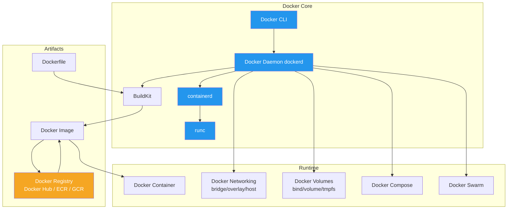

# 08 — Docker

> Containerization platform for building, shipping, and running applications in isolated environments.

## Topics

| # | Topic | Description |
|---|-------|-------------|
| 1 | [Docker Basics](01-docker-basics.md) | Architecture, installation, containers vs VMs |
| 2 | [Dockerfile](02-dockerfile.md) | Instructions, multi-stage builds, best practices |
| 3 | [Docker Compose](03-docker-compose.md) | Multi-container orchestration with YAML |
| 4 | [Docker Networking](04-docker-networking.md) | Bridge, overlay, host, macvlan drivers |
| 5 | [Docker Storage](05-docker-storage.md) | Volumes, bind mounts, tmpfs, backup strategies |
| 6 | [Docker Security](06-docker-security.md) | Non-root, capabilities, seccomp, image scanning |
| 7 | [Docker Swarm](07-docker-swarm.md) | Native orchestration, services, stacks |
| 8 | [Docker Production](08-docker-production.md) | Best practices, monitoring, orchestration comparison |

---

Previous: [07 — Microservices](../07-Microservices/README.md)
Next: [09 — Kubernetes](../09-Kubernetes/README.md)
