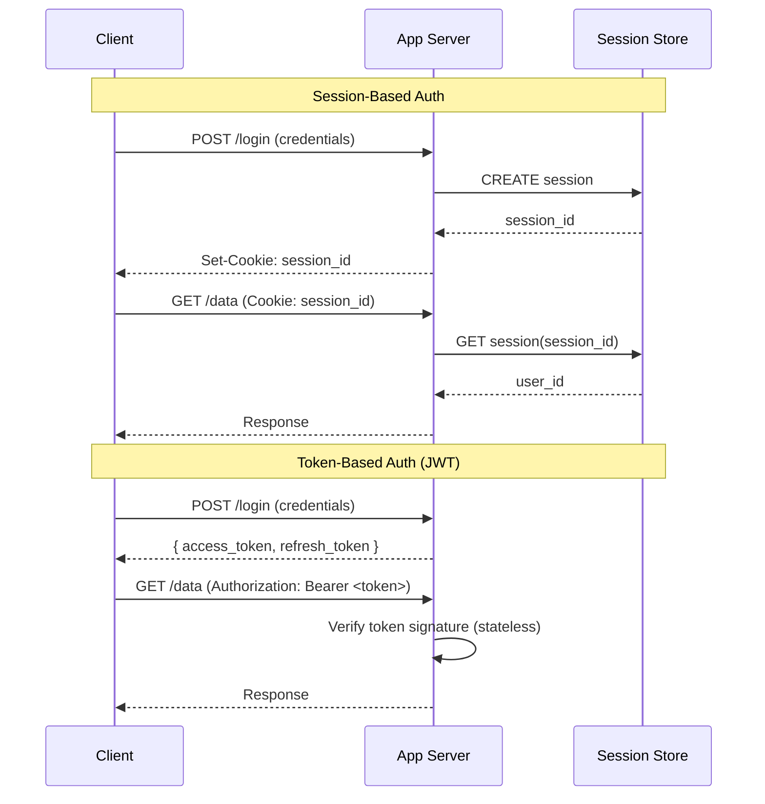

# Authentication

## Definition
Authentication (authn) is the process of verifying the identity of a user, device, or system. It answers the question: "Who are you?" Authentication must happen before authorization.

## Methods

| Method | Security | UX | Best For |
|--------|----------|----|----------|
| **Password** | Low | Low | Legacy systems (avoid) |
| **SMS OTP** | Medium | Medium | 2FA fallback |
| **TOTP (Auth apps)** | High | Medium | Standard 2FA |
| **Biometric** | High | High | Mobile apps, devices |
| **SSO (SAML/OIDC)** | Medium-High | High | Enterprise |
| **Passkeys/WebAuthn** | Very High | High | Modern, phishing-resistant |
| **Magic Link** | Medium | Very High | Low-security apps |

## Session vs Token Auth



## MFA Architecture

```
Factors:
  1. Knowledge: password, PIN
  2. Possession: phone, hardware key (YubiKey)
  3. Inherence: fingerprint, face, voice
  4. Location: trusted IP, GPS
  5. Behavior: typing pattern, mouse movement

MFA Flow:
  1. User enters password (factor 1)
  2. Server validates, challenges for factor 2
  3. User provides TOTP from authenticator app
  4. Server validates TOTP, issues session/token
  5. Step-up auth: Admin operations require hardware key

Passwordless (Passkeys):
  - Uses WebAuthn + FIDO2
  - Private key stays on device (never leaves)
  - Server stores public key
  - Phishing resistant (bound to origin)
```

## Interview Questions

1. Compare session-based auth vs token-based auth (JWT)
2. How does Multi-Factor Authentication work?
3. What is WebAuthn and how does it improve security?
4. Design an authentication system for a global platform
5. How do you handle password storage securely (hashing, salting, bcrypt/argon2)?
6. How does OAuth 2.0 differ from OpenID Connect for authentication?
