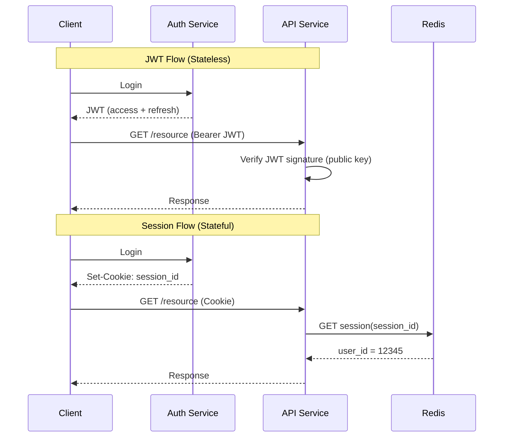

# JWT (JSON Web Token)

## Definition
JWT (RFC 7519) is a compact, URL-safe token format for representing claims securely between two parties. It's commonly used for authentication, authorization, and information exchange in distributed systems.

## Structure

```
Format: header.payload.signature

Header (base64url encoded):
{
  "alg": "RS256",      // Signing algorithm
  "typ": "JWT",         // Token type
  "kid": "key-id-1"     // Key identifier (for key rotation)
}

Payload (base64url encoded):
{
  "sub": "user_12345",     // Subject (user identifier)
  "name": "Alice Smith",   // Custom claim
  "iat": 1516239022,       // Issued at (epoch)
  "exp": 1516242622,       // Expiration (epoch)
  "aud": "api.example.com",// Audience
  "iss": "auth.example.com",// Issuer
  "role": "admin",         // Custom claim
  "permissions": ["read", "write"]
}

Signature:
  RSASHA256(
    base64urlEncode(header) + "." + base64urlEncode(payload),
    privateKey
  )
  // Verified with public key
```

## JWT vs Session



## Comparison

| Aspect | JWT | Session |
|--------|-----|---------|
| **Storage** | Client-side (self-contained) | Server-side (Redis/DB) |
| **Scaling** | Stateless — no shared session store needed | Requires distributed session store |
| **Revocation** | Hard — valid until `exp` | Easy — delete from session store |
| **Size** | Larger (each request carries full payload) | Small (just session ID cookie) |
| **Performance** | Verification < 1ms (cached public key) | ~1-5ms Redis lookup |
| **Security** | Signed (tamper-proof) | Opaque (no payload in cookie) |

## Best Practices

```
1. Short-lived access tokens (15-60 min)
2. Refresh tokens for extending sessions (7-30 days)
3. Store in httpOnly, Secure, SameSite cookies (NOT localStorage)
4. Use asymmetric signing (RS256/ES256) for multi-service verification
5. Include jti (JWT ID) for revocation tracking
6. Implement token rotation (new refresh token each use)
7. Blacklist compromised tokens (temporary, until expiry)

Why not localStorage?
- XSS can steal tokens
- httpOnly cookies are immune to JS access
- Use BFF (Backend for Frontend) pattern to issue cookies
```

## Interview Questions

1. How does JWT authentication work step by step?
2. What are the security concerns with JWT stored in localStorage?
3. How do you handle JWT revocation without a session store?
4. Compare JWT with opaque tokens for API authentication
5. Design a JWT-based authentication system with refresh tokens
6. How does JWT work in a microservice architecture? (verify with public key)
