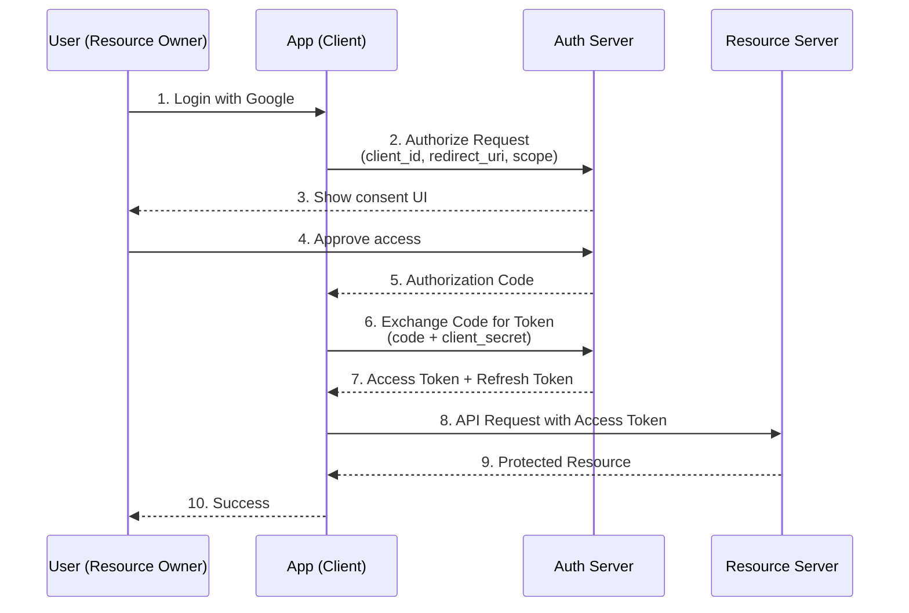

# OAuth 2.0

## Definition
OAuth 2.0 is an authorization framework that enables third-party applications to obtain limited access to user accounts on an HTTP service.

## Roles

## Grant Types

| Grant | Use Case | Security |
|-------|----------|----------|
| **Authorization Code** | Server-side web apps | Best |
| **PKCE** | Mobile/SPA | Enhanced |
| **Client Credentials** | Machine-to-machine | Service auth |
| **Implicit** | Legacy (deprecated) | Poor |
| **Resource Owner Password** | Trusted apps | Avoid |

## Interview Questions
1. How does the OAuth 2.0 authorization code flow work?
2. What is PKCE and why is it needed for mobile apps?
3. How does OAuth 2.0 differ from SAML?
4. What is the difference between OAuth 2.0 and OpenID Connect?
5. Design an OAuth 2.0 flow for a third-party API integration
