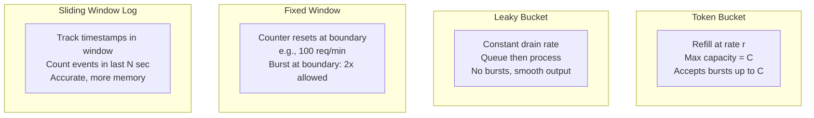

# Rate Limiting

## Definition
Rate limiting controls the rate of traffic sent or received by a network interface. It protects APIs and services from abuse and ensures fair usage.

## Algorithms

| Algorithm | Pros | Cons |
|-----------|------|------|
| **Token Bucket** | Handles bursts, simple | Memory per user |
| **Leaky Bucket** | Smooths traffic | Doesn't handle bursts |
| **Fixed Window** | Simple | Bursts at window boundary |
| **Sliding Window** | No boundary burst | More complex |
| **Sliding Window Log** | Accurate | Memory intensive |

## Algorithms Comparison



## Implementation (Token Bucket)

```python
class TokenBucket:
    def __init__(self, rate, capacity):
        self.rate = rate       # tokens per second
        self.capacity = capacity
        self.tokens = capacity
        self.last_refill = time.time()
    
    def allow(self):
        now = time.time()
        elapsed = now - self.last_refill
        self.tokens = min(self.capacity, 
                          self.tokens + elapsed * self.rate)
        self.last_refill = now
        
        if self.tokens >= 1:
            self.tokens -= 1
            return True
        return False
        
# Distributed Rate Limiter (Redis)
def allow_request_redis(user_id, limit=100, window_sec=60):
    key = f"rate_limit:{user_id}"
    current = redis.incr(key)
    if current == 1:
        redis.expire(key, window_sec)
    return current <= limit
```

## Interview Questions
1. Compare token bucket vs sliding window rate limiting
2. How do you rate limit across multiple servers?
3. What HTTP status code should rate limited requests receive?
4. How does rate limiting differ from throttling?
5. Design a distributed rate limiter using Redis
