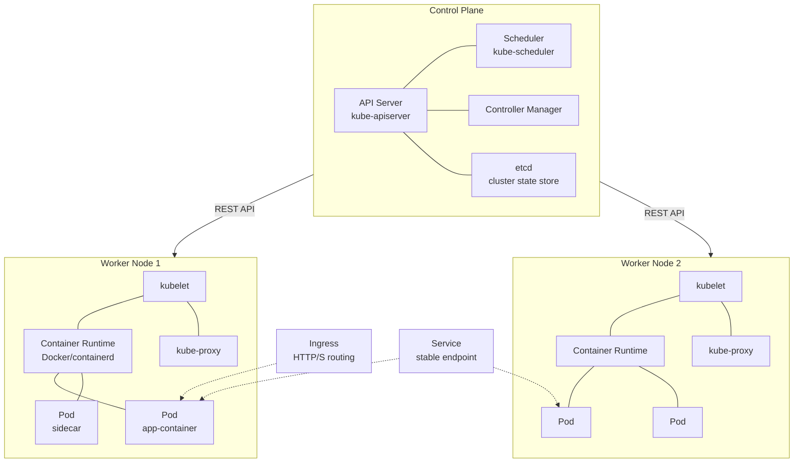

# Kubernetes (K8s)

## Definition
Kubernetes is an open-source container orchestration platform that automates deployment, scaling, and management of containerized applications.

## Architecture

## Key Concepts

| Concept | Description |
|---------|-------------|
| **Pod** | Smallest deployable unit (1+ containers) |
| **Deployment** | Declarative pod updates (rollout/rollback) |
| **Service** | Stable network endpoint for pods |
| **ConfigMap/Secret** | Configuration and secrets |
| **Ingress** | HTTP/S traffic routing |
| **PersistentVolume** | Storage abstraction |
| **Namespace** | Virtual cluster isolation |

## Related Topics
- [Docker](../08-Docker/01-docker-basics.md) — Container runtime foundation
- [EKS/GKE/AKS](13-eks-gke-aks.md) — Managed Kubernetes comparison (within K8s module)
- [AWS Overview](../10-AWS/01-aws-overview.md) — Major cloud provider
- [Service Discovery](../06-Distributed-Systems/08-service-discovery.md) — How services find each other
- [VPC Networking](../10-AWS/08-vpc-networking.md) — Network isolation in cloud

## Interview Questions
1. How does Kubernetes handle pod scheduling?
2. What's the difference between a Deployment and a StatefulSet?
3. How does Kubernetes service discovery work?
4. How would you handle a pod that's crash-looping?
5. Design a production-grade Kubernetes cluster architecture
