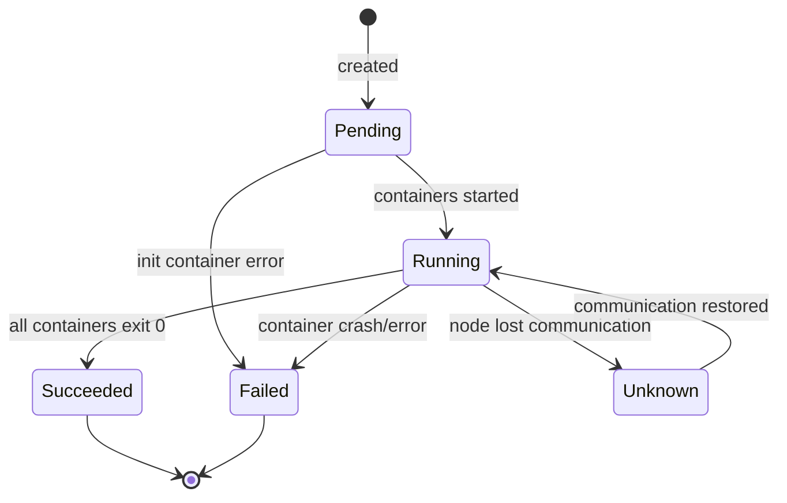

# Pods

## Definition
A Pod is the smallest deployable unit in Kubernetes — a logical host for one or more containers that share network, storage, and lifecycle. Pods are ephemeral by design and are the atomic unit of scheduling.

## Real-World Example
A microservice application sidecar injecting an Envoy proxy to handle mTLS, observability, and circuit breaking alongside the main application container. The init container downloads config secrets before the app starts.

## Key Concepts

### Pod Lifecycle


### Multi-Container Patterns
| Pattern | Role |
|---------|------|
| **Sidecar** | Enhances main container (logging, proxy, monitoring) |
| **Ambassador** | Proxies external connections (rate limiting, auth) |
| **Adapter** | Transforms output (metric format conversion) |
| **Init Containers** | Run to completion before app containers start |

## Hands-on YAML

```yaml
apiVersion: v1
kind: Pod
metadata:
  name: multi-container-pod
  labels:
    app: my-app
    tier: backend
spec:
  initContainers:
    - name: init-myservice
      image: busybox:1.36
      command: ["sh", "-c", "until nslookup myservice; do echo waiting; sleep 2; done"]
  containers:
    - name: app
      image: nginx:1.25
      ports:
        - containerPort: 80
      resources:
        requests:
          cpu: 250m
          memory: 256Mi
        limits:
          cpu: 500m
          memory: 512Mi
      securityContext:
        runAsNonRoot: true
        runAsUser: 1000
        capabilities:
          drop: ["ALL"]
        readOnlyRootFilesystem: true
      livenessProbe:
        httpGet:
          path: /healthz
          port: 80
        initialDelaySeconds: 3
        periodSeconds: 5
      readinessProbe:
        httpGet:
          path: /ready
          port: 80
        initialDelaySeconds: 3
        periodSeconds: 5
    - name: sidecar
      image: envoyproxy/envoy:v1.29-latest
      ports:
        - containerPort: 9901
      resources:
        requests:
          cpu: 100m
          memory: 128Mi
        limits:
          cpu: 200m
          memory: 256Mi
  restartPolicy: Always
  serviceAccountName: app-sa
  automountServiceAccountToken: false
```

### Pod Status Conditions
```yaml
status:
  conditions:
    - type: PodScheduled
      status: "True"
      lastTransitionTime: "2025-06-01T12:00:00Z"
    - type: Initialized
      status: "True"
    - type: ContainersReady
      status: "True"
    - type: Ready
      status: "True"
```

### QoS Classes
```yaml
# Guaranteed — limits == requests for all containers
resources:
  requests:
    cpu: 500m
    memory: 512Mi
  limits:
    cpu: 500m
    memory: 512Mi

# Burstable — at least one container has requests < limits
resources:
  requests:
    cpu: 250m
    memory: 256Mi
  limits:
    cpu: 500m
    memory: 512Mi

# BestEffort — no requests or limits set
# (container spec with no resources block)
```

### Pod Security Context
```yaml
spec:
  securityContext:
    seccompProfile:
      type: RuntimeDefault
    seLinuxOptions:
      level: s0:c123,c456
    fsGroup: 2000
    supplementalGroups: [3000]
```

## Best Practices
- Set resource requests and limits on every container.
- Use `readinessProbe` and `livenessProbe` for self-healing.
- Prefer `runAsNonRoot: true` and drop all capabilities.
- Keep containers in a pod tightly coupled (scale together).
- Use `initContainers` for setup tasks, never for runtime logic.
- Aim for `Guaranteed` QoS for critical workloads.

## Interview Questions
1. What is the difference between a Pod and a Deployment?
2. Explain the sidecar pattern and when you would use it.
3. How do init containers differ from regular containers?
4. What happens when a pod exceeds its memory limit?
5. How does Kubernetes determine which pod to evict under memory pressure?
