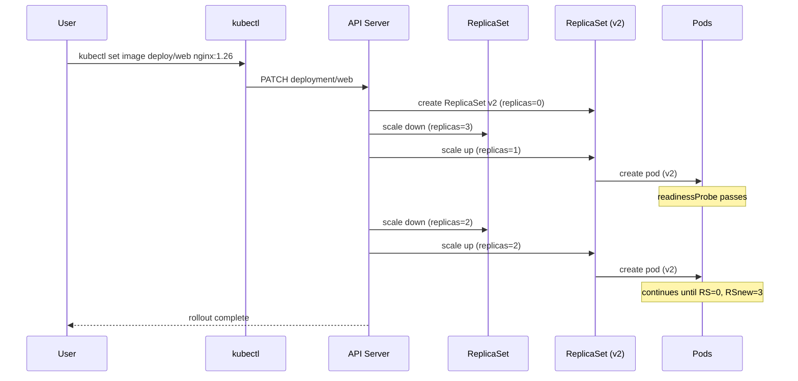

# Deployments

## Definition
A Deployment provides declarative updates for Pods and ReplicaSets. It manages the desired state, rollout strategy, revision history, and automatic rollback capabilities. Deployments own ReplicaSets, which in turn own Pods.

## Real-World Example
A payment-processing microservice that must be updated without downtime. The Deployment uses RollingUpdate strategy with maxSurge=25% and maxUnavailable=0%, ensuring every request is handled during deployment.

## Key Concepts

### Rolling Update Process


## Hands-on YAML

```yaml
apiVersion: apps/v1
kind: Deployment
metadata:
  name: web-app
  labels:
    app: web
    tier: frontend
spec:
  replicas: 5
  revisionHistoryLimit: 10
  strategy:
    type: RollingUpdate
    rollingUpdate:
      maxSurge: 1
      maxUnavailable: 0
  selector:
    matchLabels:
      app: web
  template:
    metadata:
      labels:
        app: web
        version: v2
    spec:
      containers:
        - name: nginx
          image: nginx:1.26-alpine
          ports:
            - containerPort: 80
          readinessProbe:
            httpGet:
              path: /health
              port: 80
            initialDelaySeconds: 5
            periodSeconds: 5
          resources:
            requests:
              cpu: 200m
              memory: 256Mi
            limits:
              cpu: 500m
              memory: 512Mi
      terminationGracePeriodSeconds: 60
```

### Recreate Strategy
```yaml
spec:
  strategy:
    type: Recreate
  # Deletes all old pods before creating new ones
  # Preferred for stateful workloads or DB migrations
```

### Rollout Commands
```bash
# Check rollout status
kubectl rollout status deployment/web-app

# View rollout history
kubectl rollout history deployment/web-app

# Rollback to previous revision
kubectl rollout undo deployment/web-app

# Rollback to specific revision
kubectl rollout undo deployment/web-app --to-revision=3

# Pause/unpause rollout
kubectl rollout pause deployment/web-app
kubectl rollout resume deployment/web-app
```

### ReplicaSet Ownership
```yaml
# Created automatically by Deployment
apiVersion: apps/v1
kind: ReplicaSet
metadata:
  name: web-app-7d9f8c6b4
  ownerReferences:
    - apiVersion: apps/v1
      kind: Deployment
      name: web-app
      uid: a1b2c3d4-e5f6-...
spec:
  replicas: 5
  selector:
    matchLabels:
      app: web
      version: v2
  template:
    # Pod template identical to Deployment
```

### Paused Deployment
```yaml
spec:
  paused: true
  # Allows multiple changes before triggering rollout
  # Useful for canary or blue/green workflows
```

## Best Practices
- Always set `maxUnavailable: 0` for zero-downtime deployments.
- Use `revisionHistoryLimit` to avoid etcd bloat (default: 10).
- Prefer RollingUpdate over Recreate for stateless workloads.
- Pin container images to specific tags (never `latest`).
- Use readiness probes to prevent routing traffic to unhealthy pods.
- Combine with `kubectl rollout pause` for phased rollouts.

## Interview Questions
1. How does a Deployment differ from a ReplicaSet?
2. Explain the difference between RollingUpdate and Recreate strategies.
3. What happens during a deployment rollback?
4. How does maxSurge and maxUnavailable affect a rolling update?
5. Can you run two ReplicaSets from one Deployment at the same time?
