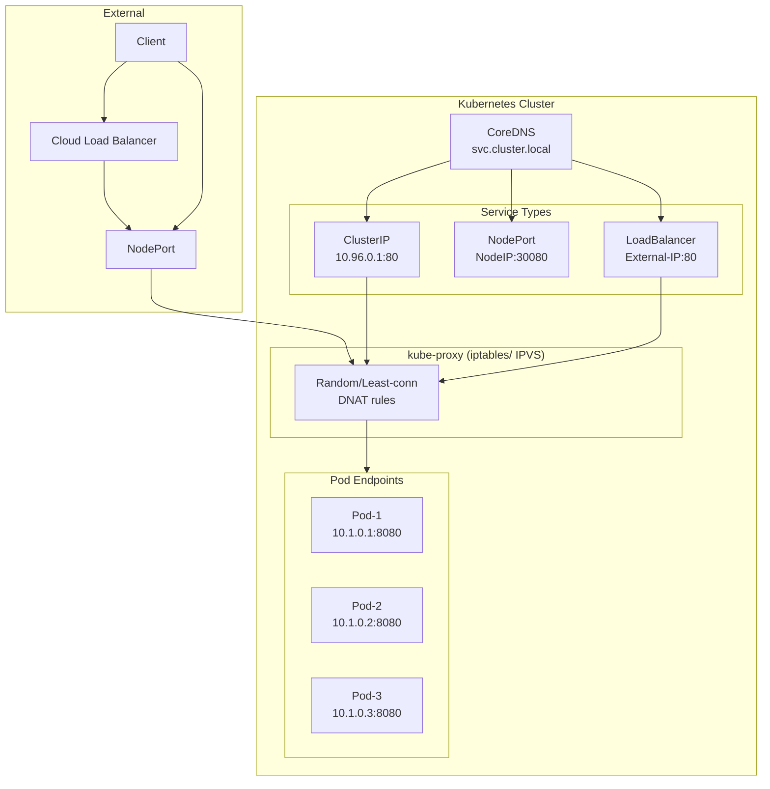

# Services

## Definition
A Service is an abstraction that defines a logical set of Pods and a policy for accessing them. Services provide stable networking (IP + DNS) regardless of pod churn, enabling service discovery and load-balanced traffic.

## Real-World Example
An e-commerce platform with a frontend service (ClusterIP), an API gateway (NodePort for internal testing), and a public-facing Ingress controller backed by a cloud LoadBalancer. Redis StatefulSet uses a headless service for direct pod DNS.

## Key Concepts

### Service Traffic Routing


## Hands-on YAML

```yaml
apiVersion: v1
kind: Service
metadata:
  name: web-service
spec:
  type: ClusterIP
  clusterIP: 10.96.0.50
  selector:
    app: web
  ports:
    - name: http
      protocol: TCP
      port: 80
      targetPort: 8080
    - name: metrics
      protocol: TCP
      port: 9090
      targetPort: 9090
  sessionAffinity: ClientIP
  sessionAffinityConfig:
    clientIP:
      timeoutSeconds: 10800
```

### Service Types
```yaml
# NodePort — exposes on each node's IP at a static port
apiVersion: v1
kind: Service
metadata:
  name: nodeport-svc
spec:
  type: NodePort
  selector:
    app: api
  ports:
    - port: 80
      targetPort: 3000
      nodePort: 30080

# LoadBalancer — provisions cloud LB
apiVersion: v1
kind: Service
metadata:
  name: lb-svc
  annotations:
    service.beta.kubernetes.io/aws-load-balancer-type: nlb
spec:
  type: LoadBalancer
  selector:
    app: frontend
  ports:
    - port: 443
      targetPort: 8443

# ExternalName — DNS alias to external service
apiVersion: v1
kind: Service
metadata:
  name: external-db
spec:
  type: ExternalName
  externalName: database.example.com
```

### Headless Service
```yaml
apiVersion: v1
kind: Service
metadata:
  name: statefulset-svc
spec:
  clusterIP: None
  selector:
    app: kafka
  ports:
    - port: 9092
      targetPort: 9092
# Pod DNS: pod-name-0.statefulset-svc.namespace.svc.cluster.local
```

### Endpoints (manual)
```yaml
apiVersion: v1
kind: Endpoints
metadata:
  name: external-service
subsets:
  - addresses:
      - ip: 192.168.1.100
      - ip: 192.168.1.101
    ports:
      - port: 3306
```

### kube-proxy Modes
```bash
# iptables mode (default) — per-packet DNAT via iptables rules
# IPVS mode (scalable) — kernel-level L4 LB with scheduling:
#   rr: round-robin, lc: least-connection, dh: destination-hash
kubectl get configmap kube-proxy -n kube-system -o yaml
```

### DNS-Based Service Discovery
```bash
# Accessible within namespace
curl http://web-service:80

# Cross-namespace
curl http://web-service.default.svc.cluster.local:80

# Pod DNS (via headless service or hostname)
curl http://pod-0.statefulset-svc.default.svc.cluster.local:9092
```

## Best Practices
- Use `internalTrafficPolicy: Local` to reduce hops for mesh traffic.
- Set `sessionAffinity: ClientIP` for stateful frontends.
- Prefer IPVS for clusters with over 1000 services.
- Use headless services for StatefulSets and discovery-heavy workloads.
- Avoid using `type: LoadBalancer` directly; use Ingress for HTTP/S.

## Interview Questions
1. What is the difference between ClusterIP, NodePort, and LoadBalancer?
2. How does kube-proxy implement service routing?
3. What is a headless service and when would you use it?
4. How does DNS-based service discovery work in Kubernetes?
5. How do Endpoints differ from EndpointSlices?
