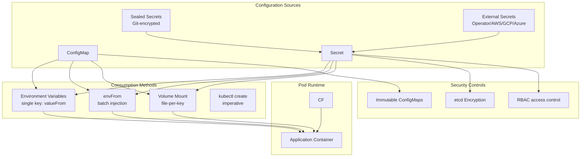

# ConfigMaps & Secrets

## Definition
ConfigMaps store non-sensitive configuration key-value pairs. Secrets store sensitive data (credentials, tokens, certs) in base64-encoded form. Both can be consumed as environment variables, mounted as volumes, or injected via `envFrom`. Secrets support encryption at rest and external management tools.

## Real-World Example
A 12-factor app reads database credentials from a Secret (via envFrom), loads the application config from a ConfigMap mounted as a volume, and auto-rotates TLS certs using cert-manager with Sealed Secrets stored in Git.

## Key Concepts

### ConfigMap/Secret Consumption Paths


## Hands-on YAML

```yaml
apiVersion: v1
kind: ConfigMap
metadata:
  name: app-config
data:
  APP_ENV: production
  LOG_LEVEL: debug
  APP_NAME: my-app
  nginx.conf: |
    server {
      listen 80;
      location / {
        proxy_pass http://backend:3000;
      }
    }
```

```yaml
apiVersion: v1
kind: Secret
metadata:
  name: db-secret
type: Opaque
data:
  DB_HOST: cG9zdGdyZXMtcHJvZC5leGFtcGxlLmNvbQ==
  DB_USER: YWRtaW4=
  DB_PASSWORD: c3VwZXJzZWNyZXQxMjM=
stringData:
  DB_NAME: production_db
```

### Consumption Methods
```yaml
apiVersion: v1
kind: Pod
metadata:
  name: config-consumer
spec:
  containers:
    - name: app
      image: my-app:1.0
      env:
        - name: APP_ENV
          valueFrom:
            configMapKeyRef:
              name: app-config
              key: APP_ENV
        - name: DB_HOST
          valueFrom:
            secretKeyRef:
              name: db-secret
              key: DB_HOST
      envFrom:
        - configMapRef:
            name: app-config
        - secretRef:
            name: db-secret
      volumeMounts:
        - name: config-volume
          mountPath: /etc/config
        - name: secret-volume
          mountPath: /etc/secrets
          readOnly: true
  volumes:
    - name: config-volume
      configMap:
        name: app-config
        items:
          - key: nginx.conf
            path: nginx.conf
    - name: secret-volume
      secret:
        secretName: db-secret
        defaultMode: 0400
```

### Immutable ConfigMaps/Secrets
```yaml
apiVersion: v1
kind: ConfigMap
metadata:
  name: immutable-config
immutable: true
data:
  feature-flags: '{"new_checkout": true, "dark_mode": false}'
```

### Secret Types
```yaml
# Docker registry credentials
apiVersion: v1
kind: Secret
metadata:
  name: regcred
type: kubernetes.io/dockerconfigjson
data:
  .dockerconfigjson: eyJhdXRocyI6...

# TLS certificate
apiVersion: v1
kind: Secret
metadata:
  name: tls-cert
type: kubernetes.io/tls
data:
  tls.crt: LS0tLS1CRUdJTi...
  tls.key: LS0tLS1CRUdJTi...

# Bootstrap token
apiVersion: v1
kind: Secret
metadata:
  name: bootstrap-token-abc123
type: bootstrap.kubernetes.io/token
stringData:
  token-id: abc123
  token-secret: xyz789
```

### External Secrets Operator
```yaml
apiVersion: external-secrets.io/v1beta1
kind: ExternalSecret
metadata:
  name: aws-secret
spec:
  refreshInterval: 1h
  secretStoreRef:
    name: aws-secretsmanager
    kind: SecretStore
  target:
    name: db-credentials
  data:
    - secretKey: DB_PASSWORD
      remoteRef:
        key: /production/db/password
```

### kubectl Creation
```bash
# From literal values
kubectl create configmap app-config --from-literal=APP_ENV=production

# From file
kubectl create secret generic db-secret --from-file=./credentials.txt

# From env file
kubectl create configmap env-config --from-env-file=./app.env

# Decode secret
kubectl get secret db-secret -o jsonpath="{.data.DB_PASSWORD}" | base64 --decode
```

## Best Practices
- Use `immutable: true` for ConfigMaps/Secrets that never change.
- Enable etcd encryption at rest for Secrets (`--encryption-provider-config`).
- Never commit raw Secrets to Git — use Sealed Secrets or External Secrets Operator.
- Use `stringData` for Secrets in YAML (plaintext, encoded automatically).
- Mount secrets with `defaultMode: 0400` and `readOnly: true`.
- Leverage namespace-scoped RBAC to restrict Secret access.

## Interview Questions
1. What is the difference between ConfigMap and Secret?
2. How can a pod consume configuration from multiple ConfigMaps?
3. What happens when you update a ConfigMap that is mounted as a volume?
4. How do you rotate secrets in Kubernetes without restarting pods?
5. How do Sealed Secrets differ from External Secrets Operator?
