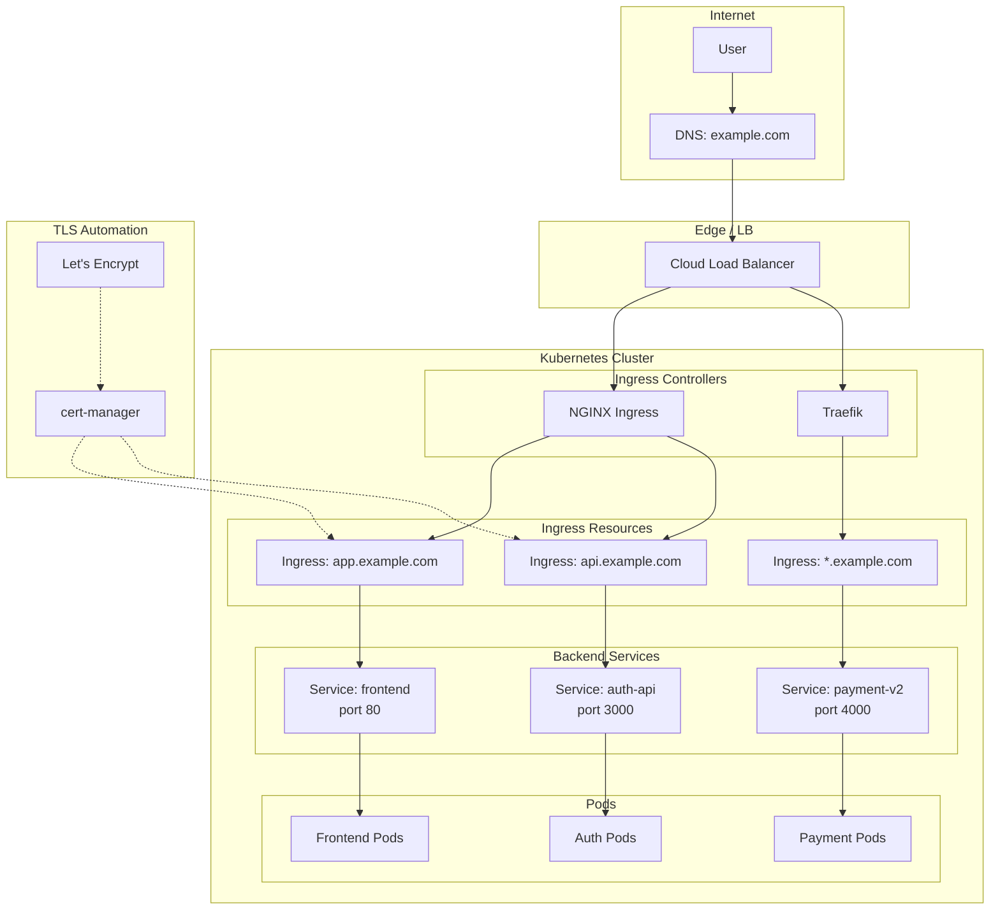

# Ingress

## Definition
Ingress exposes HTTP and HTTPS routes from outside the cluster to services within the cluster. It provides host-based and path-based routing, TLS termination, name-based virtual hosting, and load balancing. An Ingress Controller must be deployed to fulfill Ingress resources.

## Real-World Example
A SaaS platform routes traffic: `app.example.com` → frontend (React SPA), `api.example.com/v1/` → auth service, `api.example.com/v2/` → new payment service, `*.example.com` → catch-all landing page. TLS is auto-provisioned via cert-manager.

## Key Concepts

### Ingress Routing to Services


## Hands-on YAML

```yaml
apiVersion: networking.k8s.io/v1
kind: Ingress
metadata:
  name: multi-host-ingress
  annotations:
    nginx.ingress.kubernetes.io/rewrite-target: /
    nginx.ingress.kubernetes.io/ssl-redirect: "true"
    nginx.ingress.kubernetes.io/proxy-body-size: 50m
    cert-manager.io/cluster-issuer: letsencrypt-prod
spec:
  ingressClassName: nginx
  tls:
    - hosts:
        - app.example.com
        - api.example.com
      secretName: example-tls
  rules:
    - host: app.example.com
      http:
        paths:
          - path: /
            pathType: Prefix
            backend:
              service:
                name: frontend
                port:
                  number: 80
    - host: api.example.com
      http:
        paths:
          - path: /v1
            pathType: Prefix
            backend:
              service:
                name: auth-service
                port:
                  number: 3000
          - path: /v2
            pathType: Prefix
            backend:
              service:
                name: payment-service
                port:
                  number: 4000
```

### Ingress Controller Comparison
| Controller | Protocol | Features |
|------------|----------|----------|
| **NGINX** | HTTP/S, TCP, gRPC | Most mature, annotation-rich, k8s-native |
| **Traefik** | HTTP/S, TCP, UDP | Auto service discovery, dashboard, ACME |
| **HAProxy** | HTTP/S, TCP | High performance, advanced ACLs |
| **AWS ALB** | HTTP/S | Native AWS integration, WAF |
| **Contour** | HTTP/S, gRPC | Envoy-based, dynamic config via xDS |
| **Istio Gateway** | HTTP/S, TCP, gRPC | Service mesh integration, mTLS |

### Path-Based Routing
```yaml
spec:
  rules:
    - host: api.example.com
      http:
        paths:
          - path: /users
            pathType: Exact
            backend:
              service:
                name: user-svc
                port:
                  number: 8080
          - path: /orders
            pathType: Prefix
            backend:
              service:
                name: order-svc
                port:
                  number: 8080
```

### Ingress Classes
```yaml
apiVersion: networking.k8s.io/v1
kind: IngressClass
metadata:
  name: nginx-public
spec:
  controller: k8s.io/ingress-nginx
  parameters:
    apiGroup: k8s.io
    kind: IngressParameters
    name: public-config

---
apiVersion: networking.k8s.io/v1
kind: Ingress
metadata:
  name: app-ingress
spec:
  ingressClassName: nginx-public
  # ...
```

### cert-manager Auto TLS
```yaml
apiVersion: cert-manager.io/v1
kind: ClusterIssuer
metadata:
  name: letsencrypt-prod
spec:
  acme:
    server: https://acme-v02.api.letsencrypt.org/directory
    email: admin@example.com
    privateKeySecretRef:
      name: letsencrypt-key
    solvers:
      - http01:
          ingress:
            class: nginx
```

### Canary Annotations (NGINX)
```yaml
apiVersion: networking.k8s.io/v1
kind: Ingress
metadata:
  name: canary-ingress
  annotations:
    nginx.ingress.kubernetes.io/canary: "true"
    nginx.ingress.kubernetes.io/canary-weight: "10"
spec:
  ingressClassName: nginx
  rules:
    - host: app.example.com
      http:
        paths:
          - path: /
            pathType: Prefix
            backend:
              service:
                name: frontend-canary
                port:
                  number: 80
```

## Best Practices
- Always set resource limits on the Ingress controller pods.
- Use `cert-manager` with Let's Encrypt for automatic TLS.
- Set `ingressClassName` explicitly (avoid relying on default class).
- Use path-based routing to expose multiple services on one IP.
- Enable `keepalive` and `gzip` in NGINX controller ConfigMap.
- Use annotations for fine-grained control (rate limiting, CORS, WAF).

## Interview Questions
1. How does an Ingress differ from a LoadBalancer Service?
2. What is the role of an Ingress controller?
3. How does cert-manager automate TLS certificate provisioning?
4. How would you implement a canary deployment using Ingress?
5. What are the differences between NGINX and ALB Ingress controllers?
