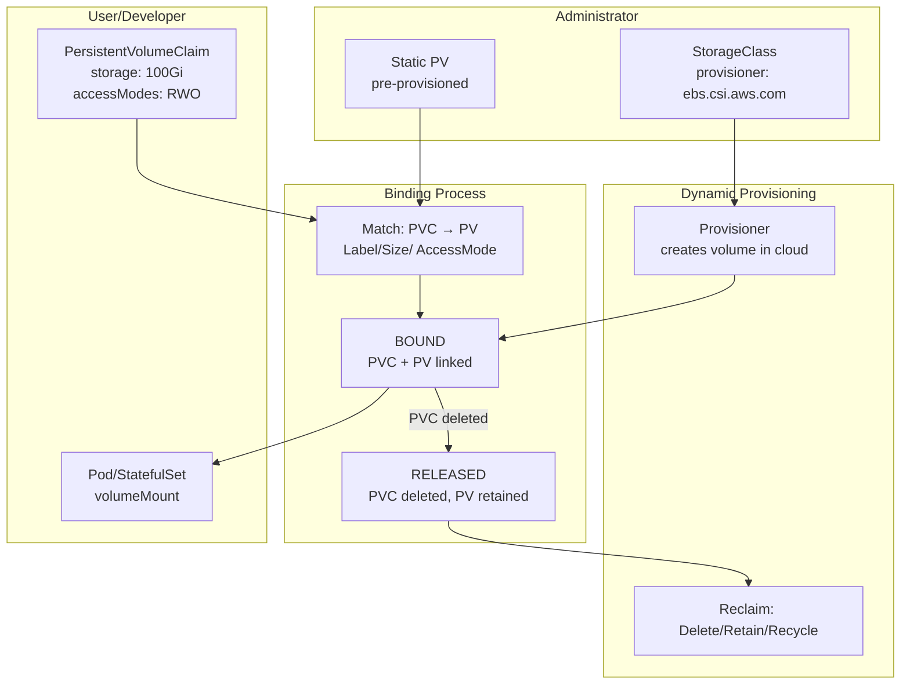

# Storage

## Definition
Kubernetes storage abstraction decouples storage lifecycle from pod lifecycle. PersistentVolume (PV) is cluster storage provisioned by an administrator. PersistentVolumeClaim (PVC) is a user request for storage. StorageClass enables dynamic provisioning with configurable backends.

## Real-World Example
A PostgreSQL StatefulSet on AWS uses a `gp3` StorageClass with `WaitForFirstConsumer` binding, dynamically provisioning 100GB EBS volumes per replica. The PVC template ensures each pod gets a dedicated volume that survives rescheduling.

## Key Concepts

### PV/PVC Binding Flow


## Hands-on YAML

```yaml
apiVersion: storage.k8s.io/v1
kind: StorageClass
metadata:
  name: fast-ssd
provisioner: ebs.csi.aws.com
parameters:
  type: gp3
  iops: "3000"
  throughput: "125"
  encrypted: "true"
reclaimPolicy: Delete
volumeBindingMode: WaitForFirstConsumer
allowVolumeExpansion: true
mountOptions:
  - discard
```

```yaml
apiVersion: v1
kind: PersistentVolumeClaim
metadata:
  name: data-pvc
spec:
  accessModes:
    - ReadWriteOnce
  storageClassName: fast-ssd
  resources:
    requests:
      storage: 100Gi
  selector:
    matchLabels:
      tier: database
```

```yaml
apiVersion: v1
kind: Pod
metadata:
  name: storage-consumer
spec:
  containers:
    - name: app
      image: nginx:1.25
      volumeMounts:
        - name: data
          mountPath: /data
  volumes:
    - name: data
      persistentVolumeClaim:
        claimName: data-pvc
```

### Access Modes
| Mode | Description | Typical Backend |
|------|-------------|-----------------|
| **ReadWriteOnce (RWO)** | Single node read-write | EBS, GCE PD, Azure Disk |
| **ReadOnlyMany (ROX)** | Many nodes read-only | NFS, Cloud File Store |
| **ReadWriteMany (RWX)** | Many nodes read-write | NFS, EFS, GlusterFS, Azure Files |
| **ReadWriteOncePod (RWOP)** | Single pod read-write | CSI 1.22+, beta |

### Dynamic Provisioning with CSI
```yaml
apiVersion: v1
kind: PersistentVolumeClaim
metadata:
  name: dynamic-pvc
spec:
  accessModes:
    - ReadWriteOnce
  storageClassName: fast-ssd
  resources:
    requests:
      storage: 50Gi
  dataSource:
    name: snapshot-volume
    kind: VolumeSnapshot
    apiGroup: snapshot.storage.k8s.io
```

### Static PV Definition
```yaml
apiVersion: v1
kind: PersistentVolume
metadata:
  name: manual-pv
  labels:
    tier: database
spec:
  capacity:
    storage: 200Gi
  volumeMode: Filesystem
  accessModes:
    - ReadWriteOnce
  persistentVolumeReclaimPolicy: Retain
  storageClassName: ""
  nfs:
    path: /exports/data
    server: nfs-server.internal
```

### Volume Snapshot
```yaml
apiVersion: snapshot.storage.k8s.io/v1
kind: VolumeSnapshotClass
metadata:
  name: fast-snapshots
driver: ebs.csi.aws.com
deletionPolicy: Delete
---
apiVersion: snapshot.storage.k8s.io/v1
kind: VolumeSnapshot
metadata:
  name: db-snapshot-20250601
spec:
  volumeSnapshotClassName: fast-snapshots
  source:
    persistentVolumeClaimName: data-pvc
```

### Stateful Workload Pattern
```yaml
apiVersion: apps/v1
kind: StatefulSet
metadata:
  name: postgres
spec:
  serviceName: postgres
  replicas: 3
  volumeClaimTemplates:
    - metadata:
        name: data
      spec:
        accessModes:
          - ReadWriteOnce
        storageClassName: fast-ssd
        resources:
          requests:
            storage: 100Gi
```

### Resize PVC
```bash
# Edit PVC to request more storage
kubectl edit pvc data-pvc
# Change resources.requests.storage to 200Gi
# Requires allowVolumeExpansion: true in StorageClass
kubectl get pvc data-pvc -w
```

## Best Practices
- Always set `volumeBindingMode: WaitForFirstConsumer` for topology-aware scheduling.
- Use CSI drivers over in-tree provisioners (deprecated since 1.21).
- Set `reclaimPolicy: Retain` for critical data to prevent accidental deletion.
- Enable `allowVolumeExpansion` for flexible storage growth.
- Use `VolumeSnapshot` for backup before upgrade operations.
- Prefer `ReadWriteOncePod` over `ReadWriteOnce` for single-writer guarantees.

## Interview Questions
1. What is the difference between a PersistentVolume and a PersistentVolumeClaim?
2. How does dynamic provisioning differ from static provisioning?
3. What are the three reclaim policies and when would you use each?
4. Explain the WaitForFirstConsumer volume binding mode.
5. How does the CSI driver architecture differ from in-tree volume plugins?
