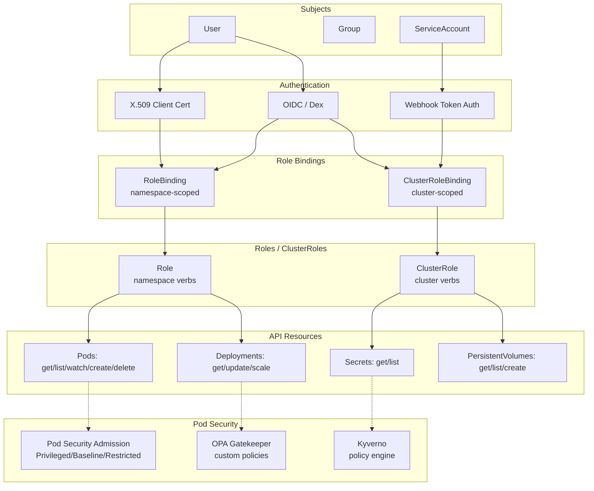

# RBAC & Security

## Definition
Role-Based Access Control (RBAC) governs who can access the Kubernetes API and what actions they can perform. Roles define permissions within a namespace, ClusterRoles define cluster-wide permissions. RoleBindings and ClusterRoleBindings attach those permissions to users, groups, or service accounts.

## Real-World Example
A platform team grants CI/CD pipeline service accounts namespace-scoped deploy/rollback permissions, while security auditors receive cluster-wide read-only access. Pod Security Standards prevent privileged containers in shared namespaces.

## Key Concepts

### RBAC Authorization Flow


## Hands-on YAML

```yaml
apiVersion: rbac.authorization.k8s.io/v1
kind: Role
metadata:
  namespace: default
  name: pod-manager
rules:
  - apiGroups: [""]
    resources: ["pods", "pods/log", "pods/exec"]
    verbs: ["get", "list", "watch", "create", "update", "patch", "delete"]
  - apiGroups: ["apps"]
    resources: ["deployments", "statefulsets"]
    verbs: ["get", "list", "watch", "create", "update"]
  - apiGroups: [""]
    resources: ["configmaps", "secrets"]
    verbs: ["get", "list"]
```

```yaml
apiVersion: rbac.authorization.k8s.io/v1
kind: RoleBinding
metadata:
  namespace: default
  name: pod-manager-binding
subjects:
  - kind: ServiceAccount
    name: ci-cd-sa
    namespace: ci
  - kind: User
    name: developer@example.com
    apiGroup: rbac.authorization.k8s.io
roleRef:
  kind: Role
  name: pod-manager
  apiGroup: rbac.authorization.k8s.io
```

### ClusterRole & ClusterRoleBinding
```yaml
apiVersion: rbac.authorization.k8s.io/v1
kind: ClusterRole
metadata:
  name: cluster-reader
rules:
  - apiGroups: [""]
    resources: ["nodes", "namespaces", "persistentvolumes"]
    verbs: ["get", "list", "watch"]
  - apiGroups: ["apiextensions.k8s.io"]
    resources: ["customresourcedefinitions"]
    verbs: ["get", "list"]
---
apiVersion: rbac.authorization.k8s.io/v1
kind: ClusterRoleBinding
metadata:
  name: auditor-read-binding
subjects:
  - kind: User
    name: auditor@example.com
    apiGroup: rbac.authorization.k8s.io
roleRef:
  kind: ClusterRole
  name: cluster-reader
  apiGroup: rbac.authorization.k8s.io
```

### Service Account with RBAC
```yaml
apiVersion: v1
kind: ServiceAccount
metadata:
  name: app-sa
  namespace: production
automountServiceAccountToken: true
---
apiVersion: rbac.authorization.k8s.io/v1
kind: RoleBinding
metadata:
  namespace: production
  name: app-sa-binding
subjects:
  - kind: ServiceAccount
    name: app-sa
    namespace: production
roleRef:
  kind: ClusterRole
  name: system:discovery
  apiGroup: rbac.authorization.k8s.io
```

### Aggregated ClusterRole
```yaml
apiVersion: rbac.authorization.k8s.io/v1
kind: ClusterRole
metadata:
  name: aggregate-pod-reader
  labels:
    rbac.authorization.k8s.io/aggregate-to-view: "true"
rules:
  - apiGroups: [""]
    resources: ["pods"]
    verbs: ["get", "list", "watch"]
```

### Pod Security Standards
```yaml
apiVersion: v1
kind: Namespace
metadata:
  name: production
  labels:
    pod-security.kubernetes.io/enforce: restricted
    pod-security.kubernetes.io/enforce-version: latest
    pod-security.kubernetes.io/audit: baseline
    pod-security.kubernetes.io/warn: baseline
---
apiVersion: apps/v1
kind: Deployment
metadata:
  name: secure-app
  namespace: production
spec:
  template:
    spec:
      securityContext:
        seccompProfile:
          type: RuntimeDefault
      containers:
        - name: app
          securityContext:
            allowPrivilegeEscalation: false
            capabilities:
              drop: ["ALL"]
            runAsNonRoot: true
            runAsUser: 1000
```

### OPA Gatekeeper Constraint
```yaml
apiVersion: constraints.gatekeeper.sh/v1beta1
kind: K8sRequiredLabels
metadata:
  name: require-team-label
spec:
  match:
    kinds:
      - apiGroups: [""]
        kinds: ["Namespace"]
  parameters:
    labels:
      - key: "team"
        allowedRegex: "^[a-zA-Z]+$"
```

## Best Practices
- Grant the minimum permissions necessary (principle of least privilege).
- Use `ClusterRole` + `RoleBinding` for reusable permission sets.
- Never bind cluster-admin to user accounts.
- Restrict secret access to only service accounts that need them.
- Enforce Pod Security Standards (Restricted) in production namespaces.
- Audit RBAC permissions regularly with `kubectl auth can-i --list`.
- Use Kyverno or OPA Gatekeeper for policy-as-code beyond Pod Security.

## Interview Questions
1. What is the difference between Role and ClusterRole?
2. How does Kubernetes authenticate a user?
3. What are Pod Security Standards and the three levels?
4. How do you audit who can perform actions in a namespace?
5. What is the difference between OPA Gatekeeper and Kyverno?
