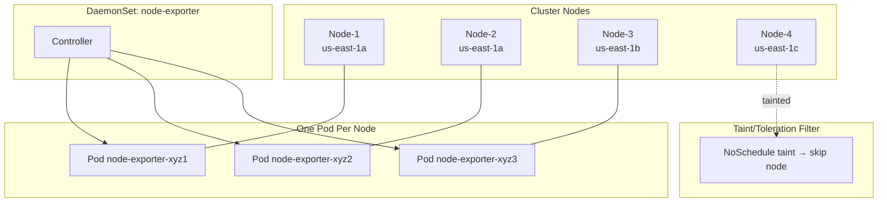

# StatefulSets & DaemonSets

## Definition
**StatefulSet** manages stateful applications with stable, unique network identities, ordered deployment/scaling, and persistent storage per pod. **DaemonSet** ensures all (or selected) nodes run a copy of a pod — ideal for node-level agents.

## Real-World Example
A 3-node Kafka cluster uses a StatefulSet with `volumeClaimTemplates` for persistent broker storage. A DaemonSet runs the node-exporter Prometheus agent and Fluentd log collector on every Kubernetes node.

## Key Concepts

### StatefulSet: Ordered Identity and Rolling Update
```mermaid
graph TB
    subgraph StatefulSet["StatefulSet: Kafka"]
        PVC0[PVC: data-kafka-0] --- P0[Pod: kafka-0<br/>ID: 0, hostname: kafka-0]
        PVC1[PVC: data-kafka-1] --- P1[Pod: kafka-1<br/>ID: 1, hostname: kafka-1]
        PVC2[PVC: data-kafka-2] --- P2[Pod: kafka-2<br/>ID: 2, hostname: kafka-2]
    end

    subgraph Headless["Headless Service"]
        SVC[kafka-hs<br/>kafka-0.kafka-hs.default.svc]
    end

    subgraph Order["Ordered Operations"]
        CREATE[Created: 0 → 1 → 2]
        UPDATE[Updated: 2 → 1 → 0 (reverse)]
        DELETE[Deleted: 2 → 1 → 0]
    end

    P0 -.-> SVC
    P1 -.-> SVC
    P2 -.-> SVC
    CREATE -.-> P0
    UPDATE -.-> P2
```

### DaemonSet: Node-Level Agent


## Hands-on YAML

### StatefulSet
```yaml
apiVersion: apps/v1
kind: StatefulSet
metadata:
  name: kafka
spec:
  serviceName: kafka-hs
  replicas: 3
  podManagementPolicy: OrderedReady
  updateStrategy:
    type: RollingUpdate
    rollingUpdate:
      maxUnavailable: 1
      partition: 0
  selector:
    matchLabels:
      app: kafka
  template:
    metadata:
      labels:
        app: kafka
    spec:
      containers:
        - name: kafka
          image: confluentinc/cp-kafka:7.6
          ports:
            - containerPort: 9092
              name: client
          env:
            - name: KAFKA_BROKER_ID
              valueFrom:
                fieldRef:
                  fieldPath: metadata.name
            - name: KAFKA_ZOOKEEPER_CONNECT
              value: zk-hs:2181
          volumeMounts:
            - name: data
              mountPath: /var/lib/kafka/data
  volumeClaimTemplates:
    - metadata:
        name: data
      spec:
        accessModes:
          - ReadWriteOnce
        storageClassName: fast-ssd
        resources:
          requests:
            storage: 100Gi
```

### DaemonSet
```yaml
apiVersion: apps/v1
kind: DaemonSet
metadata:
  name: node-exporter
spec:
  selector:
    matchLabels:
      app: node-exporter
  updateStrategy:
    type: RollingUpdate
    rollingUpdate:
      maxSurge: 0
      maxUnavailable: 1
  template:
    metadata:
      labels:
        app: node-exporter
    spec:
      hostNetwork: true
      hostPID: true
      containers:
        - name: node-exporter
          image: prom/node-exporter:v1.7
          ports:
            - containerPort: 9100
          resources:
            requests:
              cpu: 100m
              memory: 64Mi
            limits:
              cpu: 200m
              memory: 128Mi
          securityContext:
            privileged: false
            capabilities:
              add: ["SYS_PTRACE"]
      tolerations:
        - operator: Exists
      nodeSelector:
        kubernetes.io/os: linux
```

### StatefulSet Advanced Patterns
```yaml
# Parallel pod management (all pods created/deleted simultaneously)
spec:
  podManagementPolicy: Parallel

# Canary update via partition (only pods with index >= partition update)
spec:
  updateStrategy:
    type: RollingUpdate
    rollingUpdate:
      partition: 2
```

### DaemonSet Node Selector and Tolerations
```yaml
spec:
  # Only run on GPU nodes
  nodeSelector:
    nvidia.com/gpu: "true"
  tolerations:
    - key: nvidia.com/gpu
      operator: Exists
      effect: NoSchedule
    - key: CriticalAddonsOnly
      operator: Exists
```

### Common DaemonSet Use Cases
```yaml
# kube-proxy replacement with Cilium
apiVersion: apps/v1
kind: DaemonSet
metadata:
  name: cilium
  namespace: kube-system
spec:
  selector:
    matchLabels:
      k8s-app: cilium
  template:
    spec:
      containers:
        - name: cilium-agent
          image: cilium/cilium:v1.15
          securityContext:
            capabilities:
              add: ["NET_ADMIN", "SYS_MODULE"]
---
# Log collection with fluentd
apiVersion: apps/v1
kind: DaemonSet
metadata:
  name: fluentd
spec:
  selector:
    matchLabels:
      name: fluentd
  template:
    spec:
      containers:
        - name: fluentd
          image: fluent/fluentd-kubernetes-daemonset:v1.17
          volumeMounts:
            - name: varlog
              mountPath: /var/log
            - name: containers
              mountPath: /var/lib/docker/containers
      volumes:
        - name: varlog
          hostPath:
            path: /var/log
        - name: containers
          hostPath:
            path: /var/lib/docker/containers
```

## Best Practices
- Use StatefulSet only when applications require stable identity or persistent storage.
- Set `podManagementPolicy: Parallel` for high-performance stateful workloads.
- Use `partition` for canary rollouts of stateful applications.
- Always run DaemonSets with resource requests (they run on every node).
- Use `tolerations` for DaemonSets that must run on all nodes including control plane.
- Prefer `hostNetwork: true` for networking DaemonSets (kube-proxy, Cilium).

## Interview Questions
1. How does StatefulSet differ from Deployment?
2. What are volumeClaimTemplates and why are they important?
3. How do you perform a canary update on a StatefulSet?
4. What is a DaemonSet and when would you use one?
5. How does a DaemonSet ensure a pod runs on every node?
