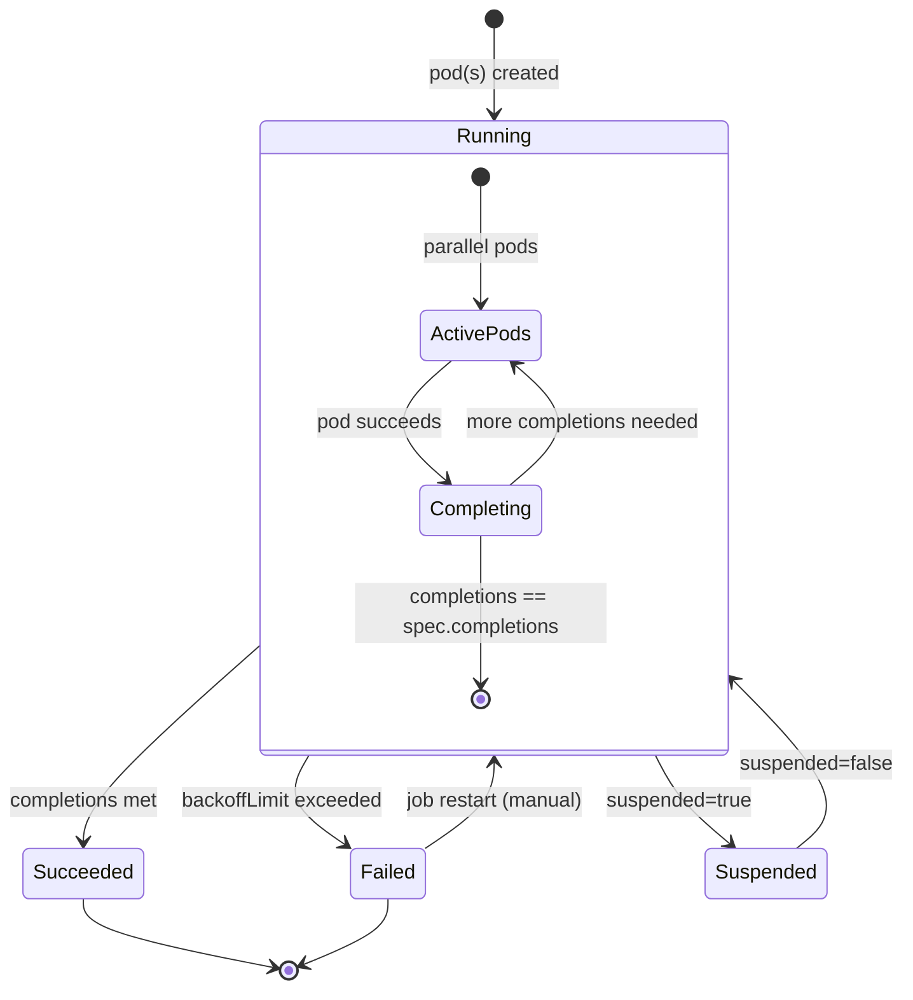
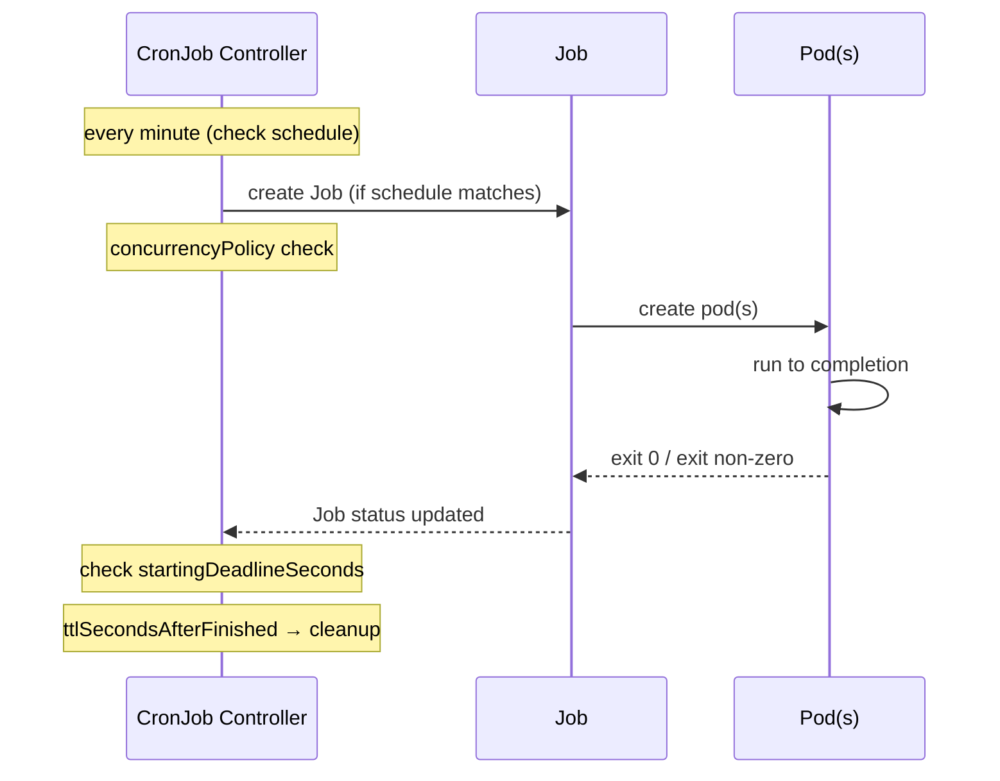

# Jobs & CronJobs

## Definition
A **Job** creates one or more Pods that run to completion (batch processing). A **CronJob** runs Jobs on a time-based schedule. Jobs support parallelism, work queues, retry limits, and timeouts. CronJobs add schedule expressions, concurrency policies, and deadlines.

## Real-World Example
A data pipeline runs a Spark Job daily at 2 AM to process 24 hours of clickstream data. A separate Job migrates database schemas before deployments. A CronJob cleans up old temp files every hour with `concurrencyPolicy: Forbid` to prevent overlap.

## Key Concepts

### Job Execution States


### CronJob Schedule Execution


## Hands-on YAML

```yaml
apiVersion: batch/v1
kind: Job
metadata:
  name: data-migration
spec:
  completions: 1
  parallelism: 1
  backoffLimit: 3
  activeDeadlineSeconds: 300
  ttlSecondsAfterFinished: 86400
  template:
    spec:
      containers:
        - name: migration
          image: myapp/migration:1.0
          env:
            - name: DB_URL
              valueFrom:
                secretKeyRef:
                  name: db-secret
                  key: DB_URL
          resources:
            requests:
              cpu: 500m
              memory: 512Mi
      restartPolicy: Never
```

### Job Types

```yaml
# Non-parallel Job (single pod, one completion)
apiVersion: batch/v1
kind: Job
metadata:
  name: single-job
spec:
  completions: 1
  parallelism: 1
  template:
    spec:
      containers:
        - name: worker
          image: busybox:1.36
          command: ["sh", "-c", "echo 'Task done' && sleep 5"]
      restartPolicy: Never

# Fixed Completion Count (2 completions, 2 parallel)
apiVersion: batch/v1
kind: Job
metadata:
  name: parallel-fixed
spec:
  completions: 6
  parallelism: 2
  template:
    spec:
      containers:
        - name: worker
          image: busybox:1.36
          command: ["sh", "-c", "echo Processing item $JOB_COMPLETION_INDEX"]
      restartPolicy: Never

# Work Queue (parallelism only, completions unset)
apiVersion: batch/v1
kind: Job
metadata:
  name: queue-worker
spec:
  parallelism: 5
  completions: 1
  template:
    spec:
      containers:
        - name: worker
          image: myapp/queue-worker:1.0
          env:
            - name: QUEUE_URL
              value: "https://sqs.us-east-1.amazonaws.com/queue"
      restartPolicy: Never
```

### CronJob
```yaml
apiVersion: batch/v1
kind: CronJob
metadata:
  name: nightly-cleanup
spec:
  schedule: "0 2 * * *"
  timeZone: "America/New_York"
  startingDeadlineSeconds: 120
  concurrencyPolicy: Forbid
  suspend: false
  successfulJobsHistoryLimit: 3
  failedJobsHistoryLimit: 1
  jobTemplate:
    spec:
      backoffLimit: 2
      ttlSecondsAfterFinished: 3600
      template:
        spec:
          containers:
            - name: cleanup
              image: myapp/cleanup:1.0
              env:
                - name: RETENTION_DAYS
                  value: "30"
              resources:
                requests:
                  cpu: 200m
                  memory: 256Mi
          restartPolicy: Never
```

### Common Cron Schedules
```yaml
# Every hour
schedule: "0 * * * *"

# Every day at midnight
schedule: "0 0 * * *"

# Every Monday at 9 AM
schedule: "0 9 * * 1"

# Every 5 minutes
schedule: "*/5 * * * *"

# First day of every month at 3 AM
schedule: "0 3 1 * *"
```

### Concurrency Policies
```yaml
# Allow (default) — multiple Jobs can run concurrently
concurrencyPolicy: Allow

# Forbid — skip new Job if previous hasn't completed
concurrencyPolicy: Forbid

# Replace — kill previous Job and start new one
concurrencyPolicy: Replace
```

### Suspend and Manual Trigger
```bash
# Suspend a CronJob
kubectl patch cronjob nightly-cleanup -p '{"spec":{"suspend":true}}'

# Resume a CronJob
kubectl patch cronjob nightly-cleanup -p '{"spec":{"suspend":false}}'

# Manually create a Job from CronJob template
kubectl create job --from=cronjob/nightly-cleanup manual-cleanup-001

# Delete completed jobs
kubectl delete job data-migration

# Check job logs
kubectl logs job/data-migration
```

## Best Practices
- Always set `backoffLimit` and `activeDeadlineSeconds` to prevent runaway jobs.
- Use `ttlSecondsAfterFinished` to auto-clean completed Jobs.
- Set `concurrencyPolicy: Forbid` for idempotent CronJobs to prevent overlap.
- Use `restartPolicy: Never` (preferred) over `OnFailure` for clearer failure semantics.
- Set `successfulJobsHistoryLimit` and `failedJobsHistoryLimit` to avoid etcd bloat.
- For work queues, leave `completions` unset and let each pod complete independently.

## Interview Questions
1. What is the difference between a Job and a CronJob?
2. How does the work queue pattern work with Jobs?
3. What happens when a Job exceeds backoffLimit?
4. Explain the three concurrencyPolicy options for CronJobs.
5. How does ttlSecondsAfterFinished work and why is it important?
