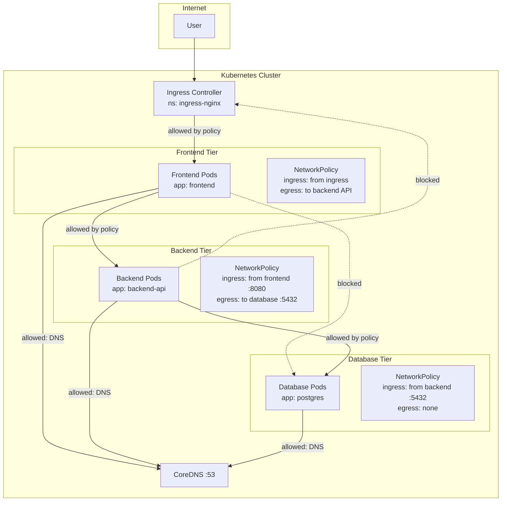

# Network Policies

## Definition
Network Policies control traffic flow between pods and at the cluster edge. They act as a pod-level firewall using label selectors and CIDR rules. By default, all pod-to-pod traffic is allowed. Network Policies enforce isolation by specifying ingress and egress rules.

## Real-World Example
A three-tier application isolates: frontend pods accept traffic from the Ingress controller only, backend API pods accept from frontend only, and database pods accept from backend API on port 5432 only. All outbound egress is blocked except DNS (UDP 53) and HTTPS (TCP 443).

## Key Concepts

### Network Policy Traffic Flow


## Hands-on YAML

### Default Deny All
```yaml
apiVersion: networking.k8s.io/v1
kind: NetworkPolicy
metadata:
  name: default-deny-all
spec:
  podSelector: {}
  policyTypes:
    - Ingress
    - Egress
```

### Allow Ingress from Specific Namespace and Pod
```yaml
apiVersion: networking.k8s.io/v1
kind: NetworkPolicy
metadata:
  name: allow-frontend-to-api
spec:
  podSelector:
    matchLabels:
      app: backend-api
  policyTypes:
    - Ingress
  ingress:
    - from:
        - namespaceSelector:
            matchLabels:
              tier: frontend
          podSelector:
            matchLabels:
              app: frontend
      ports:
        - protocol: TCP
          port: 8080
```

### Allow Egress to Specific External CIDR
```yaml
apiVersion: networking.k8s.io/v1
kind: NetworkPolicy
metadata:
  name: allow-egress-external
spec:
  podSelector:
    matchLabels:
      app: backend-api
  policyTypes:
    - Egress
  egress:
    - to:
        - ipBlock:
            cidr: 10.0.0.0/8
            except:
              - 10.96.0.0/12
      ports:
        - protocol: TCP
          port: 443
    - to:
        - namespaceSelector: {}
      ports:
        - protocol: UDP
          port: 53
```

### Full Multi-Tier Policy
```yaml
apiVersion: networking.k8s.io/v1
kind: NetworkPolicy
metadata:
  name: database-policy
spec:
  podSelector:
    matchLabels:
      app: postgres
  policyTypes:
    - Ingress
    - Egress
  ingress:
    - from:
        - podSelector:
            matchLabels:
              app: backend-api
        - namespaceSelector:
            matchLabels:
              name: monitoring
      ports:
        - protocol: TCP
          port: 5432
  egress:
    - to:
        - namespaceSelector:
            matchLabels:
              kubernetes.io/metadata.name: kube-system
          podSelector:
            matchLabels:
              k8s-app: kube-dns
      ports:
        - protocol: UDP
          port: 53
```

### Advanced Selectors
```yaml
apiVersion: networking.k8s.io/v1
kind: NetworkPolicy
metadata:
  name: advanced-policy
spec:
  podSelector:
    matchLabels:
      app: api
  policyTypes:
    - Ingress
    - Egress
  ingress:
    - from:
        # From any pod in same namespace with label role=frontend
        - podSelector:
            matchLabels:
              role: frontend
        # From any pod in monitoring namespace
        - namespaceSelector:
            matchLabels:
              name: monitoring
        # From specific IP ranges
        - ipBlock:
            cidr: 192.168.0.0/16
            except:
              - 192.168.1.0/24
        # From any pod in namespace with specific label
        - namespaceSelector:
            matchLabels:
              environment: production
          podSelector:
            matchLabels:
              app: monitoring
      ports:
        - protocol: TCP
          port: 3000
  egress:
    - to:
        - ipBlock:
            cidr: 0.0.0.0/0
            except:
              - 10.0.0.0/8
              - 172.16.0.0/12
              - 192.168.0.0/16
  # No egress rules → all egress allowed (since policyTypes includes Egress)
```

### Cilium Network Policy (Layer 7)
```yaml
apiVersion: cilium.io/v2
kind: CiliumNetworkPolicy
metadata:
  name: l7-http-policy
spec:
  endpointSelector:
    matchLabels:
      app: api
  ingress:
    - fromEndpoints:
        - matchLabels:
            app: frontend
      toPorts:
        - ports:
            - port: "8080"
              protocol: TCP
          rules:
            http:
              - method: GET
                path: "/api/v1/users/.*"
              - method: POST
                path: "/api/v1/orders"
```

### Verifying Network Policies
```bash
# Check policies in namespace
kubectl get networkpolicy -n production

# Describe a policy
kubectl describe networkpolicy database-policy -n production

# Test connectivity from a pod
kubectl exec -n production deploy/tester -- wget -qO- http://backend-api:8080

# Test blocked traffic
kubectl exec -n production deploy/tester -- wget -qO- http://postgres:5432
# Should hang / timeout
```

## Best Practices
- Start with a default-deny-all policy and selectively open paths.
- Use `namespaceSelector` combined with `podSelector` for precise isolation.
- Always specify `policyTypes` explicitly (both Ingress and Egress if needed).
- Use `ipBlock` with `except` for fine-grained external access control.
- Combine with service mesh (Istio/Cilium) for L7-aware policies.
- Use CiliumNetworkPolicy for HTTP-aware and cluster-wide policies.
- Test network policies with dedicated test pods (e.g., `netshoot` or `busybox`).

## Interview Questions
1. What is the default pod-to-pod traffic behavior in Kubernetes?
2. How do you implement a default-deny-all network policy?
3. What is the difference between podSelector and namespaceSelector?
4. How do Cilium Network Policies differ from standard Kubernetes NetworkPolicies?
5. Can Network Policies block traffic between pods in the same namespace?
