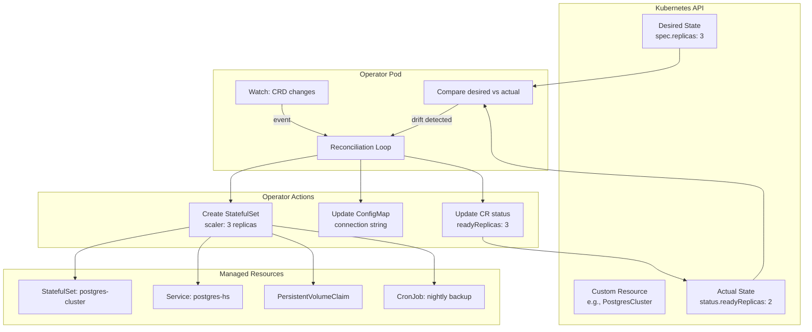

# Operators & CRDs

## Definition
**Custom Resource Definitions (CRDs)** extend the Kubernetes API with custom resource types. **Operators** implement the controller pattern — a reconciliation loop that watches custom resources and drives the actual state toward the desired state. Operators encode domain-specific operational knowledge in software.

## Real-World Example
The Prometheus Operator watches `ServiceMonitor` CRDs and dynamically updates Prometheus scrape targets. The PostgreSQL Operator manages backups, replication failover, and connection pooling via a `PostgresCluster` CRD. Helm installs and configures operators declaratively.

## Key Concepts

### Reconciliation Loop


## Hands-on YAML

### CRD Definition
```yaml
apiVersion: apiextensions.k8s.io/v1
kind: CustomResourceDefinition
metadata:
  name: postgresclusters.acme.com
spec:
  group: acme.com
  names:
    kind: PostgresCluster
    plural: postgresclusters
    singular: postgrescluster
    shortNames:
      - pgc
  scope: Namespaced
  versions:
    - name: v1
      served: true
      storage: true
      schema:
        openAPIV3Schema:
          type: object
          properties:
            spec:
              type: object
              properties:
                replicas:
                  type: integer
                  minimum: 1
                  maximum: 10
                version:
                  type: string
                storage:
                  type: string
                backup:
                  type: object
                  properties:
                    schedule:
                      type: string
                    retention:
                      type: integer
              required:
                - replicas
                - version
            status:
              type: object
              properties:
                readyReplicas:
                  type: integer
                phase:
                  type: string
                  enum:
                    - Creating
                    - Running
                    - Upgrading
                    - Failed
      subresources:
        status: {}
      additionalPrinterColumns:
        - name: Replicas
          type: integer
          jsonPath: .spec.replicas
        - name: Ready
          type: integer
          jsonPath: .status.readyReplicas
        - name: Status
          type: string
          jsonPath: .status.phase
```

### Custom Resource Instance
```yaml
apiVersion: acme.com/v1
kind: PostgresCluster
metadata:
  name: production-db
spec:
  replicas: 3
  version: "16"
  storage: "500Gi"
  backup:
    schedule: "0 3 * * *"
    retention: 30
---
apiVersion: acme.com/v1
kind: PostgresCluster
metadata:
  name: analytics-db
spec:
  replicas: 2
  version: "15"
  storage: "1Ti"
  backup:
    schedule: "0 4 * * *"
    retention: 90
```

### Operator (Simplified Controller Pattern)
```yaml
apiVersion: apps/v1
kind: Deployment
metadata:
  name: postgres-operator
spec:
  replicas: 1
  selector:
    matchLabels:
      app: postgres-operator
  template:
    metadata:
      labels:
        app: postgres-operator
    spec:
      serviceAccountName: postgres-operator
      containers:
        - name: operator
          image: acme/postgres-operator:v1.0
          args:
            - --leader-elect=true
            - --health-probe-bind-address=:8081
            - --metrics-bind-address=:8080
          env:
            - name: WATCH_NAMESPACE
              valueFrom:
                fieldRef:
                  fieldPath: metadata.namespace
          livenessProbe:
            httpGet:
              path: /healthz
              port: 8081
          readinessProbe:
            httpGet:
              path: /readyz
              port: 8081
```

### Production Operator: Prometheus Operator
```yaml
apiVersion: monitoring.coreos.com/v1
kind: ServiceMonitor
metadata:
  name: app-monitor
spec:
  selector:
    matchLabels:
      app: backend-api
  endpoints:
    - port: metrics
      interval: 30s
      path: /metrics
  namespaceSelector:
    any: true
---
apiVersion: monitoring.coreos.com/v1
kind: PrometheusRule
metadata:
  name: app-alerts
spec:
  groups:
    - name: app.rules
      rules:
        - alert: HighErrorRate
          expr: rate(http_requests_total{status=~"5.."}[5m]) > 0.05
          for: 5m
          labels:
            severity: critical
```

### Helm vs Operator
```yaml
# Helm: package and templatize Kubernetes manifests
# Best for: standardized deploys, configuration via values.yaml
# Example Helm chart value:
replicaCount: 3
image:
  repository: nginx
  tag: latest
resources:
  limits:
    cpu: 500m
    memory: 512Mi

# Operator: encode domain knowledge and automate lifecycle
# Best for: complex stateful apps, backup/restore, auto-scaling
# Example operator features:
#   - Automated failover
#   - Backup scheduling
#   - Version upgrades
#   - Scaling with data rebalancing
#   - Self-healing
```

### kubebuilder / Operator SDK
```bash
# Create a new operator project
kubebuilder init --domain acme.com --repo github.com/org/postgres-operator

# Create API (CRD + controller)
kubebuilder create api --group acme --version v1 --kind PostgresCluster

# Build and deploy
make docker-build docker-push IMG=registry/operator:v1
make deploy IMG=registry/operator:v1

# Generate CRD manifests
make manifests
```

## Best Practices
- Use CRDs for domain-specific abstractions beyond basic Kubernetes primitives.
- Always implement the status subresource for observability.
- Use leader-election for operator high availability.
- Follow the reconciliation pattern: watch → diff → act → update status.
- Prefer Helm for stateless deployments, Operators for stateful workloads.
- Use kubebuilder or Operator SDK for production-grade operators.
- Set `additionalPrinterColumns` on CRDs for better `kubectl get` output.

## Interview Questions
1. What is the difference between a CRD and an aggregated API server?
2. How does the operator reconciliation loop work?
3. What is the difference between Helm and an Operator?
4. How do you implement leader election in an operator?
5. What are some production operators you have used and what problems did they solve?
