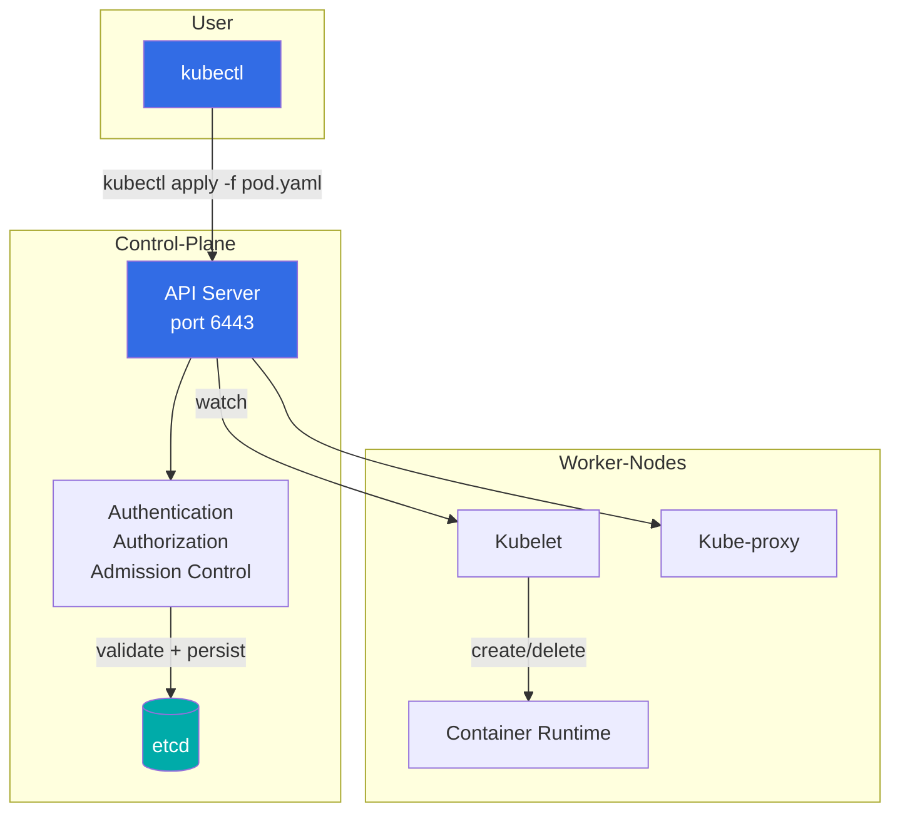

# kubectl Commands

## Definition
kubectl is the Kubernetes command-line tool that communicates with the API server to manage cluster resources. It supports imperative commands, declarative YAML management, output formatting, and debugging operations.

## kubectl Architecture



## Command Reference

### Resource Management

```bash
# Get resources
kubectl get pods
kubectl get deployments -n production
kubectl get all -n monitoring
kubectl get nodes -o wide
kubectl get pods --all-namespaces

# Describe detailed status
kubectl describe pod web-app-7d9f8c6b4-x1y2z
kubectl describe node worker-1
kubectl describe svc frontend

# Create resources
kubectl create deployment nginx --image=nginx:1.25
kubectl create configmap app-config --from-literal=APP_ENV=prod
kubectl create secret generic db-creds --from-literal=password=secret

# Apply declarative YAML
kubectl apply -f deployment.yaml
kubectl apply -f ./manifests/
kubectl apply -k ./overlays/prod/

# Delete resources
kubectl delete pod web-app-7d9f8c6b4-x1y2z
kubectl delete -f deployment.yaml
kubectl delete deployment --all -n staging
```

### Debugging and Monitoring

```bash
# View logs
kubectl logs web-app-7d9f8c6b4-x1y2z
kubectl logs -l app=web --tail=100 --since=5m
kubectl logs deployment/web-app --container=sidecar -f

# Execute commands in container
kubectl exec -it web-app-7d9f8c6b4-x1y2z -- /bin/sh
kubectl exec deploy/web-app -- ls /app/config

# Port forwarding
kubectl port-forward svc/postgres 5432:5432
kubectl port-forward pod/redis-0 6379:6379

# Copy files
kubectl cp ./backup.sql web-app-7d9f8c6b4-x1y2z:/tmp/
kubectl cp web-app-7d9f8c6b4-x1y2z:/var/log/app.log ./app.log

# Resource usage
kubectl top pods
kubectl top nodes
kubectl top pods -n kube-system

# Events
kubectl get events
kubectl get events --field-selector involvedObject.kind=Pod
kubectl get events -w
```

### Rollout and Scaling

```bash
# Rollout management
kubectl rollout status deployment/web-app
kubectl rollout history deployment/web-app
kubectl rollout undo deployment/web-app
kubectl rollout undo deployment/web-app --to-revision=3
kubectl rollout pause deployment/web-app
kubectl rollout resume deployment/web-app
kubectl rollout restart deployment/web-app

# Scaling
kubectl scale deployment/web-app --replicas=5
kubectl scale statefulset/kafka --replicas=3
kubectl autoscale deployment/web-app --min=3 --max=50 --cpu-percent=70
```

### Debug with Ephemeral Containers
```bash
# Add debug container to running pod
kubectl debug pod/web-app-7d9f8c6b4-x1y2z -it \
  --image=nicolaka/netshoot \
  --target=app

# Copy pod with debugging tools
kubectl debug pod/web-app-7d9f8c6b4-x1y2z \
  --image=busybox:1.36 \
  --copy-to=web-debug

# Debug node
kubectl debug node/worker-1 -it --image=ubuntu
```

### Wait and Watch
```bash
# Wait for condition
kubectl wait --for=condition=Ready pod/web-app-7d9f8c6b4-x1y2z
kubectl wait --for=condition=Available deployment/web-app --timeout=5m
kubectl wait --for=delete pod/web-app-7d9f8c6b4-x1y2z

# Watch resources
kubectl get pods -w
kubectl get events -w --all-namespaces
```

### Output Formatting

```bash
# Built-in formats
kubectl get pods -o wide
kubectl get pods -o yaml
kubectl get pods -o json
kubectl get pods -o name
kubectl get pods -o jsonpath='{.items[*].metadata.name}'

# Custom columns
kubectl get pods -o custom-columns=\
NAME:.metadata.name,\
STATUS:.status.phase,\
NODE:.spec.nodeName

# JSONPath queries
kubectl get pods -o jsonpath=\
'{range .items[*]}{.metadata.name}{"\t"}{.status.podIP}{"\n"}{end}'

# Sort by field
kubectl get pods --sort-by=.status.startTime
kubectl get nodes --sort-by=.metadata.name

# Template output
kubectl get pods -o go-template=\
'{{range .items}}{{.metadata.name}}{{"\n"}}{{end}}'
```

### Selectors and Filters

```bash
# Label selectors
kubectl get pods -l app=web
kubectl get pods -l 'app=web,version=v2'
kubectl get pods -l 'app in (web,api)'
kubectl get pods -l 'tier!=database'

# Field selectors
kubectl get pods --field-selector status.phase=Running
kubectl get events --field-selector type=Warning
kubectl get pods --field-selector spec.nodeName=worker-1

# Combine label and field selectors
kubectl get pods \
  -l app=web \
  --field-selector status.phase=Running
```

### Dry Run and Validation

```bash
# Dry run (client-side)
kubectl apply -f deployment.yaml --dry-run=client

# Dry run (server-side — validates with API server)
kubectl apply -f deployment.yaml --dry-run=server

# Validate YAML
kubectl apply -f deployment.yaml --validate=strict --dry-run=server

# Diff before applying
kubectl diff -f deployment.yaml

# Server-side apply (SSA)
kubectl apply -f deployment.yaml --server-side --field-manager=myapp
```

### Context and Configuration

```bash
# List contexts
kubectl config get-contexts

# Switch context
kubectl config use-context prod-cluster

# Set namespace preference
kubectl config set-context --current --namespace=production

# View current config
kubectl config view

# Quick namespace switch with alias
alias kprod='kubectl --context=prod-cluster -n production'
```

## Best Practices
- Use `kubectl apply` (declarative) over `kubectl create/delete` (imperative) for production.
- Always use `--dry-run=server` before applying critical changes.
- Use `-o wide` or custom-columns for day-to-day operations.
- Leverage `kubectl diff` to review changes before applying.
- Set namespace context to avoid accidental operations in wrong namespaces.
- Use `kubectl debug` with ephemeral containers instead of SSH into nodes.
- Use `--server-side` apply for collaborative cluster management.

## Interview Questions
1. What is the difference between `kubectl apply` and `kubectl create`?
2. How do you use `kubectl diff` to review changes before applying?
3. What is server-side apply and how does it differ from client-side apply?
4. How do ephemeral containers help with debugging?
5. How do you format kubectl output with custom columns and JSONPath?
