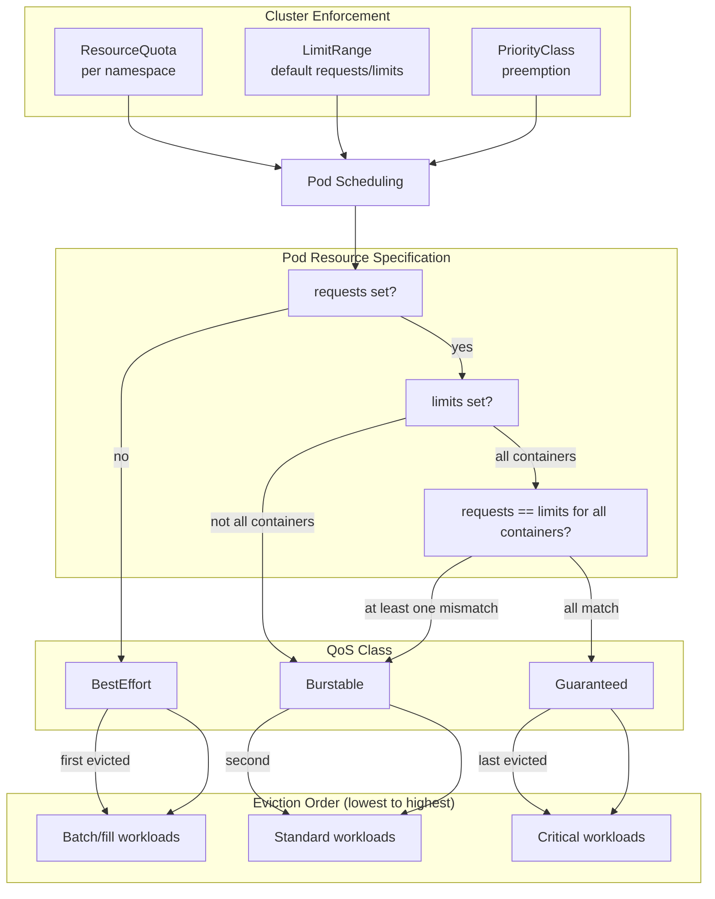

# Resource Management

## Definition
Resource management in Kubernetes controls how CPU and memory are allocated to pods, how scheduling decisions are made, and how resources are shared across namespaces. It involves requests/limits, Quality of Service (QoS) classes, LimitRanges, ResourceQuotas, PriorityClasses, and monitoring.

## Real-World Example
A multi-tenant SaaS platform uses ResourceQuotas per namespace to ensure no tenant consumes more than 8 CPUs and 16Gi memory. Critical control-plane pods use PriorityClass `cluster-critical` with a high priority value. Batch jobs run with `BestEffort` QoS to utilize spare capacity.

## Key Concepts

### QoS Class Assignment


## Hands-on YAML

### Resource Requests and Limits
```yaml
apiVersion: v1
kind: Pod
metadata:
  name: resource-demo
spec:
  containers:
    - name: app
      image: nginx:1.25
      resources:
        requests:
          cpu: 500m
          memory: 512Mi
        limits:
          cpu: "1"
          memory: 1Gi
      # QoS: Burstable (requests != limits)
---
apiVersion: v1
kind: Pod
metadata:
  name: guaranteed-pod
spec:
  containers:
    - name: critical
      image: myapp:1.0
      resources:
        requests:
          cpu: "1"
          memory: 2Gi
        limits:
          cpu: "1"
          memory: 2Gi
      # QoS: Guaranteed (requests == limits)
---
apiVersion: v1
kind: Pod
metadata:
  name: best-effort-pod
spec:
  containers:
    - name: batch
      image: busybox:1.36
      command: ["sleep", "3600"]
      # No resources block → QoS: BestEffort
```

### LimitRange
```yaml
apiVersion: v1
kind: LimitRange
metadata:
  name: resource-limits
  namespace: development
spec:
  limits:
    - max:
        cpu: "4"
        memory: 8Gi
      min:
        cpu: 50m
        memory: 64Mi
      default:
        cpu: 500m
        memory: 512Mi
      defaultRequest:
        cpu: 100m
        memory: 128Mi
      type: Container
    - max:
        storage: 500Gi
      type: PersistentVolumeClaim
```

### ResourceQuota
```yaml
apiVersion: v1
kind: ResourceQuota
metadata:
  name: team-quota
  namespace: team-a
spec:
  hard:
    requests.cpu: "8"
    requests.memory: 16Gi
    limits.cpu: "16"
    limits.memory: 32Gi
    persistentvolumeclaims: 10
    storage-class.fast-ssd.storage: 1Ti
    count/deployments: 20
    count/services: 10
    count/secrets: 50
---
apiVersion: v1
kind: ResourceQuota
metadata:
  name: compute-quota
  namespace: batch-jobs
spec:
  hard:
    requests.cpu: "20"
    requests.memory: 64Gi
    limits.cpu: "40"
    limits.memory: 128Gi
  scopeSelector:
    matchExpressions:
      - operator: In
        scopeName: PriorityClass
        values:
          - batch-low
```

### PriorityClass
```yaml
apiVersion: scheduling.k8s.io/v1
kind: PriorityClass
metadata:
  name: high-priority
value: 1000000
globalDefault: false
description: "Critical production workloads"
---
apiVersion: scheduling.k8s.io/v1
kind: PriorityClass
metadata:
  name: batch-low
value: -100
globalDefault: false
description: "Low-priority batch jobs, first to be preempted"
---
apiVersion: v1
kind: Pod
metadata:
  name: critical-app
spec:
  priorityClassName: high-priority
  containers:
    - name: app
      image: nginx:1.25
      resources:
        requests:
          cpu: "2"
          memory: 4Gi
        limits:
          cpu: "2"
          memory: 4Gi
```

### Resource Monitoring
```bash
# Node resource usage
kubectl top nodes
NAME       CPU(cores)   CPU%   MEMORY(bytes)   MEMORY%
worker-1   850m         21%    4.2Gi            26%
worker-2   1200m        30%    6.8Gi            42%
worker-3   450m         11%    3.1Gi            19%

# Pod resource usage
kubectl top pods -n production
NAME                       CPU(cores)   MEMORY(bytes)
web-app-7d9f8c6b4-x1y2z   120m         256Mi
web-app-7d9f8c6b4-a1b2c   95m          210Mi
cache-0                    45m          890Mi

# Pod resource requests and limits as table
kubectl get pods -n production -o custom-columns=\
NAME:.metadata.name,\
CPU_REQ:.spec.containers[*].resources.requests.cpu,\
CPU_LIM:.spec.containers[*].resources.limits.cpu,\
MEM_REQ:.spec.containers[*].resources.requests.memory,\
MEM_LIM:.spec.containers[*].resources.limits.memory
```

### Metrics Server Installation
```bash
# Install metrics-server
kubectl apply -f https://github.com/kubernetes-sigs/metrics-server/releases/latest/download/components.yaml

# Verify
kubectl get deployment metrics-server -n kube-system

# Test
kubectl top nodes
```

### Resource Quota Status
```bash
# View quota usage
kubectl get resourcequota team-quota -n team-a -o yaml
# Or
kubectl describe resourcequota team-quota -n team-a

# Output example:
# Status:
#   Hard:
#     requests.cpu:      8
#     requests.memory:   16Gi
#   Used:
#     requests.cpu:      3.5
#     requests.memory:   7.2Gi
```

## Best Practices
- Always set resource requests — never rely on defaults alone.
- Use `Guaranteed` QoS for latency-sensitive and critical workloads.
- Use `BestEffort` for batch jobs and non-critical background tasks.
- Set `ResourceQuota` per namespace to enforce fairness in multi-tenant clusters.
- Use `LimitRange` to set sane defaults and prevent oversized requests.
- Assign `PriorityClass` to ensure critical workloads are scheduled first.
- Deploy `metrics-server` for resource monitoring and HPA.
- Monitor quota utilization to plan cluster capacity.

## Interview Questions
1. What are the three QoS classes and how are they determined?
2. What is the difference between requests and limits?
3. How does ResourceQuota prevent resource starvation across namespaces?
4. How does PriorityClass affect pod scheduling and eviction?
5. What happens when a pod exceeds its memory limit?
