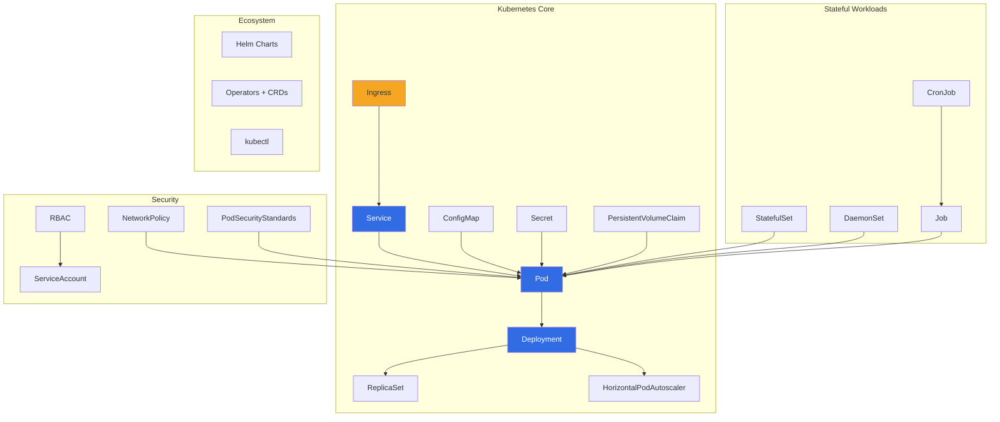

# 09 — Kubernetes

> Production-grade container orchestration for deploying, scaling, and managing containerized applications.

## Topics

| # | Topic | Description |
|---|-------|-------------|
| 1 | [Kubernetes Basics](01-kubernetes.md) | Architecture, control plane, worker nodes |
| 2 | [Pods](02-pods.md) | Multi-container patterns, lifecycle, QoS |
| 3 | [Deployments](03-deployments.md) | ReplicaSets, rollout strategies, rollback |
| 4 | [Services](04-services.md) | ClusterIP, NodePort, LoadBalancer, DNS |
| 5 | [ConfigMaps & Secrets](05-configmaps-secrets.md) | Configuration injection, secret types |
| 6 | [Ingress](06-ingress.md) | HTTP routing, TLS, controllers |
| 7 | [Storage](07-storage.md) | PV/PVC, StorageClass, dynamic provisioning |
| 8 | [RBAC & Security](08-rbac-security.md) | Roles, bindings, service accounts, policies |
| 9 | [HPA & Scaling](09-hpa-scaling.md) | Autoscaling, custom metrics, VPA |
| 10 | [StatefulSets & DaemonSets](10-statefulsets-daemonsets.md) | Stateful workloads, node-level agents |
| 11 | [Jobs & CronJobs](11-jobs-cronjobs.md) | Batch processing, scheduled tasks |
| 12 | [Network Policies](12-network-policies.md) | Pod isolation, ingress/egress rules |
| 13 | [EKS/GKE/AKS](13-eks-gke-aks.md) | Managed Kubernetes comparison |
| 14 | [Operators & CRDs](14-operators-crds.md) | Custom resources, controller pattern |
| 15 | [kubectl Commands](15-kubectl-commands.md) | Command reference, output formatting |
| 16 | [Resource Management](16-resource-management.md) | QoS classes, limits, quotas, priorities |

---

Previous: [08 — Docker](../08-Docker/README.md)
Next: [10 — AWS](../10-AWS/README.md)
