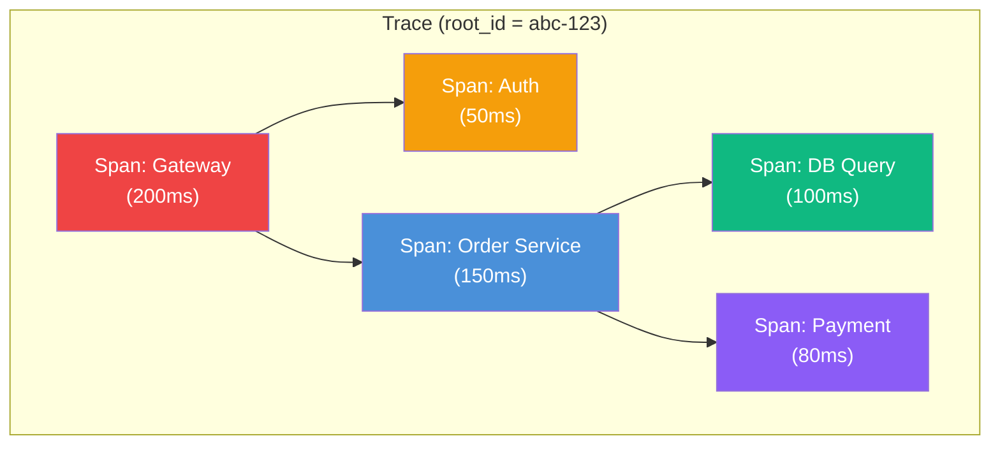

# Distributed Tracing

## Definition
Distributed tracing tracks a single request as it flows through multiple microservices. It's essential for understanding latency bottlenecks, error propagation, and service dependencies.

## Core Concepts

| Concept | Description |
|---------|-------------|
| **Trace** | End-to-end path of a single request across services |
| **Span** | A single unit of work within a trace (one service call) |
| **Span Context** | Trace ID, Span ID, parent ID — propagated across services |
| **Parent Span** | The caller's span (creates parent-child hierarchy) |
| **Root Span** | The first span in a trace (entry point) |

## Trace Structure



## Context Propagation (W3C Trace Context)

```
Request flow:
  Client → Service A → Service B → Service C

Headers propagated:
  traceparent: 00-0af7651916cd43dd8448eb211c80319c-b7ad6b7169203331-01
                │  │         trace_id                    │  span_id  flags
                │  └─ version
                └─ trace_flags

Implementation:
  1. Incoming request: Extract traceparent from headers
  2. Create child span: New span_id, parent span_id = current
  3. Outgoing request: Inject traceparent with new span_id
  4. All spans sent to tracing backend (Jaeger/Zipkin)
```

## Sampling Strategies

| Strategy | Approach | When to Use |
|----------|----------|-------------|
| **Head-based** | Decide at start of trace (e.g., 1% sample) | Low volume, simple |
| **Tail-based** | Sample after trace complete (e.g., keep slow ones) | Need all slow traces |
| **Rate-limiting** | Sample up to N traces/sec | Control costs |
| **Adaptive** | Vary sampling rate by service/time | Balance cost vs detail |

## Interview Questions

1. How does distributed tracing work across microservices?
2. What is the difference between tracing, logging, and metrics?
3. How do you propagate trace context across service calls?
4. How does sampling reduce tracing overhead?
5. Design a tracing system for a 50-microservice architecture
