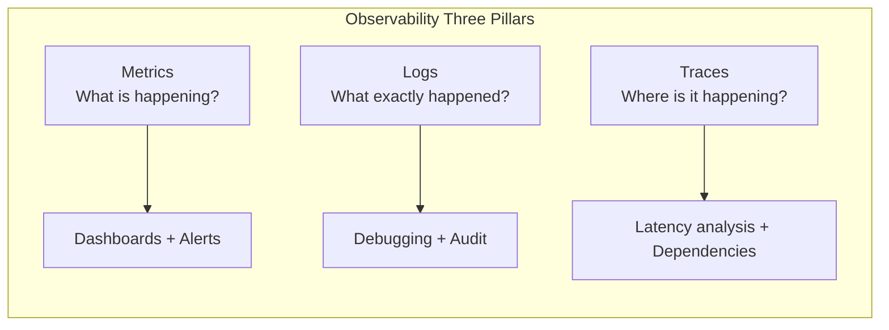

# Metrics

## Definition
Metrics are numeric measurements of system behavior over time. Unlike logs (discrete events), metrics are aggregated values that show trends, patterns, and anomalies.

## Metric Types

| Type | Description | Example | Aggregation |
|------|-------------|---------|-------------|
| **Counter** | Cumulative count (only increases) | Total requests, errors | Rate over time |
| **Gauge** | Point-in-time value (up/down) | CPU %, queue depth, memory | Current value |
| **Histogram** | Distribution of values | Request latency | p50/p95/p99, avg |
| **Summary** | Pre-computed quantiles (client-side) | Latency quantiles | Sliding window |

## Key Metrics Per Tier

| Tier | Metrics |
|------|---------|
| **Web/API** | Requests/sec, latency (p50/p95/p99), error rate (4xx, 5xx), active connections |
| **Application** | Request rate, error rate, GC pauses, thread pool, connection pool |
| **Database** | Query latency, connection count, replication lag, cache hit ratio, IOPS |
| **Cache (Redis)** | Hit rate, memory usage, evictions, connected clients, ops/sec |
| **Queue (Kafka)** | Lag (consumer offset - latest), messages/sec, partition count |
| **Infrastructure** | CPU, memory, disk I/O, network bandwidth, load average |
| **Business** | Active users, sign-ups, orders, revenue, conversion rate |

## Metrics vs Logs vs Traces

## Interview Questions

1. What are the different types of metrics and when to use each?
2. How do you design a metrics strategy for a distributed system?
3. What is the difference between RED and USE methods?
4. How do you set up meaningful dashboards for different audiences?
5. How do you aggregate metrics from 1000+ servers?
