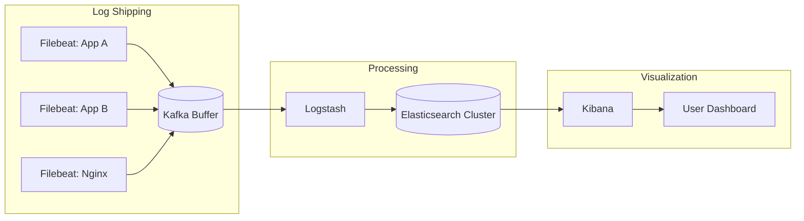

# ELK Stack (Elasticsearch, Logstash, Kibana)

## Definition
ELK is a popular open-source stack for centralized logging: **E**lasticsearch (search/analytics), **L**ogstash (data processing), **K**ibana (visualization). Often extended with Filebeat for log shipping.

## Architecture



## Components

| Component | Role | Details |
|-----------|------|---------|
| **Filebeat** | Log shipper | Lightweight agent, reads log files, sends to Logstash/Kafka |
| **Logstash** | Data processor | Parses, filters, transforms logs (grok, mutate, date) |
| **Elasticsearch** | Storage + search | Distributed, full-text search, aggregations |
| **Kibana** | Visualization | Dashboards, discover, alerts, ML anomaly detection |

## Elasticsearch Data Model

```
Index (like a database):
  logs-2026.06.04

Document (like a row):
  {
    "@timestamp": "2026-06-04T12:00:00Z",
    "service": "auth-service",
    "level": "ERROR",
    "message": "Failed to authenticate user",
    "user_id": "12345",
    "error_code": "AUTH_001",
    "duration_ms": 2500,
    "host": "ip-10-0-1-23",
    "kubernetes": {
      "pod": "auth-7d8f9c",
      "namespace": "production"
    }
  }

Sharding:
  - Index sharded by date (daily index)
  - Each shard: replica across nodes for HA
  - Search across shards, merge results
```

## Interview Questions

1. How does the ELK stack work end-to-end?
2. Why would you put Kafka between Filebeat and Logstash?
3. How do you design Elasticsearch index strategy for logs?
4. How do you handle high-volume logging (100K+ events/sec)?
5. Compare ELK stack vs Grafana Loki for logging
