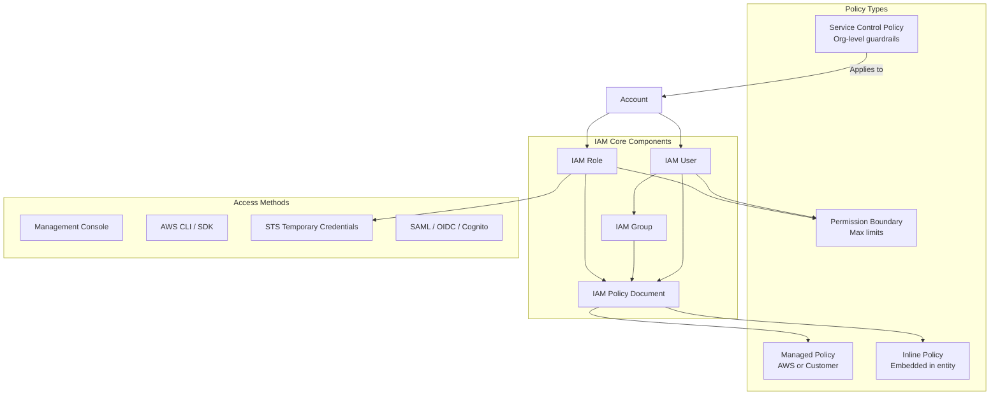

# AWS IAM Deep Dive

## What is it?
AWS Identity and Access Management (IAM) is a web service that helps you securely control access to AWS resources. It provides fine-grained access control across all AWS services, enabling you to specify who can access which resources under what conditions.

## Why it was created
Before IAM, AWS users shared a single root account with long-term access keys. This created massive security risks — no auditing, no least privilege, no way to grant temporary or cross-account access. IAM was created to provide enterprise-grade identity management with granular permissions, temporary credentials via STS, and full auditability via CloudTrail.

## When should you use it
- **Multi-user environments**: Grant different permissions to developers, admins, and auditors
- **Service-to-service auth**: Allow EC2 instances to access S3 without storing keys
- **Cross-account access**: Grant users in one account access to resources in another
- **Federated access**: Integrate with corporate SSO (SAML, OIDC, Cognito)
- **Fine-grained control**: Restrict actions to specific resources, conditions, or IP ranges

## Architecture



## Hands-on Example

```bash
# Create an IAM role for EC2 to access S3
aws iam create-role \
    --role-name EC2-S3-Access-Role \
    --assume-role-policy-document '{
        "Version": "2012-10-17",
        "Statement": [{
            "Effect": "Allow",
            "Principal": {"Service": "ec2.amazonaws.com"},
            "Action": "sts:AssumeRole"
        }]
    }'

# Attach managed policy
aws iam attach-role-policy \
    --role-name EC2-S3-Access-Role \
    --policy-arn arn:aws:iam::aws:policy/AmazonS3ReadOnlyAccess

# Create instance profile and associate
aws iam create-instance-profile \
    --instance-profile-name EC2-S3-Profile
aws iam add-role-to-instance-profile \
    --instance-profile-name EC2-S3-Profile \
    --role-name EC2-S3-Access-Role
aws ec2 associate-iam-instance-profile \
    --instance-id i-1234567890abcdef0 \
    --iam-instance-profile Name=EC2-S3-Profile

# Create a customer managed policy with conditions
aws iam create-policy \
    --policy-name S3-Production-ReadOnly \
    --policy-document '{
        "Version": "2012-10-17",
        "Statement": [{
            "Effect": "Allow",
            "Action": ["s3:GetObject", "s3:ListBucket"],
            "Resource": [
                "arn:aws:s3:::production-app-data",
                "arn:aws:s3:::production-app-data/*"
            ],
            "Condition": {
                "IpAddress": {"aws:SourceIp": "10.0.0.0/16"},
                "Bool": {"aws:MultiFactorAuthPresent": "true"}
            }
        }]
    }'
```

## Pricing Model
IAM is **free** — there is no charge for creating users, groups, roles, or policies. You only pay for usage of other AWS services accessed through IAM. AWS STS (Security Token Service) is also free, though there are request quotas.

## Best Practices
- **Least privilege**: Start with minimal permissions and use IAM Access Analyzer to detect over-permissive policies
- **Use roles, not keys**: Never store long-term access keys on EC2 — use instance profiles with STS
- **Permission boundaries**: Delegate admin access while capping maximum permissions
- **SCPs for guardrails**: Use Service Control Policies at the organization level to block dangerous actions (e.g., disable CloudTrail, delete resources)
- **Rotate credentials**: Rotate access keys every 90 days; require MFA for all human users
- **Use managed policies**: Prefer AWS-managed policies; scope custom policies to specific resources
- **Audit with CloudTrail**: Enable CloudTrail to log all IAM API calls for security analysis

## Interview Questions
1. What's the difference between an identity-based policy and a resource-based policy?
2. How do permission boundaries differ from Service Control Policies?
3. How does AWS STS work and what is the token expiration model?
4. Design an IAM strategy for a multi-account organization with 50 microservices
5. How would you grant a Lambda function write access to an S3 bucket in another account?

## Real Company Usage
**Capital One** uses IAM extensively with multi-account strategies, SCPs, and permission boundaries to secure their AWS infrastructure. They enforce least privilege across thousands of accounts using automation with IAM Access Analyzer and Config rules. **Netflix** uses IAM roles with fine-grained policies for their microservices, ensuring each service can only access the specific resources it needs.
