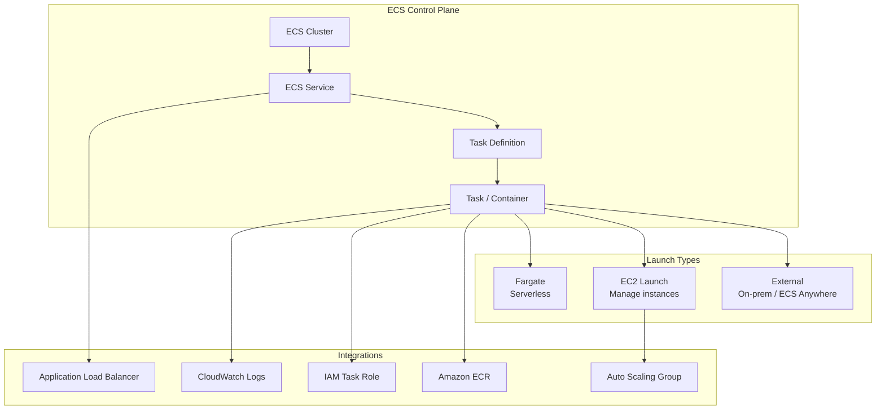

# AWS ECS (Elastic Container Service)

## What is it?
Amazon ECS is a fully managed container orchestration service that runs Docker containers on a cluster of EC2 instances or serverless Fargate. It integrates deeply with AWS services like IAM, VPC, CloudWatch, and ALB, eliminating the need to manage a separate orchestration control plane.

## Why it was created
Running containers at scale requires managing a control plane, worker nodes, networking, and scheduling. ECS was created to provide a simple, fully managed container orchestration solution that is deeply integrated with the AWS ecosystem, without the operational overhead of managing Kubernetes or a custom scheduler.

## When should you use it
- **Microservices**: Deploy and scale small, independent services
- **Batch processing**: Run periodic or event-driven containerized jobs
- **Web applications**: Serve HTTP traffic behind an ALB with auto-scaling
- **CI/CD pipelines**: Run build and test containers in ephemeral environments
- **Migrating from EC2**: Containerize existing applications without Kubernetes complexity

## Architecture



## Hands-on Example

```bash
# Create ECS cluster (Fargate)
aws ecs create-cluster --cluster-name my-app-cluster

# Register task definition
aws ecs register-task-definition \
    --family my-app \
    --network-mode awsvpc \
    --requires-compatibilities FARGATE \
    --cpu "256" \
    --memory "512" \
    --execution-role-arn arn:aws:iam::123456789012:role/ecsTaskExecutionRole \
    --container-definitions '[
        {
            "name": "my-app-container",
            "image": "nginx:latest",
            "portMappings": [{
                "containerPort": 80,
                "protocol": "tcp"
            }],
            "logConfiguration": {
                "logDriver": "awslogs",
                "options": {
                    "awslogs-group": "/ecs/my-app",
                    "awslogs-region": "us-east-1",
                    "awslogs-stream-prefix": "ecs"
                }
            }
        }
    ]'

# Create service (runs behind ALB)
aws ecs create-service \
    --cluster my-app-cluster \
    --service-name my-app-service \
    --task-definition my-app:1 \
    --desired-count 2 \
    --launch-type FARGATE \
    --network-configuration "awsvpcConfiguration={subnets=[subnet-abc,subnet-def],securityGroups=[sg-123]}" \
    --load-balancers "targetGroupArn=arn:aws:elasticloadbalancing:us-east-1:123456789012:targetgroup/my-tg/abc123,containerName=my-app-container,containerPort=80"

# Scale service
aws ecs update-service \
    --cluster my-app-cluster \
    --service my-app-service \
    --desired-count 4
```

## Pricing Model
- **Fargate**: Pay per second for vCPU and memory resources consumed by running tasks (no charge for idle)
- **EC2 Launch**: Pay for EC2 instances, EBS volumes, and any other resources in the cluster
- **No additional charge** for ECS itself — you only pay for the underlying resources (Fargate or EC2)

## Best Practices
- **Use Fargate for most workloads**: Eliminates node management and reduces blast radius
- **Task IAM roles**: Assign least-privilege IAM roles per task definition (not per instance)
- **Sidecar pattern**: Use a sidecar container for logging, metrics, or service mesh (App Mesh)
- **Service auto-scaling**: Use target tracking scaling policies based on CPU, memory, or ALB request count
- **Task placement strategies**: Use binpack (cost-optimized) or spread (availability-optimized) for EC2 launch
- **Blue/green deployments**: Use ECS rolling update with CodeDeploy for zero-downtime deployments
- **ECR integration**: Use managed container image scanning and immutable tags

## Interview Questions
1. What's the difference between Fargate and EC2 launch type?
2. How does ECS service auto-scaling work with CloudWatch alarms?
3. How do you handle secrets in ECS (environment variables vs Secrets Manager)?
4. What is the difference between an ECS task and an ECS service?
5. How does ECR integrate with ECS for secure image deployment?

## Real Company Usage
**Airbnb** uses ECS with Fargate to run backend microservices, reducing operational overhead of managing EC2 clusters. **Expedia** migrated from EC2 to ECS Fargate to simplify deployment and improve resource utilization across their travel platform.
