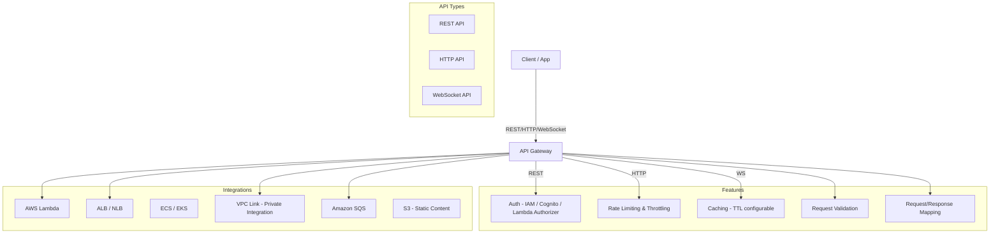

# AWS API Gateway

## What is it?
Amazon API Gateway is a fully managed service that makes it easy to create, publish, maintain, monitor, and secure APIs at any scale. It acts as a "front door" for applications to access backend services running on Lambda, EC2, ECS, or any HTTP endpoint.

## Why it was created
Building APIs requires handling authentication, rate limiting, request validation, caching, monitoring, and SSL termination. API Gateway was created to offload these cross-cutting concerns, allowing developers to focus on business logic while the gateway handles the infrastructure.

## When should you use it
- **RESTful APIs**: Expose REST endpoints backed by Lambda or HTTP backends
- **WebSocket APIs**: Real-time bidirectional communication (chat, live updates, streaming)
- **Serverless backends**: Frontend for Lambda functions with auth and throttling
- **Microservices aggregation**: Single endpoint that routes to multiple backend services
- **API monetization**: Use usage plans and API keys to sell API access to customers

## Architecture



## Hands-on Example

```bash
# Create REST API
aws apigateway create-rest-api \
    --name "MyFirstAPI" \
    --description "My first API Gateway REST API" \
    --region us-east-1

# Get root resource ID
ROOT_ID=$(aws apigateway get-resources \
    --rest-api-id abc123 \
    --query 'items[0].id' \
    --output text)

# Create a resource (/hello)
RESOURCE_ID=$(aws apigateway create-resource \
    --rest-api-id abc123 \
    --parent-id $ROOT_ID \
    --path-part hello \
    --query 'id' \
    --output text)

# Create GET method (proxy to Lambda)
aws apigateway put-method \
    --rest-api-id abc123 \
    --resource-id $RESOURCE_ID \
    --http-method GET \
    --authorization-type "NONE"

# Set Lambda integration
aws apigateway put-integration \
    --rest-api-id abc123 \
    --resource-id $RESOURCE_ID \
    --http-method GET \
    --type AWS_PROXY \
    --integration-http-method POST \
    --uri arn:aws:apigateway:us-east-1:lambda:path/2015-03-31/functions/arn:aws:lambda:us-east-1:123456789012:function:hello-world/invocations

# Deploy to stage
aws apigateway create-deployment \
    --rest-api-id abc123 \
    --stage-name prod \
    --description "Production deployment"
```

## Pricing Model
- **REST API**: $3.50 per million API calls (varies by region), plus data transfer out
- **HTTP API**: $1.00 per million API calls (cheaper, simpler than REST API)
- **WebSocket API**: $1.00 per million messages and $0.25 per million connection minutes
- **Caching**: $0.02 per hour per GB cache (varies by cache size)
- **Free tier**: 1 million REST API calls per month for 12 months

## Best Practices
- **Choose the right API type**: HTTP API for lowest cost/simplicity, REST for advanced features (usage plans, API keys, mapping templates), WebSocket for real-time
- **Use caching**: Enable API caching for read-heavy endpoints to reduce backend load and latency
- **Throttle at multiple levels**: Account-level (regional) and method-level throttling to protect backends
- **Lambda authorizer**: Use custom authorizers for fine-grained auth instead of hard-coded API keys
- **VPC Link for private backends**: Use VPC Link to connect API Gateway to private ALBs or NLB without exposing them to the internet
- **OpenAPI/Swagger import**: Define APIs in OpenAPI 3.0 and import them for version-controlled API definitions
- **Enable CloudWatch logging**: Log full request/response for debugging and security analysis

## Interview Questions
1. What's the difference between REST API, HTTP API, and WebSocket API in API Gateway?
2. How does API Gateway integrate with Lambda for serverless backends?
3. What is a VPC Link and when would you use it?
4. How do you throttle API usage per customer (usage plans and API keys)?
5. How does API Gateway handle request validation and transformation?

## Real Company Usage
**Netflix** uses API Gateway as part of their API layer to route traffic to backend microservices with authentication and rate limiting. **The New York Times** uses API Gateway with Lambda to serve their content APIs serverlessly, handling millions of requests per day.
