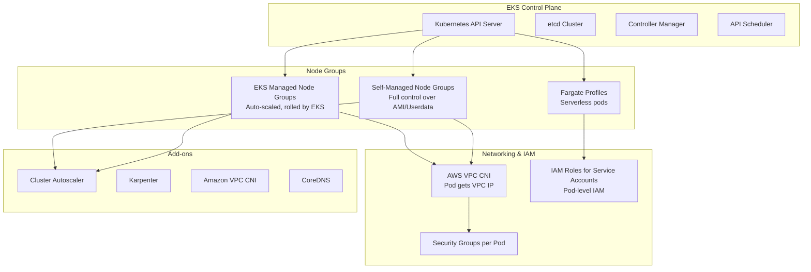

# AWS EKS Deep Dive

## What is it?
Amazon Elastic Kubernetes Service (EKS) is a managed Kubernetes service that simplifies running Kubernetes on AWS without needing to install, operate, and maintain your own control plane or nodes. EKS runs the upstream Kubernetes control plane across multiple AZs and handles upgrades, patching, and scaling.

## Why it was created
Running a production Kubernetes cluster requires managing the control plane (etcd, API server, scheduler, controller manager) for high availability, handling certificate rotation, security patches, and upgrades. EKS was created to offload this operational burden while providing native Kubernetes compatibility, so teams can focus on workloads instead of cluster management.

## When should you use it
- **Multi-cloud or hybrid strategy**: Kubernetes portability across clouds
- **Complex microservices**: Need Kubernetes-native features (CRDs, Operators, Istio, Helm)
- **Existing Kubernetes investment**: Teams already using Kubernetes on-prem or elsewhere
- **Advanced scheduling**: Node affinity, taints/tolerations, pod topology spread constraints
- **CI/CD on Kubernetes**: Running build agents, ArgoCD, Tekton in the cluster

## Architecture



## Hands-on Example

```bash
# Create EKS cluster with managed node group
aws eks create-cluster \
    --name my-cluster \
    --role-arn arn:aws:iam::123456789012:role/eks-service-role \
    --resources-vpc-config subnetIds=subnet-abc,subnet-def,securityGroupIds=sg-123

# Create managed node group
aws eks create-nodegroup \
    --cluster-name my-cluster \
    --nodegroup-name standard-workers \
    --scaling-config minSize=2,maxSize=10,desiredSize=3 \
    --subnets subnet-abc subnet-def \
    --instance-types t3.medium t3.large \
    --ami-type AL2_x86_64 \
    --capacity-type ON_DEMAND

# Configure IAM for service account (IRSA)
eksctl create iamserviceaccount \
    --cluster my-cluster \
    --namespace default \
    --name s3-reader \
    --attach-policy-arn arn:aws:iam::aws:policy/AmazonS3ReadOnlyAccess \
    --approve

# Use the service account in a pod (kubectl)
cat <<EOF | kubectl apply -f -
apiVersion: v1
kind: Pod
metadata:
  name: s3-test
  namespace: default
spec:
  serviceAccountName: s3-reader
  containers:
  - name: aws-cli
    image: amazon/aws-cli:latest
    command: ["aws", "s3", "ls"]
EOF
```

## Pricing Model
- **EKS cluster**: $0.10 per hour per cluster (including control plane)
- **EKS managed node groups**: No additional charge (pay for EC2 instances)
- **EKS Fargate profiles**: Pay for vCPU and memory per running pod (no EC2 node costs)
- **EKS add-ons**: Free (Amazon VPC CNI, CoreDNS, kube-proxy)
- **Data transfer**: Standard EC2 data transfer charges apply

## Best Practices
- **Use IRSA over node-level IAM**: Assign IAM roles at the pod level, not the node level, for least privilege
- **Managed node groups for most workloads**: EKS handles node AMI updates, scaling, and health checks
- **Cluster Autoscaler or Karpenter**: Use Cluster Autoscaler for simple scaling, Karpenter for faster, more cost-optimized scaling
- **VPC CNI with Security Groups per Pod**: Each pod gets its own VPC IP and security group for network isolation
- **Use Fargate for burst/overhead**: Run batch, CI/CD, or burst workloads on Fargate without managing nodes
- **Enable control plane logging**: Audit, API server, authenticator, controller manager, and scheduler logs to CloudWatch
- **Update clusters regularly**: EKS supports 4 versions at a time — plan upgrades for minor version increments

## Interview Questions
1. How does EKS's control plane differ from self-managed Kubernetes?
2. What is IRSA and how does it improve security over node-level IAM?
3. How does the AWS VPC CNI assign IP addresses to pods?
4. What's the difference between EKS managed node groups, self-managed node groups, and Fargate profiles?
5. How does Karpenter differ from the Cluster Autoscaler?

## Real Company Usage
**Snap** runs Snapchat workloads on EKS across thousands of nodes, using Karpenter for dynamic scaling. **Financial Times** uses EKS with Fargate profiles to run their publishing platform, eliminating node management entirely.
