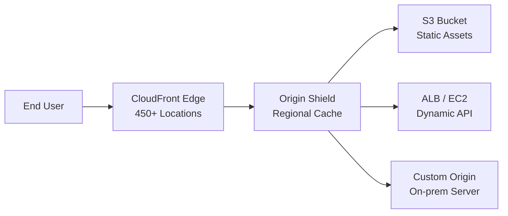

# CloudFront & CDN

## Definition
Amazon CloudFront is a fast content delivery network (CDN) service that delivers data, video, applications, and APIs to customers globally with low latency and high transfer speeds.



## Key Features
- **450+ edge locations** across 90+ cities in 50+ countries
- **Origin Shield** — Extra caching layer that reduces load on origin by aggregating requests from all edges in a region
- **Lambda@Edge** — Run Node.js/Python code at edge locations for request customization
- **AWS Shield** — Built-in DDoS protection at Layer 3/4, Shield Advanced adds Layer 7
- **Real-time metrics** — CloudWatch metrics per distribution
- **Field-Level Encryption** — Encrypt sensitive data at the edge

## Origin Types

| Origin | Use Case | Example |
|--------|----------|---------|
| **S3 Bucket** | Static assets | images.example.com → S3 + CloudFront |
| **ALB/EC2** | Dynamic API | api.example.com → ALB → EC2 |
| **Custom origin** | Any HTTP server | legacy.example.com → on-prem server |
| **MediaStore** | Video streaming | Live/on-demand HLS DASH |

## Caching & Invalidation

```
Cache behavior:
- TTL set by Cache-Control and Expires headers
- Default TTL: 24 hours (can override per behavior)
- Minimum TTL: 0 seconds (for dynamic content)

Invalidation methods:
1. API: CreateInvalidation (one-time cost per path)
2. Versioned URLs: /static/js/app.v2.js (no invalidation needed)
3. Origin headers: Cache-Control: max-age=0 (revalidate every time)

Performance optimization:
- Origin Shield: Regional cache layer (reduce origin requests 80%+)
- Brotli compression: Better compression than gzip
- HTTP/3 (QUIC): Faster connection establishment
- TCP optimizations: Faster start, keep-alive
```

## Interview Questions

1. How does CloudFront's origin shield reduce origin load?
2. How do you invalidate CloudFront cache efficiently?
3. Compare CloudFront vs Cloudflare vs Fastly
4. How does Lambda@Edge help with dynamic content?
5. Design a global content delivery strategy with CloudFront + S3 + Shield
6. How does CloudFront handle SSL/TLS termination at the edge?
