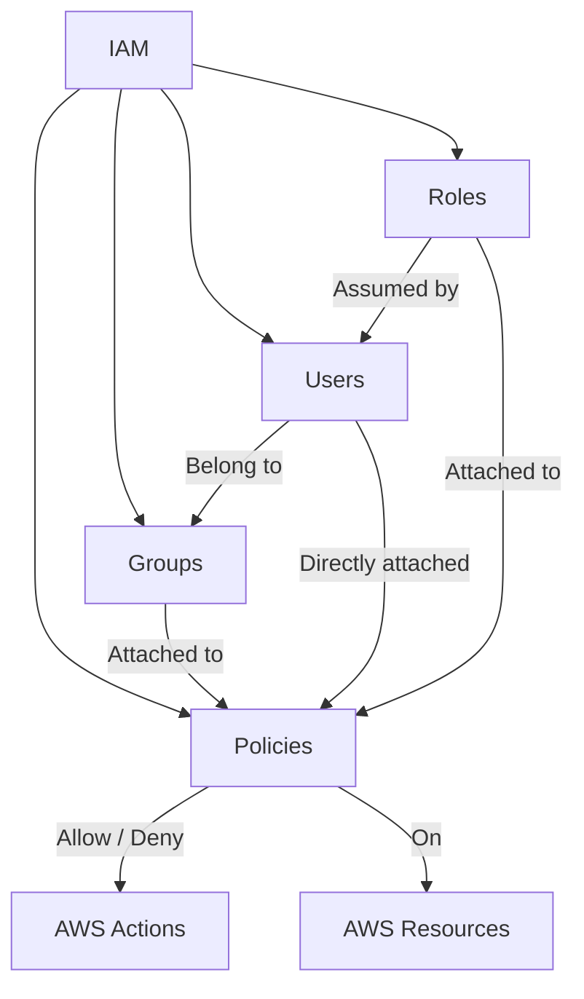

# IAM & Security

## Core Concepts



| Concept | Description | Example |
|---------|-------------|---------|
| **User** | Individual person or service account | `alice@company.com` or `deploy-bot` |
| **Group** | Collection of users with shared permissions | `Engineering`, `Admins`, `ReadOnly` |
| **Role** | Assumable permissions (cross-account, service) | `EC2-to-S3-Role`, `CrossAccountAdmin` |
| **Policy** | JSON document defining allow/deny rules | `AmazonS3FullAccess`, custom policies |
| **Permission Boundary** | Max permissions for a user/role | Delegation control |
| **Service Control Policy** | Organization-level permission guardrails | Block leaving org, block specific services |

## Identity vs Resource-Based Policies

```
Identity-based (attached to user/group/role):
  Who can do what?
  
  {
    "Effect": "Allow",
    "Action": "s3:GetObject",
    "Resource": "arn:aws:s3:::my-bucket/*"
  }
  → Attached to User "alice"
  → Alice can GET objects from my-bucket

Resource-based (attached to resource):
  Who can access this resource?
  
  {
    "Effect": "Allow",
    "Principal": { "AWS": "arn:aws:iam::123456789:user/alice" },
    "Action": "s3:GetObject",
    "Resource": "arn:aws:s3:::my-bucket/*"
  }
  → Attached to S3 bucket "my-bucket"
  → Alice can GET objects (even from other accounts)

Key difference: Resource-based policies allow cross-account access
without needing roles. Use roles for intra-account, resource-based
for cross-account resource access.
```

## IAM Best Practices

```
1. Least privilege — Start with deny-all, add only needed permissions
   Use IAM Access Analyzer to detect over-permissive policies

2. Roles > Long-term keys — Use IAM roles with STS (temporary credentials)
   EC2 gets a role, not access keys stored on the instance

3. Managed policies — Use AWS-managed policies when possible
   Custom policies: scope down to specific resources

4. Multi-factor authentication (MFA) — Required for all human users
   CLI access requires MFA session (aws sts get-session-token)

5. Key rotation — Access keys rotated every 90 days
   Use automation (Lambda + Config rules)

6. Service Control Policies (SCPs) — Organization-level guardrails
   Block: leaving org, disabling CloudTrail, creating resources outside regions

7. Permission boundaries — Delegated administration
   Admin can create roles but can't exceed the boundary
```

## Multi-Account Strategy

```
Organization Root
├── Management Account (billing, audit)
├── Security Account (CloudTrail, GuardDuty, IAM)
├── Infrastructure Account (networking, CI/CD)
├── Shared Services Account (image registry, artifacts)
├── Workload Accounts (per environment)
│   ├── Development
│   ├── Staging
│   └── Production
└── Log Archive Account (immutable logs)

Cross-account access: IAM roles with STS AssumeRole
Centralized logging: All accounts send to Log Archive account
Network: Transit Gateway + VPC peering
```

## Interview Questions

1. What's the difference between IAM users, groups, and roles?
2. How do you design a multi-account AWS strategy with IAM?
3. What is a resource-based policy vs identity-based policy?
4. How does AWS STS work for temporary credentials?
5. Design an IAM strategy for a multi-service microservice architecture
6. What are Service Control Policies and how do they differ from IAM policies?
