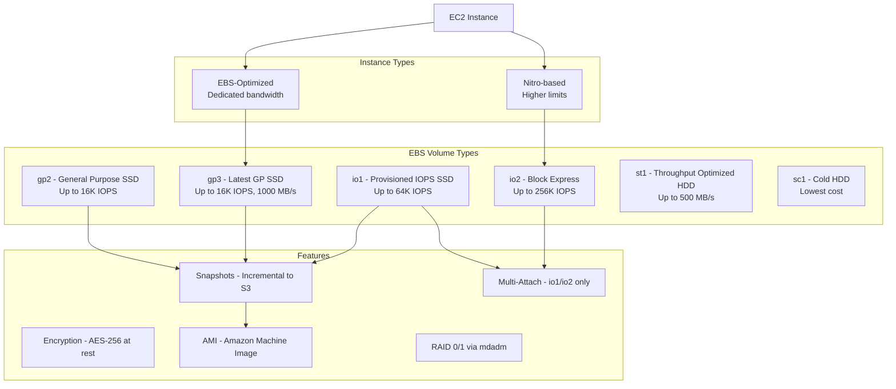

# AWS EBS (Elastic Block Store)

## What is it?
Amazon EBS provides persistent block-level storage volumes for use with EC2 instances. Each volume is automatically replicated within its Availability Zone to protect from component failure, and can be attached to a single EC2 instance at a time.

## Why it was created
EC2 instances need persistent storage that survives instance stops and terminations. EBS was created to provide durable, high-performance block storage that can be dynamically attached/detached, backed up via snapshots, and encrypted — similar to a SAN in the cloud but fully managed.

## When should you use it
- **OS boot volumes**: Root volumes for EC2 instances
- **Database storage**: Transactional workloads requiring low-latency, consistent I/O (RDS, self-managed DBs)
- **File systems**: Combining with EFS or using as a RAID array for high throughput
- **Backup & disaster recovery**: EBS snapshots to S3 for cross-region or cross-account backup
- **Big data analytics**: High-throughput sequential I/O with st1/sc1 volumes

## Architecture



## Hands-on Example

```bash
# Create an EBS volume (gp3, 100GB)
aws ec2 create-volume \
    --volume-type gp3 \
    --size 100 \
    --iops 3000 \
    --throughput 125 \
    --availability-zone us-east-1a

# Attach volume to EC2 instance
aws ec2 attach-volume \
    --volume-id vol-1234567890abcdef0 \
    --instance-id i-1234567890abcdef0 \
    --device /dev/sdf

# Create a snapshot (incremental backup)
aws ec2 create-snapshot \
    --volume-id vol-1234567890abcdef0 \
    --description "Production DB backup - $(date)"

# Create an AMI from an instance (encrypted)
aws ec2 create-image \
    --instance-id i-1234567890abcdef0 \
    --name "MyApp-v1.0.0" \
    --description "Encrypted AMI for MyApp" \
    --block-device-mappings '[{
        "DeviceName": "/dev/sda1",
        "Ebs": {"Encrypted": true, "DeleteOnTermination": true}
    }]'

# Restore from snapshot (new volume)
aws ec2 create-volume \
    --snapshot-id snap-1234567890abcdef0 \
    --volume-type gp3 \
    --availability-zone us-east-1b
```

## Pricing Model
- **Volume storage**: Per GB-month provisioned ($0.08/GB for gp3, $0.125/GB for io2)
- **IOPS**: Included for gp3 (3000 free); additional IOPS charged per provisioned IOPS-month
- **Throughput**: gp3 includes 125 MB/s free; additional throughput charged per MB/s-month
- **Snapshots**: Per GB-month of data stored in S3 (incremental)
- **Data transfer**: Charges for snapshots copied across regions or accounts

## Best Practices
- **Use gp3 as default**: Better price/performance than gp2 (20% lower cost per GB)
- **Use io2 Block Express for critical databases**: Up to 256K IOPS and 99.999% durability
- **Encrypt by default**: Enable EBS encryption by default in the region for all new volumes
- **Snapshots for DR**: Automate cross-region snapshot copies with lifecycle policies (DLM)
- **Right-size volumes**: Monitor CloudWatch metrics (VolumeQueueLength, AvgReadLatency)
- **EBS-optimized instances**: Use instances that support dedicated EBS bandwidth (most modern types)
- **Multi-attach sparingly**: Only io1/io2 support multi-attach; use it for clustered databases

## Interview Questions
1. What's the difference between gp3 and io2 Block Express?
2. How do EBS snapshots work (full vs incremental)?
3. How is an AMI different from an EBS snapshot?
4. What is an EBS-optimized instance and why does it matter?
5. How do you encrypt an existing unencrypted EBS volume?

## Real Company Usage
**Pinterest** uses io2 Block Express volumes for their MySQL and CockroachDB clusters to achieve consistent single-digit millisecond latency. **Intuit** uses gp3 volumes for their TurboTax platform, using automated snapshot lifecycle policies for backup compliance.
