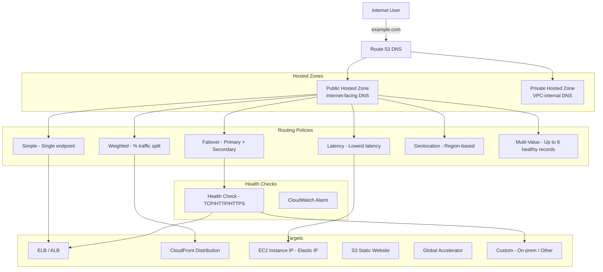

# AWS Route 53

## What is it?
Amazon Route 53 is a highly available and scalable Domain Name System (DNS) web service. It translates domain names (like `example.com`) to IP addresses, routes traffic to resources, and monitors endpoint health. It also offers domain registration and DNS-based routing policies.

## Why it was created
DNS is the foundation of internet traffic routing, but traditional DNS providers lack integration with cloud infrastructure. Route 53 was created to provide a cloud-native DNS service that deeply integrates with AWS resources (ALB, CloudFront, S3, EC2), supports advanced routing policies, and provides health-check-based failover.

## When should you use it
- **Domain registration**: Register new domains or transfer existing ones
- **DNS resolution**: Map domain names to AWS resources (ALB, CloudFront, EC2, S3)
- **Traffic routing**: Distribute traffic across regions or endpoints using routing policies
- **Health checking**: Monitor endpoint health and failover automatically
- **Hybrid DNS**: Route 53 Resolver for DNS resolution between VPC and on-premises

## Architecture



## Hands-on Example

```bash
# Create a public hosted zone
aws route53 create-hosted-zone \
    --name "myapp.example.com" \
    --caller-reference "myapp-2024-01-01"

# Create A record (alias to ALB)
aws route53 change-resource-record-sets \
    --hosted-zone-id Z1234567890ABCDEF \
    --change-batch '{
        "Changes": [{
            "Action": "CREATE",
            "ResourceRecordSet": {
                "Name": "api.myapp.example.com",
                "Type": "A",
                "AliasTarget": {
                    "HostedZoneId": "Z35SXDOTRQ7X7K",
                    "DNSName": "my-alb-123456.us-east-1.elb.amazonaws.com",
                    "EvaluateTargetHealth": true
                }
            }
        }]
    }'

# Create weighted routing (split 80/20 between two regions)
aws route53 change-resource-record-sets \
    --hosted-zone-id Z1234567890ABCDEF \
    --change-batch '{
        "Changes": [
            {
                "Action": "CREATE",
                "ResourceRecordSet": {
                    "Name": "app.myapp.example.com",
                    "Type": "A",
                    "SetIdentifier": "us-east-1",
                    "Weight": 80,
                    "AliasTarget": {
                        "HostedZoneId": "Z35SXDOTRQ7X7K",
                        "DNSName": "us-east-1-alb.elasticloadbalancing.amazonaws.com",
                        "EvaluateTargetHealth": true
                    }
                }
            },
            {
                "Action": "CREATE",
                "ResourceRecordSet": {
                    "Name": "app.myapp.example.com",
                    "Type": "A",
                    "SetIdentifier": "eu-west-1",
                    "Weight": 20,
                    "AliasTarget": {
                        "HostedZoneId": "Z2NYPWQ7DFZAZH",
                        "DNSName": "eu-west-1-alb.elasticloadbalancing.amazonaws.com",
                        "EvaluateTargetHealth": true
                    }
                }
            }
        ]
    }'

# Create health check
aws route53 create-health-check \
    --caller-reference "hc-$(date +%s)" \
    --health-check-config '{
        "Type": "HTTPS",
        "FullyQualifiedDomainName": "api.myapp.example.com",
        "Port": 443,
        "ResourcePath": "/health",
        "RequestInterval": 30,
        "FailureThreshold": 3
    }'
```

## Pricing Model
- **Hosted zones**: $0.50 per month per hosted zone (first 25 zones; volume pricing beyond)
- **DNS queries**: $0.40 per million queries per month (first 1 billion; tiered pricing)
- **Health checks**: $0.75 per health check per month (basic) or $2.00 (with endpoint monitoring)
- **Domain registration**: Varies by TLD ($0.50–$50+ per year)
- **Resolver**: $0.125 per million queries for inbound/outbound endpoints

## Best Practices
- **Use alias records for AWS resources**: Alias records are free and automatically handle IP changes
- **Use health checks with failover routing**: Ensure traffic is only routed to healthy endpoints
- **Use weighted routing for canary deployments**: Route 1% of traffic to a new version before full rollout
- **Use latency-based routing for global apps**: Route users to the region with lowest latency
- **Private hosted zones for internal DNS**: Resolve private resources without exposing DNS externally
- **Enable DNSSEC**: Protect against DNS spoofing and man-in-the-middle attacks
- **Use Route 53 Resolver for hybrid DNS**: Resolve on-premises DNS names from VPC and vice versa

## Interview Questions
1. What's the difference between a simple and weighted routing policy?
2. How does Route 53 health checking work with failover routing?
3. What is an alias record and how is it different from a CNAME?
4. How would you implement blue-green deployment using Route 53?
5. What are private hosted zones and when would you use them?

## Real Company Usage
**Pinterest** uses Route 53 with latency-based routing to route user traffic to the closest regional deployment. **Airbnb** uses Route 53 with weighted routing for canary deployments, incrementally shifting traffic to new versions while monitoring error rates.
