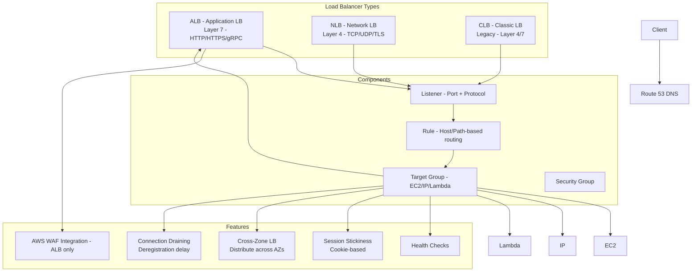

# AWS ELB (Elastic Load Balancing)

## What is it?
Elastic Load Balancing automatically distributes incoming application traffic across multiple targets (EC2 instances, containers, IP addresses, Lambda functions) in one or more Availability Zones. It monitors target health and routes traffic only to healthy targets.

## Why it was created
Distributing traffic across multiple servers requires a load balancer, but traditional hardware load balancers are expensive, rigid, and require manual scaling. ELB was created to provide a fully managed, elastic load balancing service that scales automatically, integrates with AWS services, and offers different types for different protocols.

## When should you use it
- **Web application traffic**: Distribute HTTP/HTTPS traffic across EC2, ECS, or Lambda
- **TLS termination**: Offload SSL/TLS decryption from backend instances
- **Microservices**: Route traffic to different services based on path or host
- **TCP/UDP traffic**: Load balance non-HTTP protocols using NLB
- **High availability**: Distribute traffic across AZs for fault tolerance

## Architecture



## Hands-on Example

```bash
# Create ALB (dual-stack, internet-facing)
aws elbv2 create-load-balancer \
    --name my-web-alb \
    --type application \
    --scheme internet-facing \
    --ip-address-type dualstack \
    --subnets subnet-abc subnet-def \
    --security-groups sg-123

# Create target group
aws elbv2 create-target-group \
    --name my-web-tg \
    --protocol HTTP \
    --port 80 \
    --target-type ip \
    --vpc-id vpc-12345678 \
    --health-check-path /health \
    --health-check-interval-seconds 30 \
    --health-check-protocol HTTP \
    --healthy-threshold-count 2 \
    --deregistration-delay-timeout-seconds 60

# Register targets
aws elbv2 register-targets \
    --target-group-arn arn:aws:elasticloadbalancing:us-east-1:123456789012:targetgroup/my-web-tg/abc123 \
    --targets Id=10.0.1.10,Port=80 Id=10.0.2.10,Port=80

# Create listener with rule
aws elbv2 create-listener \
    --load-balancer-arn arn:aws:elasticloadbalancing:us-east-1:123456789012:loadbalancer/app/my-web-alb/abc123 \
    --protocol HTTPS \
    --port 443 \
    --ssl-policy ELBSecurityPolicy-TLS13-1-2-2021-06 \
    --certificates CertificateArn=arn:aws:acm:us-east-1:123456789012:certificate/abc123 \
    --default-actions Type=forward,TargetGroupArn=arn:aws:elasticloadbalancing:us-east-1:123456789012:targetgroup/my-web-tg/abc123

# Enable stickiness
aws elbv2 modify-target-group-attributes \
    --target-group-arn arn:aws:elasticloadbalancing:us-east-1:123456789012:targetgroup/my-web-tg/abc123 \
    --attributes Key=stickiness.enabled,Value=true Key=stickiness.type,Value=lb_cookie Key=stickiness.lb_cookie.duration_seconds,Value=86400
```

## Pricing Model
- **ALB**: $0.0225 per hour (or partial hour) + $0.008 per LCU (Load Balancer Capacity Unit) per hour
- **NLB**: $0.0225 per hour + $0.006 per NLCU per hour
- **CLB**: $0.025 per hour + $0.008 per CLCU per hour
- **TLS offloading**: No additional charge
- **Fixed IP (NLB)**: Additional $0.005 per hour per EIP

## Best Practices
- **Use ALB for HTTP/HTTPS**: ALB offers path-based, host-based, and query-based routing with native WAF integration
- **Use NLB for TCP/UDP/gRPC**: NLB preserves source IP and offers static IPs via Elastic IPs
- **Cross-zone load balancing**: Enable for even distribution across AZs (avoids 50/50 traffic split per AZ)
- **Connection draining**: Set deregistration delay to allow in-flight requests to complete before targets are removed
- **Health checks**: Use application-level health checks (HTTP 200) rather than TCP checks for accurate status
- **Stickiness**: Use only when necessary (cookies can be `lb_cookie` or `app_cookie`)
- **Access logs**: Enable ALB access logs to S3 for request-level analysis and security auditing

## Interview Questions
1. What's the difference between ALB, NLB, and CLB?
2. How does cross-zone load balancing work and when should you enable it?
3. What is connection draining and why is it important during deployments?
4. How does path-based routing work with ALB listener rules?
5. How would you get static IP addresses for an ALB?

## Real Company Usage
**Amazon.com** uses ALBs to route traffic across thousands of microservices based on path and host headers. **Twitch** uses NLBs to load balance real-time streaming traffic, using static IP addresses and preserving source IP for geo-routing decisions.
