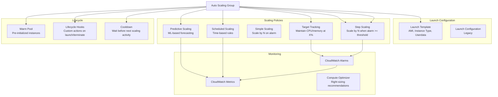

# AWS Auto Scaling

## What is it?
AWS Auto Scaling monitors your applications and automatically adjusts capacity to maintain steady, predictable performance at the lowest possible cost. It allows you to scale EC2 instances, DynamoDB tables, and other resources based on demand, schedule, or predictive models.

## Why it was created
Cloud workloads have variable traffic patterns — a fixed number of servers wastes money during low traffic and causes outages during spikes. Auto Scaling was created to dynamically match compute capacity to demand, automatically launching instances when traffic increases and terminating them when it decreases.

## When should you use it
- **Variable traffic**: Applications with daily or seasonal traffic patterns
- **Cost optimization**: Scale in during off-peak hours or weekends
- **High availability**: Maintain minimum capacity across AZs
- **Batch processing**: Scale up for job processing, scale down to zero after
- **Predictable spikes**: Scale up before known traffic events (e.g., Black Friday)

## Architecture



## Hands-on Example

```bash
# Create launch template
aws ec2 create-launch-template \
    --launch-template-name my-app-template \
    --launch-template-data '{
        "ImageId": "ami-0c55b159cbfafe1f0",
        "InstanceType": "t3.medium",
        "SecurityGroupIds": ["sg-123"],
        "UserData": "IyEvYmluL2Jhc2gK...",
        "IamInstanceProfile": {"Name": "EC2-S3-Access"},
        "BlockDeviceMappings": [{
            "DeviceName": "/dev/sda1",
            "Ebs": {"VolumeSize": 30, "VolumeType": "gp3"}
        }]
    }'

# Create Auto Scaling Group with target tracking
aws autoscaling create-auto-scaling-group \
    --auto-scaling-group-name my-app-asg \
    --launch-template LaunchTemplateName=my-app-template,Version=1 \
    --min-size 2 \
    --max-size 20 \
    --desired-capacity 3 \
    --vpc-zone-identifier "subnet-abc,subnet-def" \
    --health-check-type ELB \
    --health-check-grace-period 300 \
    --target-group-arns arn:aws:elasticloadbalancing:us-east-1:123456789012:targetgroup/my-web-tg/abc123

# Target tracking policy (CPU at 60%)
aws autoscaling put-scaling-policy \
    --auto-scaling-group-name my-app-asg \
    --policy-name cpu-target-tracking \
    --policy-type TargetTrackingScaling \
    --target-tracking-configuration '{
        "PredefinedMetricSpecification": {
            "PredefinedMetricType": "ASGAverageCPUUtilization"
        },
        "TargetValue": 60.0,
        "DisableScaleIn": false
    }'

# Scheduled scaling (scale up at 8 AM weekdays)
aws autoscaling put-scheduled-update-group-action \
    --auto-scaling-group-name my-app-asg \
    --scheduled-action-name scale-up-8am \
    --recurrence "0 8 * * 1-5" \
    --desired-capacity 10 \
    --min-size 5 \
    --max-size 20

# Create lifecycle hook (run script before instance terminates)
aws autoscaling put-lifecycle-hook \
    --lifecycle-hook-name drain-and-save \
    --auto-scaling-group-name my-app-asg \
    --lifecycle-transition autoscaling:EC2_INSTANCE_TERMINATING \
    --heartbeat-timeout 300 \
    --default-result CONTINUE \
    --notification-target-arn arn:aws:sns:us-east-1:123456789012:asg-lifecycle \
    --role-arn arn:aws:iam::123456789012:role/ASG-Lifecycle-Hook
```

## Pricing Model
- **No additional charge** for Auto Scaling itself — you pay only for the resources managed by Auto Scaling (EC2 instances, CloudWatch metrics, alarms)
- **CloudWatch metrics**: Standard metrics (CPU, network) are free; detailed monitoring ($2.10 per instance per month for 1-minute metrics)
- **Predictive scaling**: No additional charge (uses standard CloudWatch metrics)

## Best Practices
- **Use launch templates over launch configurations**: Launch templates support newer features (T2/T3 unlimited, multiple instance types, Spot)
- **Target tracking for most workloads**: Simplest and most effective — set CPU/request count target and let ASG handle the rest
- **Use multiple instance types**: Mix instance types in mixed instances policies for better Spot availability and pricing
- **Warm pools for latency-sensitive workloads**: Pre-initialize instances so they're ready to serve immediately when scaled up
- **Cooldown periods**: Set appropriate cooldown (default 300 seconds) to avoid rapid scale-in/out oscillation
- **Lifecycle hooks**: Use hooks for graceful shutdown (draining connections, uploading logs, sending notifications)
- **Predictive scaling for recurring patterns**: Use ML-based forecasting for workloads with daily/weekly patterns

## Interview Questions
1. How does target tracking scaling differ from step scaling?
2. What are lifecycle hooks and how do you use them for graceful shutdown?
3. What is a warm pool and when would you use it?
4. How does predictive scaling work using ML?
5. How do you handle scale-in protection for critical instances?

## Real Company Usage
**Netflix** uses Auto Scaling extensively — they scale up streaming capacity during peak hours and scale down at night, combining target tracking with scheduled scaling for predictable Prime Time traffic. **Lyft** uses Auto Scaling with multiple instance types in their mixed instances policy to optimize for both cost and Spot instance availability.
