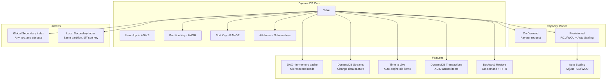

# AWS DynamoDB Deep Dive

## What is it?
Amazon DynamoDB is a fully managed, serverless, key-value and document NoSQL database that delivers single-digit millisecond performance at any scale. It is a multi-region, multi-active database that provides built-in security, backup and restore, and in-memory caching.

## Why it was created
Relational databases struggle with horizontal scaling, high-velocity writes, and unpredictable traffic patterns. DynamoDB was created to provide a fully managed NoSQL database that scales horizontally by distributing data across partitions, delivers consistent single-digit millisecond latency, requires no schema management, and handles auto-scaling without downtime.

## When should you use it
- **High-traffic web apps**: User sessions, gaming leaderboards, metadata stores
- **Event-driven architectures**: Event sourcing with DynamoDB Streams triggering Lambda
- **IoT and time-series**: High-volume write workloads with TTL for automatic data expiration
- **Serverless backends**: Lambda + DynamoDB is the backbone of serverless applications
- **Caching layer**: DAX for read-heavy workloads requiring microsecond latency

## Architecture



## Hands-on Example

```bash
# Create DynamoDB table (provisioned)
aws dynamodb create-table \
    --table-name Orders \
    --attribute-definitions \
        AttributeName=OrderId,AttributeType=S \
        AttributeName=CreatedAt,AttributeType=S \
    --key-schema \
        AttributeName=OrderId,KeyType=HASH \
        AttributeName=CreatedAt,KeyType=RANGE \
    --global-secondary-indexes \
        "[{
            \"IndexName\": \"StatusIndex\",
            \"KeySchema\": [{\"AttributeName\":\"Status\",\"KeyType\":\"HASH\"}],
            \"Projection\": {\"ProjectionType\":\"ALL\"},
            \"ProvisionedThroughput\": {\"ReadCapacityUnits\":5,\"WriteCapacityUnits\":5}
        }]" \
    --provisioned-throughput ReadCapacityUnits=10,WriteCapacityUnits=5 \
    --stream-specification StreamEnabled=true,StreamViewType=NEW_AND_OLD_IMAGES

# Put item
aws dynamodb put-item \
    --table-name Orders \
    --item '{
        "OrderId": {"S": "ORD-001"},
        "CreatedAt": {"S": "2024-01-15T10:30:00Z"},
        "CustomerId": {"S": "CUST-456"},
        "Amount": {"N": "99.95"},
        "Status": {"S": "PENDING"},
        "Items": {"L": [
            {"M": {"ProductId": {"S": "PROD-123"}, "Qty": {"N": "2"}}}
        ]}
    }'

# Query with GSI
aws dynamodb query \
    --table-name Orders \
    --index-name StatusIndex \
    --key-condition-expression "#s = :status" \
    --expression-attribute-names '{"#s": "Status"}' \
    --expression-attribute-values '{":status": {"S": "PENDING"}}'

# Enable auto-scaling for RCU/WCU (via Application Auto Scaling)
aws application-autoscaling register-scalable-target \
    --service-namespace dynamodb \
    --resource-id "table/Orders" \
    --scalable-dimension "dynamodb:table:ReadCapacityUnits" \
    --min-capacity 5 \
    --max-capacity 100

aws application-autoscaling put-scaling-policy \
    --service-namespace dynamodb \
    --resource-id "table/Orders" \
    --scalable-dimension "dynamodb:table:ReadCapacityUnits" \
    --policy-name "target-utilization-70" \
    --policy-type TargetTrackingScaling \
    --target-tracking-scaling-policy-configuration '{
        "TargetValue": 70.0,
        "PredefinedMetricSpecification": {
            "PredefinedMetricType": "DynamoDBReadCapacityUtilization"
        }
    }'
```

## Pricing Model
- **On-demand capacity**: $1.25 per million write request units, $0.25 per million read request units
- **Provisioned capacity**: $0.00065 per WCU per hour, $0.00013 per RCU per hour
- **Storage**: $0.25 per GB-month
- **DAX**: $0.12–$0.56 per hour per node (depending on instance size)
- **DynamoDB Streams**: $0.02 per 100,000 read request units
- **Backup/restore**: On-demand backup at $0.10 per GB-month; PITR at $0.10 per GB-month
- **Free tier**: 25 GB storage, 25 RCU, 25 WCU

## Best Practices
- **Choose partition keys wisely**: High-cardinality keys for even data distribution (avoid hot partitions)
- **Use GSI sparingly**: Each GSI uses separate throughput capacity — monitor for throttling
- **Use on-demand for unpredictable workloads**: Auto-scales without capacity planning (2x cost of provisioned)
- **Use DynamoDB Streams for change data capture**: Trigger Lambda for real-time processing (analytics, search indexing, replication)
- **Use TTL for automatic data expiration**: Cheaper than Scan+Delete — DynamoDB deletes expired items transparently
- **Use DAX for read-heavy workloads**: Microsecond latency, reduces read load on table
- **Use transactions for multi-item ACID**: Costs 2x the normal RCU/WCU — use only when needed

## Interview Questions
1. How does DynamoDB partition data across multiple nodes?
2. What is the difference between a Global Secondary Index and a Local Secondary Index?
3. How does DynamoDB auto-scaling work and when would you use on-demand mode?
4. What is the difference between strongly consistent and eventually consistent reads?
5. How do DynamoDB Streams enable event-driven architectures?

## Real Company Usage
**Amazon.com** uses DynamoDB for its shopping cart, session management, and product catalog with trillions of requests per day. **Lyft** uses DynamoDB to store ride history and real-time ride state, using DynamoDB Streams to update their search and analytics pipelines.
