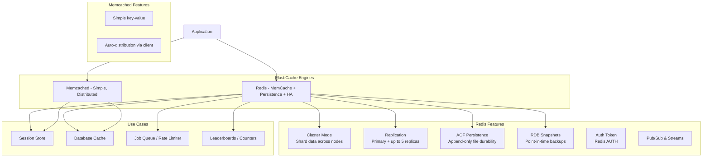

# AWS ElastiCache

## What is it?
Amazon ElastiCache is a fully managed in-memory caching service that offers Redis and Memcached. It improves application performance by storing frequently accessed data in memory for sub-millisecond latency, reducing load on backend databases.

## Why it was created
Databases are often the bottleneck in application performance — reading frequently accessed data from disk is slow and expensive. ElastiCache was created to provide a managed, highly available in-memory cache layer that offloads read traffic from databases, reduces latency, and scales elastically.

## When should you use it
- **Read-heavy workloads**: Cache frequently accessed data (user sessions, product catalog, blog posts)
- **Session storage**: Store user sessions outside of web servers for stateless scaling
- **Rate limiting**: Implement sliding window rate limits with Redis sorted sets
- **Leaderboards**: Real-time gaming leaderboards using Redis sorted sets
- **Pub/Sub messaging**: Real-time messaging between microservices using Redis Pub/Sub
- **Database query caching**: Cache expensive database query results

## Architecture



## Hands-on Example

```bash
# Create Redis cluster (cluster mode enabled)
aws elasticache create-replication-group \
    --replication-group-id my-redis-cluster \
    --replication-group-description "Production Redis cluster" \
    --engine redis \
    --engine-version 7.1 \
    --cache-node-type cache.r6g.large \
    --num-node-groups 3 \
    --replicas-per-node-group 2 \
    --automatic-failover-enabled \
    --multi-az-enabled \
    --at-rest-encryption-enabled \
    --transit-encryption-enabled \
    --auth-token "my-secure-auth-token" \
    --security-group-ids sg-123 \
    --cache-parameter-group default.redis7

# Create Memcached cluster
aws elasticache create-cache-cluster \
    --cache-cluster-id my-memcached-cluster \
    --engine memcached \
    --engine-version 1.6.22 \
    --cache-node-type cache.m6g.large \
    --num-cache-nodes 3 \
    --az-mode cross-az \
    --security-group-ids sg-123

# Connect to Redis via CLI
redis-cli -h my-redis-cluster.abc123.ng.0001.use1.cache.amazonaws.com -p 6379 -a "my-secure-auth-token"

# Set cache entry
SET user:123:profile '{"name": "Alice", "role": "admin"}' EX 3600

# Backup Redis cluster (create snapshot)
aws elasticache create-snapshot \
    --replication-group-id my-redis-cluster \
    --snapshot-name pre-deploy-backup

# Modify parameter group
aws elasticache create-cache-parameter-group \
    --cache-parameter-group-name my-redis-settings \
    --cache-parameter-group-family redis7 \
    --description "Custom Redis 7 settings"

aws elasticache modify-cache-parameter-group \
    --cache-parameter-group-name my-redis-settings \
    --parameter-name-values 'ParameterName=timeout,ParameterValue=300' \
    'ParameterName= maxmemory-policy,ParameterValue=allkeys-lru'
```

## Pricing Model
- **On-demand**: Pay per node-hour ($0.034–$6.94/hour depending on instance size)
- **Reserved nodes**: 1-year or 3-year commits for 30–60% discount
- **Data transfer**: Standard EC2 data transfer rates apply
- **Backup storage**: Free up to your cluster's total cache size; additional at $0.085/GB-month
- **Snapshot export to S3**: Standard S3 rates apply

## Best Practices
- **Use Redis over Memcached**: Redis offers persistence, replication, cluster mode, and richer data structures
- **Enable cluster mode for production**: Distribute data across shards for horizontal scaling and high availability
- **Use Multi-AZ with auto-failover**: Primary node fails → replica promoted in seconds
- **Set appropriate eviction policy**: Use `allkeys-lru` for caching workloads, `volatile-lru` for mixed use
- **Use auth tokens**: Require Redis AUTH token for every connection
- **Encrypt at rest and in transit**: Enable encryption for compliance (PCI-DSS, HIPAA)
- **Monitor with CloudWatch**: Track CPUUtilization, CacheHits, CacheMisses, Evictions, CurrConnections
- **Reserved nodes for steady-state workloads**: Commit to 1–3 years for cost savings on predictable traffic

## Interview Questions
1. When would you choose Redis over Memcached?
2. How does Redis Cluster Mode horizontally scale data?
3. How does ElastiCache handle automatic failover in Multi-AZ?
4. What is the difference between DAX and ElastiCache for DynamoDB workloads?
5. How would you design a distributed rate limiter with Redis?

## Real Company Usage
**Instagram** uses Redis (via ElastiCache) for their feed ranking and session management, caching millions of user sessions. **Tinder** uses ElastiCache for Redis to power real-time matching and messaging features, leveraging Redis Pub/Sub for low-latency notifications.
