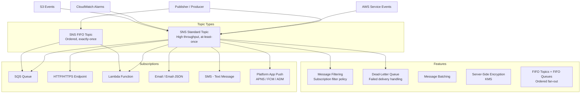

# AWS SNS (Simple Notification Service)

## What is it?
Amazon Simple Notification Service (SNS) is a fully managed pub/sub messaging service for decoupling event producers from consumers. It delivers messages to subscribers via multiple protocols including HTTP/S, SQS, Lambda, email, SMS, and platform push notifications.

## Why it was created
Broadcasting events to multiple subscribers traditionally required building custom pub/sub infrastructure. SNS was created to provide a fully managed, high-throughput pub/sub service that supports multiple delivery protocols, filtering, fan-out patterns, and integrates with other AWS services.

## When should you use it
- **Fan-out patterns**: Send a single event to multiple SQS queues, Lambda functions, and HTTP endpoints
- **Application alerts**: Notify operations teams via email, SMS, or mobile push
- **Event broadcasting**: Publish domain events for multiple microservices to consume
- **Push notifications**: Send mobile push notifications to iOS, Android, and Kindle devices
- **System-to-system messaging**: Decouple services with topic-based pub/sub

## Architecture



## Hands-on Example

```bash
# Create Standard topic
aws sns create-topic \
    --name order-events

# Create FIFO topic
aws sns create-topic \
    --name order-events.fifo \
    --attributes FifoTopic=true,ContentBasedDeduplication=true

# Create multiple subscriptions
# 1. HTTP/HTTPS
aws sns subscribe \
    --topic-arn arn:aws:sns:us-east-1:123456789012:order-events \
    --protocol https \
    --notification-endpoint https://api.myapp.com/webhooks/orders

# 2. SQS
aws sns subscribe \
    --topic-arn arn:aws:sns:us-east-1:123456789012:order-events \
    --protocol sqs \
    --notification-endpoint arn:aws:sqs:us-east-1:123456789012:order-processing-queue

# 3. Lambda
aws sns subscribe \
    --topic-arn arn:aws:sns:us-east-1:123456789012:order-events \
    --protocol lambda \
    --notification-endpoint arn:aws:lambda:us-east-1:123456789012:function:order-processor

# 4. Email
aws sns subscribe \
    --topic-arn arn:aws:sns:us-east-1:123456789012:order-events \
    --protocol email \
    --notification-endpoint ops@company.com

# Set message filtering (subscribe only high-value orders)
aws sns set-subscription-attributes \
    --subscription-arn arn:aws:sns:us-east-1:123456789012:order-events:abc123 \
    --attribute-name FilterPolicy \
    --attribute-value '{"amount": [{"numeric": [">=", 1000]}]}'

# Publish message
aws sns publish \
    --topic-arn arn:aws:sns:us-east-1:123456789012:order-events \
    --message '{"orderId": "ORD-001", "amount": 99.95, "customerId": "CUST-456"}' \
    --message-attributes '{"eventType": {"DataType": "String", "StringValue": "order.created"}}'
```

## Pricing Model
- **Standard topics**: $0.50 per million published messages, $0.50 per million deliveries
- **FIFO topics**: $0.50 per million published messages, $0.50 per million deliveries
- **HTTP/HTTPS delivery**: $0.60 per million HTTP notifications
- **Email delivery**: $2.00 per 100,000 email notifications
- **SMS delivery**: Varies by destination country ($0.00228–$0.75 per message)
- **Mobile push**: $0.50 per million push notification deliveries

## Best Practices
- **Use message filtering**: Attach filter policies to subscriptions to deliver only relevant messages
- **Use dead-letter queues**: Configure DLQs for subscriptions to capture undelivered messages
- **Use FIFO topics with SQS FIFO queues**: For exactly-once, ordered fan-out patterns
- **Encrypt with KMS**: Enable SSE for topics containing sensitive data
- **Monitor delivery failures**: Track `NumberOfNotificationsFailed` and `NumberOfNotificationsFilteredOut` in CloudWatch
- **Structure messages clearly**: Include `eventType` and `version` in message attributes for routing

## Interview Questions
1. How does SNS fan-out pattern work with SQS?
2. What is message filtering in SNS and how do you implement it?
3. How does SNS differentiate from SQS in terms of delivery model?
4. When would you use a FIFO topic vs a Standard topic?
5. How would you design a multi-protocol notification system with SNS?

## Real Company Usage
**Netflix** uses SNS to broadcast infrastructure events — when a deployment completes, SNS notifies monitoring, logging, and alerting systems simultaneously. **Zillow** uses SNS with SQS fan-out to distribute property listing changes to multiple backend services for indexing, caching, and analytics.
