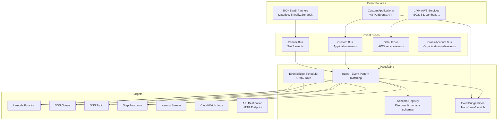

# AWS EventBridge

## What is it?
Amazon EventBridge is a serverless event bus service that connects applications using events from your own applications, AWS services, and SaaS partners. It provides event ingestion, filtering, transformation, routing, and delivery with built-in schema discovery.

## Why it was created
Traditional event-driven architectures require building custom event routers, managing schemas, and integrating with numerous event sources. EventBridge was created to provide a unified, schema-aware event bus that connects AWS services, SaaS applications, and custom applications with automatic event schema discovery and no-code transformation.

## When should you use it
- **Event-driven architectures**: Central event bus for microservices communication
- **AWS service integration**: Route events from over 140 AWS services to targets
- **SaaS integration**: Connect with Datadog, Shopify, Zendesk, PagerDuty, etc.
- **Scheduled tasks**: EventBridge Scheduler for cron/rate-based task scheduling
- **Data pipelines**: Filter and transform events before routing to targets
- **Event replay**: Re-process events for error recovery or testing

## Architecture



## Hands-on Example

```bash
# Create custom event bus
aws events create-event-bus \
    --name my-app-bus

# Create rule that matches specific events
aws events put-rule \
    --name order-created \
    --event-bus-name my-app-bus \
    --event-pattern '{
        "source": ["my-app.orders"],
        "detail-type": ["OrderCreated"],
        "detail": {
            "amount": [{"numeric": [">=", 100]}]
        }
    }'

# Add target to rule
aws events put-targets \
    --rule order-created \
    --event-bus-name my-app-bus \
    --targets '[
        {
            "Id": "SendToSlack",
            "Arn": "arn:aws:sqs:us-east-1:123456789012:order-alerts-queue"
        },
        {
            "Id": "ProcessOrder",
            "Arn": "arn:aws:lambda:us-east-1:123456789012:function:order-processor"
        }
    ]'

# Put event to custom bus
aws events put-events \
    --entries '[
        {
            "Source": "my-app.orders",
            "DetailType": "OrderCreated",
            "Detail": "{\"orderId\":\"ORD-001\",\"amount\":99.95,\"customerId\":\"CUST-456\"}",
            "EventBusName": "my-app-bus"
        }
    ]'

# Create schedule (runs every hour)
aws scheduler create-schedule \
    --name hourly-order-report \
    --schedule-expression "cron(0 * * * ? *)" \
    --target '{
        "Arn": "arn:aws:lambda:us-east-1:123456789012:function:generate-report",
        "RoleArn": "arn:aws:iam::123456789012:role/scheduler-role"
    }'

# Discover schema for custom events
aws schemas create-discoverer \
    --source-arn arn:aws:events:us-east-1:123456789012:event-bus/my-app-bus
```

## Pricing Model
- **Custom events**: $1.00 per million events published to custom/partner event buses
- **Cross-account events**: $1.00 per million events published
- **Scheduled rules**: $1.00 per million invocations
- **Schema discovery**: $0.001 per schema checked (first 5 million free per month)
- **EventBridge Pipes**: $0.40 per million messages (source → enrichment → target)
- **EventBridge Scheduler**: $1.00 per million schedule invocations

## Best Practices
- **Use event patterns for filtering**: Filter at the event bus level, not at the target — reduces cost and invocations
- **Use input transformers**: Transform event payloads before sending to targets (no-code transformations)
- **Use Pipes for ETL pipelines**: EventBridge Pipes connect source → optional enrichment → target with built-in filtering
- **Use Scheduler for cron/recurring tasks**: EventBridge Scheduler replaces Lambda + CloudWatch Events for scheduled tasks
- **Enable schema registry**: Automatically discover and generate code bindings for your custom events
- **Use archive and replay**: Archive events for up to 7 days for debugging and error recovery
- **Cross-account buses**: Use resource-based policies on event buses for multi-account event routing

## Interview Questions
1. How does EventBridge differ from SQS and SNS?
2. What is the difference between EventBridge and CloudWatch Events?
3. How do EventBridge rules filter events before routing?
4. What are EventBridge Pipes and when would you use them?
5. How do partner event sources work in EventBridge?

## Real Company Usage
**Stripe** uses EventBridge to stream payment events to customer applications — merchants receive real-time payment updates via their own EventBridge buses. **Zendesk** integrates with EventBridge as a partner event source, enabling customers to route Zendesk ticket events directly to AWS Lambda or Step Functions.
