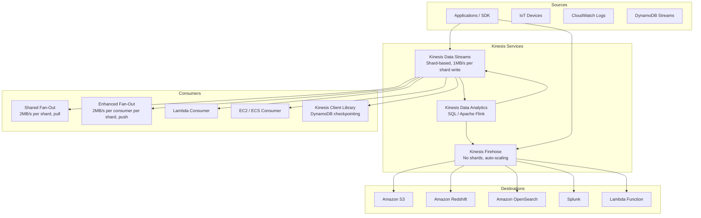

# AWS Kinesis

## What is it?
Amazon Kinesis is a set of managed services for real-time streaming data at massive scale. It includes Kinesis Data Streams (ingest and store), Kinesis Data Firehose (load to destinations), and Kinesis Data Analytics (real-time SQL/Flink processing).

## Why it was created
Real-time data streaming traditionally required managing Apache Kafka clusters or building custom streaming infrastructure with complex scaling, durability, and monitoring. Kinesis was created to provide fully managed, elastic real-time data streaming with built-in durability, replay, and integration with AWS analytics services.

## When should you use it
- **Real-time analytics**: Process streaming data with sub-second latency (clickstreams, IoT, logs)
- **Data ingestion**: Ingest high-volume data from thousands of sources (mobile devices, sensors)
- **Log aggregation**: Collect and process application logs in real-time
- **Streaming ETL**: Transform data streams and load to S3, Redshift, OpenSearch
- **Real-time dashboards**: Compute rolling metrics (1-min, 5-min, 1-hour) from streams
- **ML features in real-time**: Compute feature vectors for ML models on streaming data

## Architecture



## Hands-on Example

```bash
# Create Kinesis Data Stream (5 shards)
aws kinesis create-stream \
    --stream-name clickstream-events \
    --shard-count 5

# Put record (with partition key)
aws kinesis put-record \
    --stream-name clickstream-events \
    --partition-key "user-123" \
    --data "$(echo '{"event":"page_view","userId":"user-123","page":"/home","timestamp":"2024-01-15T10:30:00Z"}' | base64)"

# Get shard iterator
SHARD_ID=$(aws kinesis get-shard-iterator \
    --stream-name clickstream-events \
    --shard-id shardId-000000000000 \
    --shard-iterator-type LATEST \
    --query 'ShardIterator' \
    --output text)

# Get records from shard
aws kinesis get-records \
    --shard-iterator "$SHARD_ID" \
    --limit 100

# Update shard count (reshard)
aws kinesis update-shard-count \
    --stream-name clickstream-events \
    --target-shard-count 10 \
    --scaling-type UNIFORM_SCALING

# Create Firehose delivery stream (to S3)
aws firehose create-delivery-stream \
    --delivery-stream-name clickstream-to-s3 \
    --extended-s3-destination-configuration '{
        "BucketARN": "arn:aws:s3:::my-clickstream-bucket",
        "Prefix": "raw-data/year=!{timestamp:yyyy}/month=!{timestamp:MM}/",
        "BufferingHints": {"IntervalInSeconds": 60, "SizeInMBs": 5},
        "CompressionFormat": "GZIP",
        "ErrorOutputPrefix": "errors/",
        "EncryptionConfiguration": {"NoEncryptionConfig": "NoEncryption"}
    }'

# Create Data Analytics app (SQL)
aws kinesisanalyticsv2 create-application \
    --application-name clickstream-analytics \
    --runtime-environment SQL-1_0 \
    --service-execution-role arn:aws:iam::123456789012:role/kinesis-analytics-role
```

## Pricing Model
- **Kinesis Data Streams**: $0.015 per shard-hour (ingestion), $0.015 per shard-hour (retention standard)
- **Kinesis Data Firehose**: $0.029 per GB ingested (includes delivery to S3/Redshift/OpenSearch)
- **Kinesis Data Analytics (SQL)**: $0.11 per KPU (Kinesis Processing Unit) per hour
- **Enhanced Fan-Out**: $0.013 per shard-hour per consumer
- **Long-term retention**: $0.023 per shard-hour (extended up to 365 days)

## Best Practices
- **Choose partition keys carefully**: Distribute writes evenly across shards to avoid hot shards
- **Use KCL for consumer applications**: KCL handles shard discovery, load balancing, checkpointing with DynamoDB
- **Use enhanced fan-out for many consumers**: Each consumer gets dedicated throughput (2MB/s per shard)
- **Use Firehose for near-realtime delivery**: Firehose batches and delivers to S3/Redshift/OpenSearch with minimal effort
- **Use Data Analytics for SQL processing**: Real-time SQL queries on streaming data without custom code
- **Monitor with CloudWatch**: Track `IncomingBytes`, `IncomingRecords`, `GetRecords.Success` per shard
- **Reshard for scaling**: Split shards for higher throughput, merge shards for cost savings

## Interview Questions
1. How does Kinesis Data Streams differ from SQS and Kafka?
2. What is a shard and how does it determine throughput?
3. How does the Kinesis Client Library distribute records across consumers?
4. What's the difference between shared fan-out and enhanced fan-out?
5. How does Kinesis Data Firehose differ from Kinesis Data Streams?

## Real Company Usage
**Capital One** uses Kinesis Data Streams to process millions of real-time transaction events for fraud detection, with Kinesis Data Analytics running Apache Flink for feature computation. **Netflix** uses Kinesis to stream and process billions of events per day across their microservices platform for monitoring and alerting.
