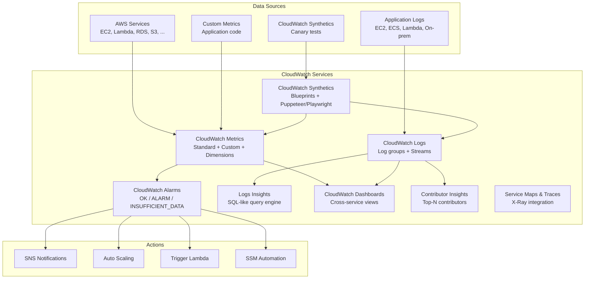

# AWS CloudWatch

## What is it?
Amazon CloudWatch is a monitoring and observability service that collects metrics, logs, and events from AWS resources and applications. It provides actionable insights with dashboards, alarms, logs analytics, and automated actions.

## Why it was created
Monitoring cloud infrastructure requires collecting metrics, logs, and events from many distributed services. CloudWatch was created to provide a unified observability platform that automatically collects metrics from AWS services, enables custom application metrics, provides log aggregation and search, and triggers automated responses.

## When should you use it
- **Infrastructure monitoring**: CPU, memory, disk, network metrics for EC2, RDS, Lambda, etc.
- **Application monitoring**: Custom metrics for application performance (request latency, error rates, throughput)
- **Log management**: Collect, search, and analyze application logs with Logs Insights
- **Automated responses**: Trigger Auto Scaling, Lambda, or SNS based on metric thresholds
- **Synthetic monitoring**: Canaries for automated UI and API endpoint testing
- **Service maps**: Trace requests across microservices with X-Ray integration

## Architecture



## Hands-on Example

```bash
# Put custom metric (application latency)
aws cloudwatch put-metric-data \
    --namespace "MyApp" \
    --metric-name "RequestLatency" \
    --dimensions "Service=order-processing,Environment=production" \
    --unit "Milliseconds" \
    --value 245.3 \
    --timestamp "2024-01-15T10:30:00Z"

# Create CloudWatch alarm (EC2 CPU > 80%)
aws cloudwatch put-metric-alarm \
    --alarm-name "High-CPU-Production" \
    --alarm-description "CPU > 80% for 5 minutes in production" \
    --metric-name CPUUtilization \
    --namespace AWS/EC2 \
    --statistic Average \
    --period 300 \
    --evaluation-periods 2 \
    --threshold 80 \
    --comparison-operator GreaterThanThreshold \
    --dimensions Name=AutoScalingGroupName,Value=my-app-asg \
    --alarm-actions arn:aws:sns:us-east-1:123456789012:ops-alerts \
    --ok-actions arn:aws:sns:us-east-1:123456789012:ops-alerts

# Query logs with Logs Insights
aws logs start-query \
    --log-group-names "/aws/lambda/order-processor" \
    --start-time 1705314000 \
    --end-time 1705317600 \
    --query-string \
        'fields @timestamp, @message, @requestId
        | filter @message like /ERROR|Exception/
        | stats count() by @requestId
        | sort @timestamp desc
        | limit 100'

# Create canary (synthetic monitoring)
aws synthetics create-canary \
    --name home-page-check \
    --runtime-version syn-1.0 \
    --schedule Expression="rate(5 minutes)",DurationInSeconds=3600 \
    --code '{
        "Handler": "homePageCheck.handler",
        "Script": "// Puppeteer script..."
    }' \
    --execution-role-arn arn:aws:iam::123456789012:role/CloudWatchSyntheticsRole \
    --artifact-s3-location s3://my-synthetics-artifacts/ \
    --run-config MemoryInMB=3000,TimeoutInSeconds=120

# Create Contributor Insights rule (top IPs hitting API)
aws cloudwatch put-insight-rule \
    --rule-name top-api-requesters \
    --rule-definition '{
        "Schema": {"Name": "CloudWatchLogsRuleSchema", "Version": 1},
        "LogGroupNames": ["/aws/http/api-gateway"],
        "LogFormat": "JSON",
        "Fields": {"sourceIP": "$.sourceIP", "bytes": "$.responseBytes"},
        "Contribution": {"Keys": ["sourceIP"], "AggregateOn": "Sum"},
        "Filters": []
    }'
```

## Pricing Model
- **Metrics**: $0.30 per custom metric per month; standard metrics free (EC2, Lambda, RDS, etc.)
- **Dashboards**: $3.00 per dashboard per month (up to 50 metrics); $0.50 per additional 100 metrics
- **Alarms**: $0.10 per standard alarm per month; $0.30 per high-resolution alarm
- **Logs**: $0.50 per GB ingested; $0.03 per GB stored per month
- **Logs Insights**: $0.005 per GB of data scanned
- **Contributor Insights**: $0.45 per contributor rule per month ($0.80 with high-resolution)
- **Synthetics**: $0.0012 per canary run

## Best Practices
- **Use namespaces and dimensions**: Organize custom metrics with `Namespace` and `Dimensions` for easy querying
- **Set composite alarms**: Combine multiple metric alarms with AND/OR logic for complex conditions
- **Use Logs Insights for troubleshooting**: Query-structured logs with SQL-like syntax for fast debugging
- **Create Contributor Insights for anomaly detection**: Automatically identify top contributors (IPs, URLs, users)
- **Use Synthetics canaries for SLA monitoring**: Run Puppeteer/Playwright scripts every 5 minutes from multiple regions
- **Enable detailed monitoring for EC2**: 1-minute intervals ($2.10/instance/month) vs 5-minute default
- **Use anomaly detection bands**: CloudWatch Anomaly Detection auto-creates bands based on historical patterns

## Interview Questions
1. How do CloudWatch metrics, logs, and alarms work together?
2. What is the difference between standard and detailed monitoring for EC2?
3. How do you use CloudWatch Logs Insights for debugging?
4. What are CloudWatch Synthetics canaries and when would you use them?
5. How does CloudWatch Contributor Insights help with security analysis?

## Real Company Usage
**Atlassian** uses CloudWatch extensively across their AWS infrastructure, with custom metrics for application performance, dashboards for cross-service visibility, and Logs Insights for troubleshooting production issues. **Expedia** uses CloudWatch Synthetics to monitor their booking APIs from multiple geographic regions, validating end-to-end SLAs.
